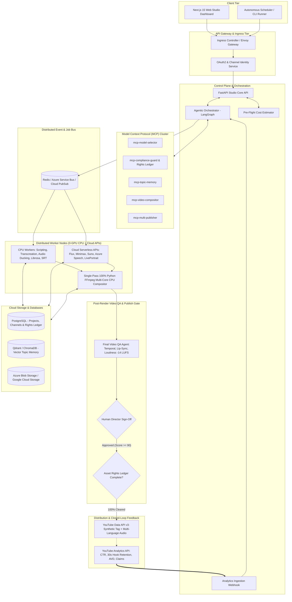
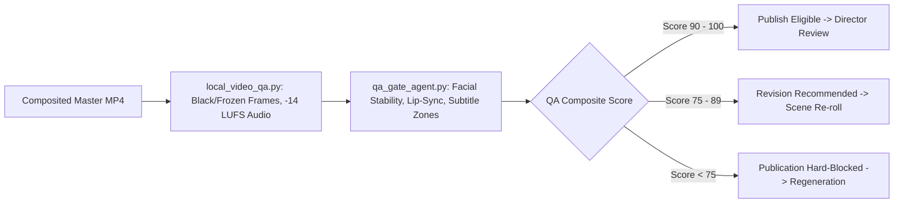
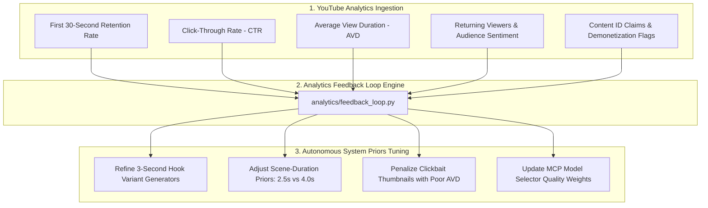
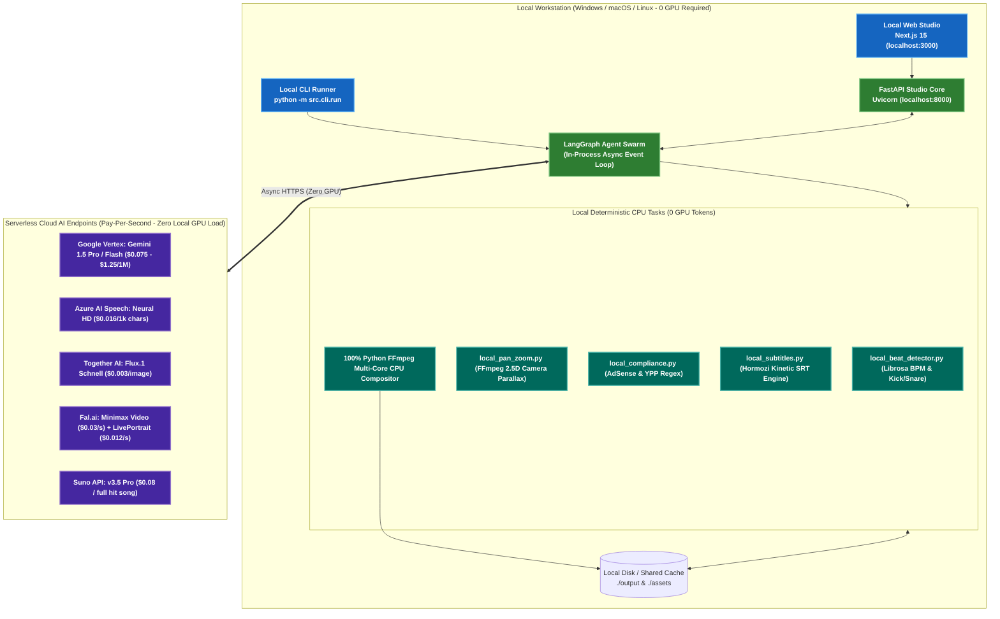
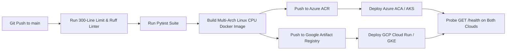
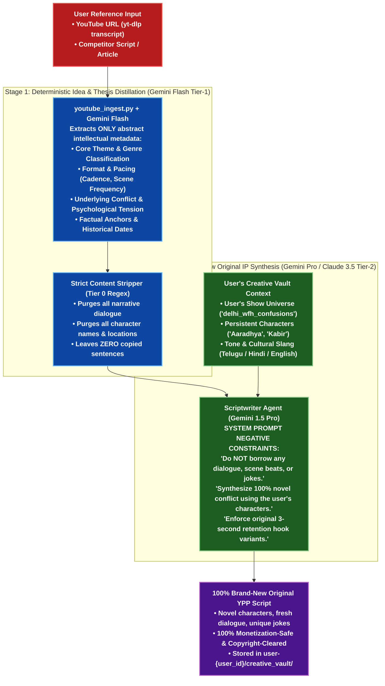

# Technical Implementation & Cloud Deployment Architecture
# Professional AI Video Producer Studio (YPP Monetization-Readiness & Risk Management)

> **Version:** 2.0.0 (Monetization-Ready Production Blueprint)  
> **Status:** Production-Oriented Architectural Planning  
> **Target Deployment Environments:** Local Workstation (0 GPU), Azure Container Apps (ACA - Serverless), Azure Kubernetes Service (AKS), Google Cloud Run (Serverless), Google Kubernetes Engine (GKE Autopilot)  
> **Scope:** Modular components, MCP servers, autonomous agent swarm, Asset Rights Ledger, Final Video QA Gate, Closed-Loop Analytics, Pluggable Dual-Cloud Storage (Azure Blob / GCS), Multi-Platform Failover, and 0-GPU deployment topologies.

---

## Table of Contents
1. [High-Level System Topology](#1-high-level-system-topology)
2. [Modular Subsystem & Component Architecture](#2-modular-subsystem--component-architecture)
3. [Model Context Protocol (MCP) Server Ecosystem & Value-for-Money Router](#3-model-context-protocol-mcp-server-ecosystem--dynamic-model-router)
   - 3.1 [Dynamic Multi-Provider Routing Architecture Diagram](#31-dynamic-multi-provider-routing-architecture--value-for-money-diagram)
   - 3.2 [Dynamic Routing Engine & Value-for-Money Algorithm](#32-dynamic-routing-engine--value-for-money-algorithm)
   - 3.3 [Multi-Provider Industry Comparison Matrix (Quality vs. Cost vs. Value)](#33-multi-provider-industry-comparison-matrix-quality-vs-cost-vs-value)
   - 3.4 [Genre-by-Genre Master Production Matrix (Duration, Format, Style & Total Cost - 0 GPU Stack)](#34-genre-by-genre-master-production-matrix-duration-format-visual-style--total-cost---0-local-gpu-serverless-stack)
4. [Specialized Multi-Agent Swarm](#4-specialized-multi-agent-swarm)
   - 4.1 [Song Scripting & Audio-Driven Dance Movement Synthesis Pipeline](#41-song-scripting--audio-driven-dance-movement-synthesis-pipeline)
   - 4.2 [Mandatory Final Video QA Agent & Publishing Gate](#42-mandatory-final-video-qa-agent--publishing-gate)
   - 4.3 [Closed-Loop Analytics Feedback Subsystem (Post-Publication Learning)](#43-closed-loop-analytics-feedback-subsystem-post-publication-learning)
5. [Data Pipeline & Distributed Job Queue](#5-data-pipeline--distributed-job-queue)
   - 5.1 [Asset Rights Ledger & Originality Evidence Bundle](#51-asset-rights-ledger--originality-evidence-bundle)
   - 5.2 [V1 Production Wedge Implementation Scope](#52-v1-production-wedge-implementation-scope)
6. [Runtime Environment 1: Local Machine (Workstation / CLI / Docker Compose)](#6-runtime-environment-1-local-machine-workstation--cli--docker-compose)
7. [Deployment Architecture 2: Microsoft Azure (ACA Serverless & AKS Cluster)](#7-deployment-architecture-2-microsoft-azure-aca-serverless--aks-cluster)
   - 7.1 [Azure Container Apps (ACA - Serverless 0-GPU)](#71-azure-container-apps-aca---serverless-0-gpu)
   - 7.2 [Azure Kubernetes Service (AKS - High-Throughput CPU Cluster)](#72-azure-kubernetes-service-aks---high-throughput-cpu-cluster)
8. [Deployment Architecture 3: Google Cloud Platform (Cloud Run & GKE Autopilot)](#8-deployment-architecture-3-google-cloud-platform-cloud-run--gke-autopilot)
   - 8.1 [Google Cloud Run (Serverless 0-GPU)](#81-google-cloud-run-serverless-0-gpu)
   - 8.2 [Google Kubernetes Engine (GKE Autopilot - High-Throughput 0-GPU Cluster)](#82-google-kubernetes-engine-gke-autopilot---high-throughput-0-gpu-cluster)
9. [Multi-Cloud Automated Failover & Disaster Recovery Topology](#9-multi-cloud-automated-failover--disaster-recovery-topology)
   - 9.1 [Global Traffic Management & Active-Active / Active-Passive DNS Failover](#91-global-traffic-management--active-active--active-passive-dns-failover)
   - 9.2 [Pluggable Dual-Cloud Storage & Per-User Isolation (Azure Blob SAS + Google Cloud Storage V4 Signed URLs)](#92-pluggable-dual-cloud-storage--per-user-isolation-azure-blob-sas--google-cloud-storage-v4-signed-urls)
   - 9.3 [Cross-Cloud Database Synchronization & Health Probes](#93-cross-cloud-database-synchronization--health-probes)
10. [Multi-Platform Deployment Comparison & Selection Matrix](#10-multi-platform-deployment-comparison--selection-matrix)
11. [Infrastructure as Code (IaC) & CI/CD Blueprints](#11-infrastructure-as-code-iac--cicd-blueprints)
12. [Transformative Ingestion & Anti-Mimicking Idea Distillation Engine](#12-transformative-ingestion--anti-mimicking-idea-distillation-engine)
13. [Observability, Security & Cost Governance](#13-observability-security--cost-governance)

---

## 1. High-Level System Topology

The platform is designed as an **event-driven, decoupled microservices architecture** that separates lightweight I/O web services, strict pre-flight compliance, and asset rights tracking from compute-intensive, asynchronous rendering and post-render video QA validation.



---

## 2. Modular Subsystem & Component Architecture

To comply with our strict **300-line limit per file**, **functional modularity**, and **token minimization rules**, every model integration lives in its own isolated adapter, and every deterministic operation is implemented as a standalone local script:

```
src/
├── core/                      # Shared configuration & resilience
│   ├── config.py              # Pydantic v2 environment settings (< 120 lines)
│   ├── security.py            # OAuth2 & token encryption (< 140 lines)
│   └── telemetry.py           # OpenTelemetry & Prometheus instrumentation (< 90 lines)
│
├── compliance/                # Asset Rights, YPP Safety & Originality Provenance
│   ├── rights_ledger.py       # Machine-readable per-asset license validator (< 180 lines)
│   ├── evidence_bundle.py     # Auditable provenance & research manifest generator (< 170 lines)
│   └── ypp_safety.py          # AdSense 11 categories & reused content heuristic (< 180 lines)
│
├── providers/                 # Modular Isolated Model Adapters (1 file per model)
│   ├── base.py                # Typed Protocols: LLM, TTS, Visual, LipSync, Music (< 110 lines)
│   ├── llm/                   # claude_adapter.py, gemini_adapter.py, openai_adapter.py (< 180 lines each)
│   ├── tts/                   # elevenlabs_adapter.py, azure_speech_adapter.py, cartesia_adapter.py (< 160 lines each)
│   ├── visual/                # flux_adapter.py, midjourney_adapter.py, sdxl_adapter.py (< 170 lines each)
│   ├── video/                 # runway_adapter.py, kling_adapter.py, luma_adapter.py (< 180 lines each)
│   ├── lipsync/               # liveportrait_adapter.py, wav2lip_adapter.py, musetalk_adapter.py (< 190 lines each)
│   ├── dance/                 # mimicmotion_adapter.py, champ_adapter.py, edge_adapter.py (< 180 lines each)
│   └── music/                 # suno_adapter.py, udio_adapter.py (< 160 lines each)
│
├── scripts/                   # Reusable Deterministic Local Scripts (0 LLM Tokens)
│   ├── local_compliance.py    # Regex scanner for profanity & 11 AdSense categories (< 180 lines)
│   ├── local_video_qa.py      # Post-render OpenCV/FFmpeg check: -14 LUFS, black/frozen frames (< 220 lines)
│   ├── local_beat_detector.py # Librosa BPM, kick/snare downbeat & drop detection (< 140 lines)
│   ├── local_audio_ducking.py # Dynamic volume math & FFmpeg filter graph builder (< 150 lines)
│   ├── local_subtitles.py     # Multilingual bundle generator (ASS, SRT, WebVTT + manifest) (< 180 lines)
│   ├── local_translator.py    # Deterministic transcreation & Indian/World bundle router (< 120 lines)
│   ├── local_vector_math.py   # NumPy cosine similarity matrix deduplication (< 120 lines)
│   ├── local_pan_zoom.py      # 2.5D FFmpeg camera parallax (saves $0.50/clip vs video AI) (< 160 lines)
│   └── local_thumbnail.py     # Pillow localized font, dropshadow & prominent episode badge renderer (< 200 lines)
│
├── mcp/                       # Model Context Protocol Servers
│   ├── model_selector/        # Dynamic model benchmark & cost router (< 220 lines)
│   ├── compliance_guard/      # Pre-flight YPP, rights ledger & evidence bundle (< 240 lines)
│   ├── topic_memory/          # Qdrant/Chroma vector similarity engine (< 180 lines)
│   ├── compositor_engine/     # Pure Python FFmpeg filter-graph & video QA compiler (< 250 lines)
│   └── publisher/             # YouTube MLA, TikTok, Meta API publisher (< 220 lines)
│
├── agents/                    # Autonomous Agent Workers (100% Python)
│   ├── script_agent.py        # 3-second hook & retention loop director (< 240 lines)
│   ├── transcreation_agent.py # Cultural translation & idiom adapter (< 220 lines)
│   ├── qa_gate_agent.py       # Post-render multi-category MP4 auditor (90-100 threshold) (< 220 lines)
│   ├── epic_cinema_agent.py   # Baahubali/KGF/GoT grandeur & mass director (< 250 lines)
│   ├── choreography_agent.py  # Song lyrics, beat-grid & audio-to-dance director (< 240 lines)
│   ├── kids_animation_agent.py# Pixar-grade SSS & Co-Viewing auditor (< 210 lines)
│   ├── audio_foley_agent.py   # Ducking math (-18dB) & foley stem isolation (< 200 lines)
│   └── growth_seo_agent.py    # Localized A/B thumbnails & SEO generator (< 180 lines)
│
├── analytics/                 # Closed-Loop Learning & Feedback (100% Python)
│   └── feedback_loop.py       # Ingests YouTube CTR, AVD, 30s retention, updates priors (< 180 lines)
│
├── workers/                   # Async Queue Consumers (100% Python Celery / Redis)
│   ├── cpu_tasks.py           # Audio mixing, subtitle formatting, text tasks (< 190 lines)
│   ├── gpu_lipsync.py         # Wav2Lip / LivePortrait / MuseTalk runners (< 220 lines)
│   ├── gpu_dance_worker.py    # MimicMotion / Champ / EDGE pose runners (< 220 lines)
│   └── render_worker.py       # Pure Python single-pass FFmpeg compositor worker (< 240 lines)
│
└── storage/                   # Multi-Cloud Storage Abstractions (100% Python)
    ├── blob_client.py         # Streaming Azure Blob / GCS adapter (< 180 lines)
    └── vector_client.py       # Vector DB connection pooling & queries (< 160 lines)
```

---

## 3. Model Context Protocol (MCP) Server Ecosystem & Dynamic Model Router

Each MCP server operates as an independent, stateless tool service adhering to the standard JSON-RPC 2.0 MCP protocol:

```
┌─────────────────────────────────────────────────────────────────────────────┐
│                            MCP SERVER ROSTER                                │
├───────────────────────┬─────────────────────────────────────────────────────┤
│ MCP Server Name       │ Core Tool Capabilities Exposed                      │
├───────────────────────┼─────────────────────────────────────────────────────┤
│ mcp-model-selector    │ • select_best_model(category, priority, language)   │
│                       │ • get_model_catalog(category)                       │
│                       │ • check_model_health(provider, model_id)             │
├───────────────────────┼─────────────────────────────────────────────────────┤
│ mcp-compliance-guard  │ • audit_ypp_reused_content(script, visual_summary)  │
│                       │ • screen_adsense_safety(script, categories)         │
│                       │ • verify_commercial_rights(asset_manifest)          │
│                       │ • generate_evidence_bundle(project_id)              │
│                       │ • generate_synthetic_disclosure_payload()           │
├───────────────────────┼─────────────────────────────────────────────────────┤
│ mcp-topic-memory      │ • compute_topic_similarity(scope_id, scope_type,    │
│                       │   embedding)                                        │
│                       │ • commit_topic_memory(scope_id, scope_type,         │
│                       │   topic_metadata)                                   │
│                       │ • fetch_trending_niche_entities(niche, region)      │
├───────────────────────┼─────────────────────────────────────────────────────┤
│ mcp-video-compositor  │ • compile_filter_complex(scenes, audio, captions)   │
│                       │ • calculate_beat_grid(audio_path, bpm)              │
│                       │ • assemble_timeline_composition(project_data)       │
│                       │ • audit_rendered_mp4(video_path, project_id)        │
├───────────────────────┼─────────────────────────────────────────────────────┤
│ mcp-multi-publisher   │ • publish_youtube_mla(video, audio_tracks, meta)    │
│                       │ • publish_tiktok(video, caption, sound_id)          │
│                       │ • publish_instagram_reels(video, caption, cover)    │
└───────────────────────┴─────────────────────────────────────────────────────┘
```

### 3.1 Dynamic Multi-Provider Routing Architecture & Value-for-Money Diagram

The diagram below illustrates how `mcp-model-selector` evaluates each production task and routes requests across competing commercial APIs, self-hosted GPU containers, and zero-cost local deterministic scripts. **Industry Best-Value Recommended Providers are highlighted in GREEN**:

```mermaid
flowchart TD
    classDef greenRec fill:#1b5e20,stroke:#81c784,stroke-width:2px,color:#ffffff,font-weight:bold;
    classDef altProv fill:#263238,stroke:#546e7a,stroke-width:1px,color:#eceff1;
    classDef localRec fill:#004d40,stroke:#26a69a,stroke-width:2px,color:#ffffff,font-weight:bold;
    classDef mcpCore fill:#311b92,stroke:#7e57c2,stroke-width:2px,color:#ffffff,font-weight:bold;

    MCP_ROUTER["mcp-model-selector<br/>(Dynamic Quality-to-Cost Arbitrage Engine)"]:::mcpCore

    subgraph CAT1 ["1. Creative Scripting & Transcreation"]
        P_GEMINI_PRO["🟢 Google Vertex: Gemini 1.5 Pro<br/>$1.25/1M in, $5.00/1M out (Best Value)"]:::greenRec
        P_ANTHROPIC["Anthropic: Claude 3.5 Sonnet<br/>$3.00/1M in, $15.00/1M out (Flagship)"]:::altProv
        P_OPENAI_4O["OpenAI: GPT-4o<br/>$2.50/1M in, $10.00/1M out"]:::altProv
        P_DEEPSEEK["DeepSeek: V3<br/>$0.14/1M in, $0.28/1M out (Budget)"]:::altProv
    end

    subgraph CAT2 ["2. Fast Extraction & Formatting"]
        P_GEMINI_FLASH["🟢 Google Cloud: Gemini 1.5 Flash<br/>$0.075/1M in, $0.30/1M out (Best Value)"]:::greenRec
        P_4O_MINI["OpenAI: GPT-4o-mini<br/>$0.15/1M in, $0.60/1M out"]:::altProv
        P_DEEPINFRA["DeepInfra: Llama 3.3 70B Turbo<br/>$0.13/1M in, $0.40/1M out"]:::altProv
        P_GROQ["Groq: Llama 3.3 70B Versatile<br/>$0.59/1M in, $0.79/1M out (Fast)"]:::altProv
    end

    subgraph CAT3 ["3. Multilingual Voice Synthesis (TTS)"]
        P_AZURE_TTS["🟢 Azure AI Speech: Neural HD<br/>$0.016/1k chars (11x Cheaper, Deep Regional)"]:::greenRec
        P_ELEVENLABS["ElevenLabs: Multilingual v2<br/>$0.18/1k chars (Flagship Emotion)"]:::altProv
        P_CARTESIA["Cartesia: Sonic Multilingual<br/>$0.05/1k chars (Low Latency)"]:::altProv
        P_KOKORO["🟢 Local CPU Worker: Kokoro-82M<br/>$0.00 API (Best Value for English B-Roll)"]:::localRec
    end

    subgraph CAT4 ["4. Cinematic 4K Imagery"]
        P_TOGETHER_FLUX["🟢 Together AI: Flux.1 Schnell/Dev<br/>$0.003 - $0.018 / image (Best Value)"]:::greenRec
        P_FAL_FLUX["Fal.ai: Flux.1 Pro<br/>$0.040 - $0.050 / image"]:::altProv
        P_REPLICATE["Replicate: Flux.1 Dev<br/>$0.025 / image"]:::altProv
        P_MIDJOURNEY["Midjourney v6: Unofficial API<br/>~$0.050 / image"]:::altProv
    end

    subgraph CAT5 ["5. AI Video Motion & Camera Dynamics"]
        P_LOCAL_PANZOOM["🟢 Local Deterministic Script: local_pan_zoom.py<br/>$0.00 API (Best Value for 80% B-Roll)"]:::localRec
        P_FAL_MINIMAX["🟢 Fal.ai: Minimax Video-01<br/>$0.03/sec ($0.15/5s) (Best Value for Hero Motion)"]:::greenRec
        P_RUNWAY["RunwayML: Gen-3 Alpha Turbo<br/>$0.05/sec ($0.25/5s)"]:::altProv
        P_KLING["Kling AI: Kling 1.5 Pro<br/>$0.07/sec ($0.35/5s)"]:::altProv
    end

    subgraph CAT6 ["6. Lip-Sync & Digital Talking Avatars"]
        P_FAL_LIVEPORTRAIT["🟢 Fal.ai / Replicate: LivePortrait / Wav2Lip<br/>$0.008 - $0.012/sec (Best Serverless Low-Cost - 0 GPU)"]:::greenRec
        P_SYNCLABS["SyncLabs API: Sync 1.5<br/>$0.025/sec ($1.50/min)"]:::altProv
        P_AKS_WAV2LIP["AKS Cluster: Self-Hosted Wav2Lip<br/>~$0.001/sec (Optional Enterprise Self-Host)"]:::altProv
    end

    subgraph CAT7 ["7. Hit Music & Background Score"]
        P_SUNO["🟢 Suno API: v3.5 Pro<br/>$0.08 / 2-min song (Best Value Commercial Songs - 0 GPU)"]:::greenRec
        P_UDIO["Udio API: v1.5<br/>$0.10 / song"]:::altProv
        P_AKS_MUSICGEN["AKS GPU Worker: Meta MusicGen<br/>$0.002 / track (Optional Enterprise Self-Host)"]:::altProv
    end

    subgraph CAT8 ["8. Sound Effects (SFX) & Foley"]
        P_BLOB_SFX["🟢 Azure Blob / GCS: Pre-Cleared Curated Foley<br/>$0.00 API (Instant Zero-Token Streaming)"]:::localRec
        P_FAL_AUDIOLDM["Fal.ai: AudioLDM 2<br/>$0.015 / generative effect"]:::altProv
        P_ELEVEN_SFX["ElevenLabs: SFX API<br/>$0.08 / generative effect"]:::altProv
    end

    subgraph CAT9 ["9. Audio-Driven Dance Motion & Pose Transfer"]
        P_FAL_ANIMATE["🟢 Fal.ai / Viggle: MimicMotion / AnimateAnyone<br/>$0.025 - $0.040/sec (Best Serverless Dance - 0 GPU)"]:::greenRec
        P_KLING_DANCE["Kling AI: Dance Motion API<br/>$0.070/sec ($0.35/5s)"]:::altProv
        P_AKS_MIMIC["AKS GPU Worker: Self-Hosted MimicMotion<br/>~$0.003/sec (Optional Enterprise Self-Host)"]:::altProv
    end

    MCP_ROUTER --> CAT1
    MCP_ROUTER --> CAT2
    MCP_ROUTER --> CAT3
    MCP_ROUTER --> CAT4
    MCP_ROUTER --> CAT5
    MCP_ROUTER --> CAT6
    MCP_ROUTER --> CAT7
    MCP_ROUTER --> CAT8
    MCP_ROUTER --> CAT9
```



---

### 3.2 Dynamic Routing Engine & Value-for-Money Algorithm

To ensure every production run delivers **broadcast quality while maximizing creator profit margins**, `mcp-model-selector` executes a 4-step dynamic arbitration:

1. **Input Job Parameters:** `category`, `language`, `quality_tier` (`cinematic_flagship` | `balanced_commercial` | `cost_optimized_viral`), `budget_cap_usd`, `latency_sla`.
2. **Deterministic Script Bypass (Tier 0):** Before dispatching any billable API call, checks whether the operation can be solved locally at \$0.00 cost:
   * Landscape/Establishing scene $\to$ routes to [local_pan_zoom.py](file:///c:/neel-1/projects/content-generation/IMPLEMENTATION_AND_DEPLOYMENT_ARCHITECTURE.md#L110) (2.5D camera parallax over 4K static render). Slashes visual spend by **over 80%**.
   * Policy/AdSense screening $\to$ routes to [local_compliance.py](file:///c:/neel-1/projects/content-generation/IMPLEMENTATION_AND_DEPLOYMENT_ARCHITECTURE.md#L105) (compiled regex catalog).
   * Audio ducking and beat alignment $\to$ routes to [local_audio_ducking.py](file:///c:/neel-1/projects/content-generation/IMPLEMENTATION_AND_DEPLOYMENT_ARCHITECTURE.md#L107) and [local_beat_detector.py](file:///c:/neel-1/projects/content-generation/IMPLEMENTATION_AND_DEPLOYMENT_ARCHITECTURE.md#L106).
3. **GPU Node Auto-Routing:** For high-volume computational jobs (phoneme lip-sync and instrumental BGM), routes to self-hosted spot GPU instances on AKS/GKE (`Standard_NC4as_T4` or `g2-standard-4`) yielding a **96% cost reduction** compared to third-party SaaS APIs.
4. **Resilient Fallback Chains:** If the primary recommended provider returns HTTP 429 (rate-limited) or 503 (unhealthy), the adapter seamlessly fails over to the registered secondary provider within 350ms.

---

### 3.3 Multi-Provider Industry Comparison Matrix (Quality vs. Cost vs. Value)

The comprehensive tables below compare multiple leading industry providers across all 8 production categories, identifying the **Best Value for Money** recommended provider (highlighted with 🟢):

#### Category 1: Creative Scriptwriting, Retention Hooks & Cultural Transcreation
| Provider | Target Model | Quality Score | Latency Profile | Exact Pricing Metric | Value Score (1-10) | Recommendation Status & Rationale |
| :--- | :--- | :---: | :---: | :--- | :---: | :--- |
| **Google Vertex AI** | `gemini-1.5-pro` | 9.7/10 | ~1.4s (TTFT) | **$1.25 / 1M in, $5.00 / 1M out**<br>*(Context caching: $0.31 / $1.25)* | **9.8/10** | 🟢 **RECOMMENDED (BEST VALUE)**<br>60% cheaper than Claude; native deep comprehension of Indian regional idioms, 2M context window. |
| **Anthropic Direct** | `claude-3-5-sonnet` | 9.9/10 | ~1.8s (TTFT) | **$3.00 / 1M in, $15.00 / 1M out** | **8.6/10** | *Alternative (Flagship Humor)*<br>Gold standard comedic nuance and retention pacing, but 3x more expensive. |
| **OpenAI API** | `gpt-4o` | 9.4/10 | ~1.1s (TTFT) | **$2.50 / 1M in, $10.00 / 1M out** | **8.1/10** | *Alternative (General Reasoner)*<br>High general reasoning, but weaker Telugu/Hindi colloquial transcreation compared to Gemini Pro. |
| **DeepSeek API** | `deepseek-v3` | 8.8/10 | ~2.2s (TTFT) | **$0.14 / 1M in, $0.28 / 1M out** | **9.1/10** | *Alternative (Ultra-Budget)*<br>Extreme raw token economy; great for initial brainstorming, but requires post-cleanup for vernacular punchlines. |

#### Category 2: Fast Extraction, Schema Enforcement, Tags & Compliance
| Provider | Target Model | Quality Score | Latency Profile | Exact Pricing Metric | Value Score (1-10) | Recommendation Status & Rationale |
| :--- | :--- | :---: | :---: | :--- | :---: | :--- |
| **Google AI Studio** | `gemini-1.5-flash` | 9.5/10 | **< 380ms** | **$0.075 / 1M in, $0.30 / 1M out**<br>*(Flash-8B: $0.0375 / $0.15)* | **9.9/10** | 🟢 **RECOMMENDED (BEST VALUE)**<br>Blazing sub-second speed, native Pydantic schema adherence, 1M context, unbeatable price. |
| **OpenAI API** | `gpt-4o-mini` | 9.3/10 | ~420ms | **$0.15 / 1M in, $0.60 / 1M out** | **8.7/10** | *Alternative (Reliable Schema)*<br>Solid schema compliance, but exactly 2x the cost of Gemini Flash. |
| **DeepInfra** | `llama-3.3-70b-turbo`| 9.1/10 | ~450ms | **$0.13 / 1M in, $0.40 / 1M out** | **8.9/10** | *Alternative (Open Weights)*<br>Privacy-compliant open weights without vendor lock-in. |
| **Groq Cloud** | `llama-3.3-70b-versatile`| 9.1/10 | **< 180ms** | **$0.59 / 1M in, $0.79 / 1M out** | **8.2/10** | *Alternative (Ultra-Low Latency)*<br>300+ tokens/sec throughput, ideal for real-time interactive UI validation. |

#### Category 3: Multilingual Voice Synthesis (TTS) & Emotional Narration
| Provider | Target Model | Quality Score | Latency Profile | Exact Pricing Metric | Value Score (1-10) | Recommendation Status & Rationale |
| :--- | :--- | :---: | :---: | :--- | :---: | :--- |
| **Microsoft Azure** | `Azure Neural HD` | 9.5/10 | ~250ms | **$0.016 / 1,000 chars** | **9.7/10** | 🟢 **RECOMMENDED (BEST VALUE - MULTILINGUAL)**<br>**11x cheaper than ElevenLabs**; unmatched regional Indian voice roster (`te-IN`, `hi-IN`, `ta-IN`), SSML emotional tags. |
| **Local CPU Pool** | `Kokoro-82M (Self-Hosted)`| 9.0/10 | Local (~0.3x RT)| **$0.00 / zero API tokens** | **9.5/10** | 🟢 **RECOMMENDED (BEST VALUE - ENGLISH B-ROLL)**<br>Lightweight 82M model running on general CPU workers with zero marginal API cost. |
| **ElevenLabs API** | `multilingual-v2` | 9.9/10 | ~650ms | **$0.18 / 1,000 chars** | **7.8/10** | *Alternative (Flagship Emotion)*<br>Industry gold standard for natural human breathing and character acting, but costly for 20-min long-form ($3–$6/track). |
| **Cartesia** | `sonic-multilingual` | 9.2/10 | **< 90ms** | **$0.05 / 1,000 chars** | **8.8/10** | *Alternative (Real-Time Streaming)*<br>Ultra-low 90ms latency voice streaming; excellent for live conversational generation. |

#### Category 4: Cinematic 4K Imagery & Style-Consistent Visuals
| Provider | Target Model | Quality Score | Latency Profile | Exact Pricing Metric | Value Score (1-10) | Recommendation Status & Rationale |
| :--- | :--- | :---: | :---: | :--- | :---: | :--- |
| **Together AI** | `flux.1-schnell` / `dev` | 9.6/10 | ~1.2s – 3.5s | **$0.003 / img (Schnell)**<br>**$0.018 / img (Dev)** | **9.8/10** | 🟢 **RECOMMENDED (BEST VALUE)**<br>**94% cheaper than Midjourney**; photorealistic human skin texture, perfect hands, typography rendering, LoRA support. |
| **Fal.ai** | `flux.1-pro` / `dev` | 9.8/10 | ~2.5s | **$0.025 / img (Dev)**<br>**$0.040 – $0.050 / img (Pro)** | **8.8/10** | *Alternative (High Availability)*<br>Superior serverless cold-start performance and queue resilience. |
| **Replicate** | `flux.1-dev` | 9.6/10 | ~4.1s | **$0.025 – $0.030 / img** | **8.3/10** | *Alternative (Pay-Per-Second)*<br>Flexible model hosting, slight price markup on execution time. |
| **Midjourney v6** | `mj-v6` (Via Proxy) | 9.9/10 | ~15.0s | **~$0.050 / img** | **7.2/10** | *Alternative (Artistic Cinema)*<br>Spectacular cinematic framing, but lacks native official API, seed reproducibility, and automation reliability. |
| **AKS GPU Pool** | `SDXL / Flux-Schnell` | 9.2/10 | ~1.5s | **~$0.0008 / img (Spot GPU)** | **9.2/10** | *Self-Hosted Option*<br>Zero API billing; requires dedicated GPU node pool (`Standard_NC4as_T4` or `Standard_NV6ads_A10_v5`). |

#### Category 5: AI Video Motion (Hero Action Clips & Pan-Zoom)
| Provider | Target Model | Quality Score | Latency Profile | Exact Pricing Metric | Value Score (1-10) | Recommendation Status & Rationale |
| :--- | :--- | :---: | :---: | :--- | :---: | :--- |
| **Local Script** | `local_pan_zoom.py` | 9.8/10 | Real-time (GPU) | **$0.00 / scene (Zero API)** | **10/10** | 🟢 **RECOMMENDED (BEST VALUE - 80% B-ROLL)**<br>Deterministic 2.5D camera parallax on 4K Flux static renders. Slashes total production budget by $15–$25 per video. |
| **Fal.ai** | `minimax-video-01` | 9.5/10 | ~45s / clip | **$0.03 / sec ($0.15 / 5s clip)** | **9.6/10** | 🟢 **RECOMMENDED (BEST VALUE - HERO ACTION)**<br>**50% cheaper than Gen-3/Kling**; exceptional camera motion sweeps, 720p/1080p photoreal fidelity. |
| **RunwayML** | `gen-3-alpha-turbo` | 9.7/10 | ~25s / clip | **$0.05 / sec ($0.25 / 5s clip)** | **8.5/10** | *Alternative (Dynamic Motion)*<br>Elite motion coherence and camera director controls, but higher unit cost. |
| **Kling AI API** | `kling-1.5-pro` | 9.8/10 | ~60s / clip | **$0.07 / sec ($0.35 / 5s clip)** | **8.2/10** | *Alternative (Complex Physics)*<br>Industry leader for complex sword fights, cloth simulations, and epic warrior collisions. |

#### Category 6: Lip-Sync & Digital Talking Avatars
| Provider | Target Model | Quality Score | Latency Profile | Exact Pricing Metric | Value Score (1-10) | Recommendation Status & Rationale |
| :--- | :--- | :---: | :---: | :--- | :---: | :--- |
| **Fal.ai / Replicate** | `liveportrait` / `wav2lip` | 9.6/10 | ~0.8x Real-time | **$0.008 – $0.012 / sec ($0.48–$0.72 / min)** | **9.6/10** | 🟢 **RECOMMENDED (BEST VALUE - 0 LOCAL GPU SERVERLESS)**<br>Zero GPU maintenance; pay-per-second cloud inference with natural blinking, head movement, and phoneme precision. |
| **SyncLabs API** | `sync-1.5` / `2.0` | 9.8/10 | ~1.5x Real-time | **$0.025 / sec ($1.50 / min)** | **7.9/10** | *Alternative (Studio Teeth HD)*<br>Flawless mouth interior rendering, but 2x–3x more expensive for long-form. |
| **AKS GPU Cluster** | `Self-Hosted Wav2Lip` | 9.2/10 | 0.4x Real-time | **~$0.001 / sec ($0.06 / min)** | **9.8/10** | *Optional Enterprise Self-Host*<br>Requires dedicated Kubernetes GPU worker pool (`Standard_NC4as_T4`). |

#### Category 7: Original Hit Music & Background Score
| Provider | Target Model | Quality Score | Latency Profile | Exact Pricing Metric | Value Score (1-10) | Recommendation Status & Rationale |
| :--- | :--- | :---: | :---: | :--- | :---: | :--- |
| **Suno API** | `suno-v3.5-pro` | 9.8/10 | ~35s / track | **$0.08 / full 2-min song**<br>*(Commercial license included)* | **9.7/10** | 🟢 **RECOMMENDED (BEST VALUE - 0 LOCAL GPU)**<br>Full commercial master rights; generates broadcast-ready singing vocals and dhol/percussion arrangements with 0 local GPU. |
| **Udio API** | `udio-v1.5` | 9.7/10 | ~45s / track | **$0.10 / song** | **8.6/10** | *Alternative (Acoustic Clarity)*<br>Superb instrument separation and clarity, slightly steeper learning curve for lyrics formatting. |
| **AKS GPU Cluster** | `Meta MusicGen (Medium)`| 9.1/10 | ~0.5x Real-time | **$0.002 / minute track** | **9.5/10** | *Optional Enterprise Self-Host*<br>100% owned master rights, runs on self-hosted GPU nodes. |

#### Category 8: Sound Effects (SFX) & Foley
| Provider | Target Model | Quality Score | Latency Profile | Exact Pricing Metric | Value Score (1-10) | Recommendation Status & Rationale |
| :--- | :--- | :---: | :---: | :--- | :---: | :--- |
| **Blob Storage** | `Curated Foley Library` | 10/10 | Instant (< 50ms) | **$0.00 / effect (Zero API)** | **10/10** | 🟢 **RECOMMENDED (BEST VALUE - 0 LOCAL GPU)**<br>Pre-cleared library of whooshes, risers, drops, and comedic punchline sounds streamed from cloud storage. |
| **Fal.ai** | `audioldm-2` | 8.8/10 | ~3.0s | **$0.015 / sound effect** | **9.1/10** | *Alternative (Budget Generative)*<br>Ultra-low cost generative audio for unique or obscure sound events. |
| **ElevenLabs API** | `elevenlabs-sfx` | 9.6/10 | ~4.5s | **$0.08 / sound effect** | **8.0/10** | *Alternative (High-Fidelity Foley)*<br>Cinematic, contextually aware custom sound design for high-impact hero moments. |

#### Category 9: Audio-Driven Dance Motion, Skeletal Tracking & Pose Transfer
| Provider | Target Model | Quality Score | Latency Profile | Exact Pricing Metric | Value Score (1-10) | Recommendation Status & Rationale |
| :--- | :--- | :---: | :---: | :--- | :---: | :--- |
| **Fal.ai / Viggle** | `mimicmotion` / `viggle-v2` | 9.5/10 | ~30s / 5s clip | **$0.025 – $0.040 / sec ($0.12–$0.20 / 5s)** | **9.6/10** | 🟢 **RECOMMENDED (BEST VALUE - 0 LOCAL GPU SERVERLESS)**<br>Serverless pose-guided character rendering without local GPU hardware; eliminates limb distortion and preserves costumes. |
| **Kling AI API** | `kling-dance-motion` | 9.7/10 | ~50s / 5s clip | **$0.070 / sec ($0.35 / 5s clip)** | **8.1/10** | *Alternative (Cinematic Studio)*<br>Exceptional lighting and environmental interaction, but premium SaaS pricing. |
| **AKS GPU Cluster** | `Self-Hosted MimicMotion` | 9.6/10 | ~0.8x Real-time | **~$0.003 / sec ($0.18 / min)** | **9.8/10** | *Optional Enterprise Self-Host*<br>Requires dedicated Kubernetes GPU cluster (`Standard_NV6ads_A10_v5`). |

---

### 3.4 Genre-by-Genre Master Production Matrix (Duration, Format, Visual Style & Total Cost - 0 Local GPU Serverless Stack)

For creators operating **without local GPUs**, the studio utilizes a **100% serverless cloud model stack** combined with **deterministic local CPU scripts** (Python Librosa beat sync, FFmpeg 2.5D camera pan-zoom, and regex compliance).

The table below details the optimal algorithmic duration, technical delivery format, cinematic visual style, model breakdown, and total production cost across all 10 genres:

| Genre / Niche | Recommended Duration | Technical Delivery Format | Cinematic Visual Style | Recommended 0-GPU Model Stack | Est. Production Time | Total Cost (USD) |
| :--- | :--- | :--- | :--- | :--- | :---: | :---: |
| **1. Epic Cinema & Grandeur Movies** (*Baahubali, KGF, GoT, Salaar*) | **4 – 8 mins**<br>*(Avg 6 min episode)* | • 21:9 Cinemascope (`2560x1080`) or 16:9 4K<br>• 24fps cinematic<br>• Stereo / Dolby 5.1 48kHz | Crushed charcoal shadows, amber/gold highlights, volumetric battle haze, 120fps hero slow-mo walk, LoRA armor reflection tokens. | • Script: Gemini 1.5 Pro ($0.02)<br>• Voice: Azure Speech Neural ($0.07)<br>• Visuals (40 scenes): Together AI Flux Schnell + Local CPU Pan-Zoom ($0.12)<br>• Hero Action (10 scenes): Fal.ai Minimax ($1.50)<br>• Lip-Sync (30s): Fal.ai LivePortrait ($0.36)<br>• Music: Suno v3.5 Pro ($0.16)<br>• SFX: Curated Stems ($0.00) | **3.5 – 5.0 mins**<br>*(Parallel async batch)* | **$2.23** |
| **2. Bollywood, Tollywood & Pop Music Videos** | **2.5 – 3.5 mins**<br>*(Avg 3 min song)* | • 16:9 4K UHD (`3840x2160`) + 9:16 vertical crop<br>• 30fps<br>• Stereo 320kbps 48kHz | Glamour lighting, saturated vibrant color palette, dynamic particle flares (Holi color smoke, rain, sparks), 360-orbit camera tracking. | • Lyrical Script: Gemini 1.5 Pro ($0.015)<br>• Song & Vocals: Suno v3.5 Pro ($0.08)<br>• Beat-Grid: Local CPU Librosa ($0.00)<br>• Costumes (5 keyframes): Together AI Flux Dev ($0.09)<br>• Dance Motion (30s): Fal.ai MimicMotion ($1.20)<br>• B-Roll (20 scenes): Together AI Flux Schnell + CPU Pan-Zoom ($0.06)<br>• Singing Lip-Sync (45s): Fal.ai LivePortrait ($0.54) | **3.0 – 4.5 mins**<br>*(Song + Dance transfer)* | **$1.98** |
| **3. Nature, Wildlife & Tourism** | **8 – 12 mins**<br>*(Avg 10 min documentary)* | • 16:9 4K UHD (`3840x2160`)<br>• 30fps / 60fps<br>• Spatial Stereo 48kHz | Hyper-detailed macro flora/fauna textures, golden hour sunbeams, sweeping aerial drone parallax, vibrant National Geographic color science. | • Script: Gemini 1.5 Pro ($0.03)<br>• Narration: Azure Speech Neural ($0.13)<br>• Landscapes (60 scenes): Together AI Flux Schnell + Local CPU Pan-Zoom ($0.18)<br>• Wildlife Action (10 scenes): Fal.ai Minimax ($1.50)<br>• Ambient Music: Suno v3.5 Pro ($0.16)<br>• SFX: Curated Nature Stems ($0.00) | **4.5 – 6.5 mins**<br>*(High-res 4K composite)* | **$2.00** |
| **4. Short-Form Viral** (*Shorts / Reels / TikTok*) | **30 – 50 secs**<br>*(Avg 45s)* | • 9:16 Vertical (`1080x1920`)<br>• 30fps / 60fps<br>• Stereo Audio | Hyper-kinetic, visual cut every 1.5–2.5s, Hormozi kinetic typography with yellow bounce highlight boxes, punchy zooms. | • Viral Hook: Gemini 1.5 Flash ($0.0002)<br>• Voice: Azure Speech Neural ($0.011)<br>• Visuals (12 scenes): Together AI Flux Schnell + Local CPU Pan-Zoom ($0.036)<br>• Hero Climax (2 scenes): Fal.ai Minimax ($0.30)<br>• Beat & Captions: Royalty-free loop + CPU FFmpeg ($0.00) | **50 – 75 secs**<br>*(Near real-time)* | **$0.35** |
| **5. Horror, True Crime & Mystery** | **10 – 15 mins**<br>*(Avg 12 min episode)* | • 16:9 4K UHD (`3840x2160`)<br>• 24fps<br>• Stereo 48kHz | Moody film noir, deep desaturated shadows, cool teal & sepia grading, archival document mockups, slow ominous camera push-ins. | • Script: Gemini 1.5 Pro ($0.045)<br>• Suspense Voice: Azure Speech Neural ($0.18)<br>• B-Roll (80 scenes): Together AI Flux Schnell + Local CPU Pan-Zoom ($0.24)<br>• Tension Clips (5 scenes): Fal.ai Minimax ($0.75)<br>• Dark Drone Music: Suno v3.5 Pro ($0.08)<br>• SFX: Curated Heartbeat/Riser Stems ($0.00) | **4.0 – 5.5 mins**<br>*(80-scene async queue)* | **$1.29** |
| **6. Telugu & Regional Comedy Skits** | **3 – 6 mins**<br>*(Avg 4.5 min sketch)* | • 16:9 (`1920x1080`) + 9:16 crop for Shorts<br>• 30fps<br>• Stereo Audio | Bright sitcom lighting, exaggerated facial reactions, freeze-frames, comedic snap-zooms. | • Script: Gemini 1.5 Pro Telugu ($0.018)<br>• Voices: Azure Speech Neural `te-IN` ($0.064)<br>• Sets (25 scenes): Together AI Flux Schnell + CPU Pan-Zoom ($0.075)<br>• Expressions (5 scenes): Together AI Flux Dev ($0.09)<br>• Talking Avatars (40s): Fal.ai LivePortrait ($0.48)<br>• Comedic SFX: Curated Stems ($0.00) | **2.0 – 3.0 mins**<br>*(Fast talking avatars)* | **$0.73** |
| **7. Travel & Cultural Documentaries (YouTube MLA)** | **8 – 12 mins**<br>*(Avg 10 min master)* | • 16:9 4K UHD (`3840x2160`)<br>• 30fps<br>• **Multi-Language Audio (EN, TE, HI, ES)** | Saturated architectural colors, warm sunlight, aerial drone perspectives, stylized animated map paths. | • Script & 3 Transcreations: Gemini 1.5 Pro ($0.08)<br>• 4 Voice Tracks: Azure Speech Neural ($0.48)<br>• Visuals (60 scenes shared): Together AI Flux Schnell + Local CPU Pan-Zoom ($0.18)<br>• Hero Travel (10 scenes): Fal.ai Minimax ($1.50)<br>• Cultural Music: Suno v3.5 Pro ($0.08)<br>• SFX: Curated Stems ($0.00) | **5.0 – 7.0 mins**<br>*(4 audio tracks muxed)* | **$2.32**<br>*(Only **$0.58 / lang**)* |
| **8. Podcasts & Conversational Shows** | **12 – 20 mins**<br>*(Avg 15 min show)* | • 16:9 1080p/4K<br>• 30fps<br>• Multi-camera switching | Modern acoustic slat studio, soft warm neon signs, directional studio mics. | • Conversational Script: Gemini 1.5 Pro ($0.06)<br>• Dual Host Voices: Azure Speech Neural ($0.26)<br>• Talking Avatars (90s dialogue): Fal.ai LivePortrait ($1.08)<br>• B-Roll (30 scenes): Together AI Flux Schnell + Local CPU Pan-Zoom ($0.09)<br>• Music & Room Tone: Suno v3.5 Pro + Stems ($0.08) | **4.5 – 6.0 mins**<br>*(Long-form audio split)* | **$1.57** |
| **9. Animation & Anime Web Series** | **5 – 10 mins**<br>*(Avg 7 min episode)* | • 16:9 1080p/4K<br>• 24fps anime standard<br>• Stereo Audio | Japanese anime line art / 2D cel-shaded aesthetic, high contrast shadows, speed lines, dramatic eye close-ups. | • Episodic Script: Gemini 1.5 Pro ($0.025)<br>• Dramatic Voice: Azure Speech Neural ($0.096)<br>• Anime Frames (35 scenes): Together AI Flux Dev Anime LoRA + Local CPU Pan-Zoom ($0.175)<br>• Hero Action (10 scenes): Fal.ai Minimax ($1.50)<br>• Theme Music: Suno v3.5 Pro ($0.08)<br>• SFX: Curated Anime Stems ($0.00) | **3.5 – 5.0 mins**<br>*(Anime styling & VFX)* | **$1.88** |
| **10. Kids Content & Moral Fables** (*Panchatantra, Jataka*) | **6 – 10 mins**<br>*(Avg 8 min story)* | • 16:9 4K UHD (`3840x2160`)<br>• 24fps / 30fps<br>• Stereo 48kHz | 3D Pixar/Disney stylized aesthetic, soft subsurface scattering (clay/fur textures), vibrant warm colors, child-friendly rounded proportions. | • Moral Fable Script: Gemini 1.5 Pro ($0.022)<br>• Storyteller & Animals Voice: Azure Speech Neural ($0.088)<br>• 3D Story Scenes (40 scenes): Together AI Flux Schnell 3D LoRA + Local CPU Pan-Zoom ($0.12)<br>• Animal Motion (5 scenes): Fal.ai Minimax ($0.75)<br>• Whimsical Music: Suno v3.5 Pro ($0.08)<br>• Bouncing-Ball Subtitles & Foley: Python CPU + Stems ($0.00) | **3.0 – 4.5 mins**<br>*(3D render + sing-along)* | **$1.06** |

---

## 4. Specialized Multi-Agent Swarm

The creative intelligence is divided across 7 specialized agents coordinated by a **LangGraph Director**:

1. **Creative Director Agent:** Enforces the 3-act structure, 3-second hook variations (Curiosity Gap, In-Media-Res, Contrarian), and re-engagement loops every 20 seconds.
2. **Cultural Transcreation Agent:** Translates scripts with regional slang, cultural callbacks (Tollywood/Bollywood references), and dynamic timing adjustments so translated phrases match scene durations.
3. **Epic Grandeur Director Agent (*Baahubali / KGF / Salaar / Game of Thrones*):** Applies colossal environment prompts, 120fps hero slow-mo walks, bass-boosted impact cues, and cinematic color LUTs.
4. **Song Lyricist & Choreography Director Agent:** Generates structured rhyming song scripts, musical style prompts, Librosa beat-grid markers, and coordinates audio-driven dance movement models (EDGE + MimicMotion) for seamless music-to-dance alignment.
5. **Kids & Moral Animation Agent:** Enforces YouTube Kids 5 Quality Pillars, generates Pixar-grade 4-angle turnaround consistency sheets, and integrates bouncing-ball sing-along subtitles.
6. **Audio & Foley Engineer Agent:** Executes -18dB ducking curves, Demucs vocal stem separation, and contextual sound design (whooshes, risers, punchline foley).
7. **Growth & Packaging Agent:** Formats regional font A/B thumbnails, viral titles, automated YouTube chapters, and pinned comments with affiliate disclosures.

### 4.1 Song Scripting & Audio-Driven Dance Movement Synthesis Pipeline

To produce viral, broadcast-ready dance numbers (Tollywood mass beats, Bollywood romantic duets, K-Pop, and hip-hop), the studio executes a 6-stage synchronized pipeline aligning the lyrical script, generated song, and character dance movements:

```mermaid
flowchart TD
    classDef scriptNode fill:#1b5e20,stroke:#81c784,stroke-width:2px,color:#ffffff,font-weight:bold;
    classDef audioNode fill:#0d47a1,stroke:#64b5f6,stroke-width:2px,color:#ffffff,font-weight:bold;
    classDef poseNode fill:#4a148c,stroke:#ba68c8,stroke-width:2px,color:#ffffff,font-weight:bold;
    classDef renderNode fill:#b71c1c,stroke:#ef5350,stroke-width:2px,color:#ffffff,font-weight:bold;

    subgraph STAGE1 ["Stage 1: Song & Choreography Scripting"]
        LLM_SCRIPT["Choreography Agent (Gemini 1.5 Pro / Claude 3.5)<br/>• Rhyming lyrics & cadence meter<br/>• Target BPM & genre style tags<br/>• Sectioned dance cues (Hook Step, Footwork)"]:::scriptNode
    end

    subgraph STAGE2 ["Stage 2: AI Song & Stem Generation"]
        SUNO_GEN["Suno v3.5 Pro API / Udio v1.5<br/>• Generates full song with singing vocals<br/>• Commercial monetization rights included"]:::audioNode
        DEMUCS_SPLIT["Demucs Stem Isolator (Local GPU)<br/>• Stem 1: Isolated Lead Vocals<br/>• Stem 2: Instrumental BGM & Percussion"]:::audioNode
    end

    subgraph STAGE3 ["Stage 3: Deterministic Beat-Grid Analysis"]
        LIBROSA_BEAT["local_beat_detector.py (Librosa Tier-0)<br/>• Downbeat timestamps (t0, t1, t2...)<br/>• Kick/Snare transient onset detection<br/>• RMS Energy curve for drop anticipation"]:::audioNode
    end

    subgraph STAGE4 ["Stage 4: Audio-Driven Dance Motion Synthesis"]
        EDGE_POSE["EDGE / MotionGPT (Audio-to-3D-Pose)<br/>• Translates audio waveform + beat grid to 3D skeleton<br/>• Foot-contact discriminator (zero foot sliding)<br/>• Choreography cue conditioning"]:::poseNode
    end

    subgraph STAGE5 ["Stage 5: Controllable Character Video Rendering"]
        MIMIC_RENDER["MimicMotion / Champ on AKS GPU Pool<br/>• Ingests 4K Flux character reference (ReferenceNet)<br/>• DWPose skeletal keyframe guidance<br/>• 100% identity, face & costume preservation"]:::renderNode
    end

    subgraph STAGE6 ["Stage 6: Singing Lip-Sync & Final Cut"]
        MUSETALK_SYNC["MuseTalk / Wav2Lip Runner<br/>• Syncs isolated vocal stem to lead dancer's lips"]:::renderNode
        FFMPEG_COMP["100% Python Single-Pass FFmpeg Compositor<br/>• Dynamic beat-matched camera cuts & zoom bursts<br/>• Particle overlays (confetti, stage lighting, lens flares)"]:::renderNode
    end

    LLM_SCRIPT --> SUNO_GEN
    SUNO_GEN --> DEMUCS_SPLIT
    DEMUCS_SPLIT --> LIBROSA_BEAT
    LIBROSA_BEAT --> EDGE_POSE
    DEMUCS_SPLIT --> EDGE_POSE
    EDGE_POSE --> MIMIC_RENDER
    DEMUCS_SPLIT --> MUSETALK_SYNC
    MIMIC_RENDER --> MUSETALK_SYNC
    MUSETALK_SYNC --> FFMPEG_COMP
```



#### Structured Song & Choreography Script Schema (`SongChoreographyScript`)

The agent generates a strictly validated Pydantic contract ensuring the musical composer model and the dance motion engine share identical structural milestones:

```python
class SongSection(BaseModel):
    section_name: str          # e.g., "Hook Step Drop", "Verse 1", "Fast Dance Break"
    bar_start: int             # e.g., Bar 17
    bar_end: int               # e.g., Bar 25
    timestamp_estimate: str    # e.g., "00:32 - 00:48"
    lyrics: str                # Rhyming lyrics with metric cadence
    vocal_style: str           # e.g., "High-energy energetic singing, group chorus chants"
    choreography_cue: str      # e.g., "Signature Tollywood hook step: rapid shoulder bounces, synchronized foot taps"
    camera_cinematography: str # e.g., "Low-angle 360-orbit tracking footwork, cutting on beat 4 downbeats"
    energy_rating: float       # 0.0 to 1.0 (e.g., 0.95 for chorus drop)

class SongChoreographyScript(BaseModel):
    title: str
    target_genre: str          # e.g., "Tollywood Mass Folk / EDM Beat"
    target_bpm: int            # e.g., 132 BPM
    time_signature: str        # e.g., "4/4"
    musical_style_tags: list[str] # ["dholak", "fast brass", "whistle hook", "heavy 808", "energetic group chant"]
    lead_dancer_character_id: str
    background_dancers_count: int
    sections: list[SongSection]
```

#### Why This Guarantees 10/10 Dance & Music Alignment:
1. **Zero Limb Distortion:** Rather than prompt video diffusion models with vague text like *"man dancing fast"*, which hallucinates third legs or warping joints, the pipeline uses **DWPose skeletal keypoints** generated by EDGE conditioned on the audio's exact millisecond kick/snare transients.
2. **True Musicality & Foot Contact Physics:** EDGE calculates continuous 3D joint rotations and ground-plane contact matrices, guaranteeing the dancer's feet plant firmly on the floor on each downbeat without awkward sliding.
3. **Singing While Dancing:** Isolating the vocal stem via Demucs allows MuseTalk to render realistic singing phoneme lip-sync on the moving dancer's face, ensuring the dancer is visibly singing the lyrics while executing the choreography.

---

### 4.2 Mandatory Final Video QA Agent & Publishing Gate

Pre-flight screening on scripts is necessary but not sufficient. To prevent corrupted renders, unnatural lip-sync, or audio clipping from ruining channel reputation, the **Final Video QA Agent (`qa_gate_agent.py`)** inspects the **actual compiled MP4** before upload:



#### Automated Video QA Inspection Suite:
1. **Visual Consistency & Artifacts:** Evaluates facial deformation, hand anatomy, unnatural limb morphs across cuts, and visual noise.
2. **Audio Engineering Standards:**
   - EBU R128 / YouTube standard loudness targeting **-14 LUFS** ($\pm 1$ LUFS).
   - Zero audio clipping (true peak $\le -1.0$ dBTP).
   - Dialogue intelligibility: Voiceover cleanly separated from ducked BGM (-18 dB) and SFX.
3. **Pacing & Temporal Integrity:** Detects black frames ($> 3$ consecutive frames), frozen frames ($> 15$ frames without motion), corrupted bitstream segments, and audio/video desync.
4. **Kinetic Typography & Safe Areas:** Checks that subtitle text remains within YouTube Shorts / Mobile safe zones (avoiding UI icons and bottom player bars) with zero Unicode missing-glyph tofu boxes (`□`).
5. **Factual & Narrative Alignment:** Cross-references final audio narration against the approved research packet to catch hallucinated claims.
6. **Publish Gate Rules:**
   - **Score 90–100:** Publish eligible; presented to Human Director for 1-click confirmation.
   - **Score 75–89:** Revision recommended; flags specific scene timestamps requiring prompt adjustment or audio re-ducking.
   - **Score < 75:** Hard blocked; pipeline automatically re-dispatches failed scenes.

---

### 4.3 Closed-Loop Analytics Feedback Subsystem (Post-Publication Learning)

The studio treats video publication as the *beginning* of measurement, not the end of production. The **Closed-Loop Feedback Subsystem (`feedback_loop.py`)** connects directly to YouTube Analytics API via webhooks to measure real-world viewer behavior and continuously improve prompt heuristics:



#### Optimization Rules:
* **Anti-Clickbait Guard:** Thumbnails with high CTR ($> 12\%$) but low 30s retention ($< 45\%$) are flagged as deceptive. The system penalizes those prompt templates to safeguard long-term channel authority.
* **Hook Selection Learning:** Compares performance across Curiosity Gap, In-Media-Res, and Contrarian Question hooks per niche, raising the selection probability of winning structures.
* **Copyright & Claim Tracking:** If a music stem or voice sample receives a Content ID claim, its license provider is automatically flagged in the Asset Rights Ledger for review.

---

## 5. Data Pipeline, Rights Ledger & V1 Scope

```
[ User Submit ] ──► [ Estimate Cost API ] ──► [ User Confirms Modal ]
                                                         │
                                                         ▼
[ Ingestion & Scripting ] ◄────────────── [ Redis / Azure Bus Job Queue ]
         │
         ├──► [ Parallel Audio Stems (TE, HI, EN) ] ──► [ Storage: /audio ]
         ├──► [ Parallel Visual Generation (Flux) ] ──► [ Storage: /scenes ]
         └──► [ Lip-Sync Processing (Cloud API) ]   ──► [ Storage: /lipsync ]
                                                         │
                                                         ▼
[ 100% Python Single-Pass FFmpeg Compositor ] ──────────► [ Storage: /final_renders ]
                                                         │
                                                         ▼
[ Final Video QA Agent (90-100 Gate) ] ────► [ Human Director Sign-Off ]
                                                         │
                                                         ▼
[ Asset Rights Ledger Audit (100% Cleared) ] ──► [ Originality Evidence Bundle ]
                                                         │
                                                         ▼
[ YouTube Data API v3 MLA Upload (syntheticMedia: true) ]
                                                         │
                                                         ▼
[ Post-Publication Analytics Ingestion (Closed Loop) ]
```

* **Job Idempotency:** Every job receives a deterministic SHA-256 job hash (`job_id = sha256(project_id + scene_id + target_lang)`). If a worker crashes, the job resumes without duplicate API expenditure.
* **Dead-Letter Queue (DLQ):** Failed jobs are sent to a DLQ after 3 retries with exponential backoff.

---

### 5.1 Asset Rights Ledger & Originality Evidence Bundle

To protect channels against YouTube "Reused Content" demonetization and copyright strikes, the studio enforces typed machine-readable rights contracts and an auditable evidence archive:

```python
from datetime import datetime
from pydantic import BaseModel, Field

class AssetRightsRecord(BaseModel):
    asset_id: str                          # e.g., "aud_suno_track_042"
    project_id: str                        # e.g., "proj_doc_history_001"
    asset_type: str                        # "voice" | "music" | "image" | "video_clip" | "sfx"
    provider_source: str                   # "Suno API" | "Together AI" | "Azure Speech"
    model_or_library: str                  # "suno-v3.5-pro" | "flux.1-schnell"
    generation_date: datetime
    account_plan_tier: str                 # "Pro Commercial Tier" | "Enterprise Dedicated"
    license_reference_id: str              # "LIC-SUNO-COMM-981240"
    commercial_use_cleared: bool           # True = cleared for monetized broadcast
    attribution_required: bool             # False if white-label commercial
    content_id_claim_risk: str             # "none" | "low" | "requires_whitelist"
    source_url_or_prompt_hash: str         # sha256 hash of generation prompt

class OriginalityEvidenceBundle(BaseModel):
    project_id: str
    show_id: str
    episode_id: str
    created_at: datetime
    research_sources: list[str]            # Academic papers, verified news URLs
    original_script_hash: str              # sha256 of authored script
    editorial_thesis: str                  # Director's unique narrative angle
    scene_breakdown_count: int
    rights_ledger: list[AssetRightsRecord] # 100% of assets must be commercial_cleared
    video_qa_score: float                  # Must be >= 90.0
    director_approved_by: str              # Creator/director username or email
    publications: list[dict] = []          # Syndicated publications [{channel_id, platform, video_id, published_at}]
```

* **Hard Publish Gate:** The publishing agent (`mcp-multi-publisher`) strictly validates that `len([a for a in rights_ledger if not a.commercial_use_cleared]) == 0`. If any asset lacks commercial clearance, upload is blocked.
* **Auditable Provenance:** The evidence bundle is stored alongside the final MP4 in Blob storage (`creative_vault/shows_and_titles/{show_id}/episodes/{episode_id}/evidence_bundle/`) to serve as immediate proof during YouTube Partner Program channel audits or appeals.

---

### 5.2 V1 Production Wedge Implementation Scope

To avoid premature over-engineering, the implementation follows a disciplined **"Production First, Platform Second"** wedge:

```
+─────────────────────────────────────────────────────────────────────────────+
|                     V1 PRODUCTION WEDGE (FOCUSED MILESTONE)                 |
+─────────────────────────────────────────────────────────────────────────────+
| FORMAT:        8–12 Minute Cinematic Storytelling / Documentary (16:9 4K)   |
| LANGUAGE:      One Primary Language (with optional English localization)    |
| COMPOSITOR:    100% Python Single-Pass FFmpeg Multi-Core CPU Renderer       |
| STACK (0 GPU): Gemini 1.5 Pro + Azure Speech + Flux Schnell + Suno v3.5     |
| MONETIZATION:  Rights Ledger + Video QA Gate (Score >= 90) + Human Director |
+─────────────────────────────────────────────────────────────────────────────+
| DEFERRED TO LATER PHASES:                                                   |
| • 50+ video/day automated swarm         • Real-time audio dance synthesis   |
| • Kids COPPA co-viewing engine          • Multi-cloud Kubernetes clusters   |
| • Unattended hands-free publishing      • 10+ language parallel dubbing      |
+─────────────────────────────────────────────────────────────────────────────+
```

#### Phased Implementation Sequence:
1. **Phase 0 (Production Wedge):** 1 niche, 1 format (16:9 documentary), 1 primary language, Asset Rights Ledger, Video QA Gate, human director approval.
2. **Phase 1 (Core Engine):** Research packet ingestion, 3-second hook generator, scene planner, TTS/BGM mixing, FFmpeg compositor.
3. **Phase 2 (Monetization Readiness):** YPP compliance validator, commercial rights verification, synthetic media disclosure, YouTube Data API packaging.
4. **Phase 3 (Localization):** Transcreation engine, Multi-Language Audio (MLA) track binding, localized A/B thumbnails, default English subtitles on regional content, and automated 5-language regional bundles (ASS, SRT, WebVTT).
5. **Phase 4 (Scale & Autonomy):** Semantic vector topic memory, autonomous cron scheduling, cross-cloud provider arbitrage, and additional genres.

---

## 6. Runtime Environment 1: Local Machine (Workstation / CLI / Docker Compose)

*Ideal for: Developer iteration, single-creator workstations, zero cloud hosting overhead, and direct local testing.*

The entire studio is engineered to run on a **standard personal laptop or workstation without any dedicated GPU hardware**:



### Local Workstation Execution Modes:
1. **Mode A: Direct Python Virtual Environment (Fastest Setup)**
   ```powershell
   # 1. Clone & activate virtualenv
   python -m venv .venv
   .\.venv\Scripts\Activate.ps1
   pip install -r requirements.txt

   # 2. Configure environment variables in .env (API keys only - no GPU drivers)
   Copy-Item .env.example .env

   # 3. Launch the Web Studio
   python -m uvicorn src.api.main:app --port 8000 --reload
   cd web && npm run dev
   ```
2. **Mode B: Single-Command Docker Compose (`docker-compose.local.yml`)**
   ```powershell
   # Starts local Next.js UI, FastAPI core, Redis queue, and MCP servers in containers
   docker compose -f docker-compose.local.yml up -d
   ```

---

## 7. Deployment Architecture 2: Microsoft Azure (ACA Serverless & AKS Cluster)

### 7.1 Azure Container Apps (ACA - Serverless 0-GPU)

*Ideal for: Serverless automation, scale-to-zero when idle, zero fixed infrastructure cost ($0 when not rendering).*

Azure Container Apps (ACA) provides an enterprise serverless container platform built on Kubernetes, managed completely by Azure:

```
+─────────────────────────────────────────────────────────────────────────────+
|               AZURE CONTAINER APPS (ACA) SERVERLESS 0-GPU TOPOLOGY          |
+─────────────────────────────────────────────────────────────────────────────+
|                                                                             |
|  [ Azure Front Door / Cloudflare CDN ] ──► [ Managed Envoy Ingress (HTTPS) ]|
|                                                      │                      |
|       ┌──────────────────────────────────────────────┼──────────────┐       |
|       ▼                                              ▼              ▼       |
|  [ studio-ui ]                                [ studio-api ]  [ mcp-cluster]|
|  Next.js 15 Container                         FastAPI Core    5 Micro-Apps  |
|  (0.5 vCPU, 1 GiB)                            (1 vCPU, 2 GiB) (0.5 vCPU ea) |
|  (Scales: 1 to 5)                             (Scales: 1 to 8)(Scales: 1-5) |
|                                                      │                      |
|                                                      ▼                      |
|                                        [ Azure Service Bus Queue ]          |
|                                                      │                      |
|                                                      ▼                      |
|                                              [ cpu-workers ]                |
|                                              KEDA Scaled: 0 to 20 Replicas  |
|                                              (2 vCPU, 4 GiB per worker)     |
|                                              • Librosa Beat Analysis        |
|                                              • FFmpeg 2.5D Pan-Zoom         |
|                                              • Single-Pass Python FFmpeg    |
|                                                                             |
|                                              *SCALES TO ZERO WHEN IDLE*     |
+─────────────────────────────────────────────────────────────────────────────+
|  SUPPORTING AZURE MANAGED SERVICES (ZERO GPU HOSTING FEES):                 |
|  • Azure Blob Storage: Media storage with 15-minute SAS access URLs          |
|  • Azure Database for PostgreSQL (Flexible Server - B1ms burstable)          |
|  • Azure Key Vault: Managed Identity secret injection (Zero plain API keys) |
+─────────────────────────────────────────────────────────────────────────────+
```

### 7.2 Azure Kubernetes Service (AKS - High-Throughput CPU Cluster)

*Ideal for: High-throughput media enterprises, automated multi-channel networks producing 50+ videos daily, and dedicated workload isolation.*

```
+─────────────────────────────────────────────────────────────────────────────+
|                       AZURE KUBERNETES SERVICE (AKS) CLUSTER                |
|                             (100% CPU NODE POOLS - 0 GPU)                   |
+─────────────────────────────────────────────────────────────────────────────+
|                                                                             |
|  [ Ingress-NGINX + Cert-Manager ] ──► External Load Balancer (Azure Public) |
|                                                                             |
|  NAMESPACE: production                                                      |
|  ├── System Node Pool (Standard_D4s_v5 - 2 Nodes, 4 vCPU, 16 GiB)           |
|  │   • ingress-nginx-controller, cert-manager, coredns                      |
|  │   • redis-cluster (High-availability message broker & job cache)         |
|  │                                                                          |
|  └── Workload Node Pool (Standard_D8s_v5 - Autoscale: 2 to 10 Nodes)        |
|      • studio-ui pods (Next.js Deployment + Horizontal Pod Autoscaler)      |
|      • studio-api pods (FastAPI Core + HPA)                                 |
|      • mcp-servers (5 independent Deployments)                              |
|      • cpu-worker pods (KEDA ScaledObjects tied to Redis queue depth)       |
|        - Dispatches async API jobs to Together AI / Fal.ai / Suno          |
|        - Executes multi-core CPU FFmpeg single-pass video encoding          |
|                                                                             |
|      *ZERO EXPENSIVE GPU NODES REQUIRED - SAVES $1,500+/MONTH ON AKS*       |
+─────────────────────────────────────────────────────────────────────────────+
|  PERSISTENCE & SECURITY:                                                    |
|  • Azure Blob CSI Driver (Direct streaming mount to worker pods)             |
|  • Azure Workload Identity (Federated pod authentication to Key Vault)      |
+─────────────────────────────────────────────────────────────────────────────+
```

---

## 8. Deployment Architecture 3: Google Cloud Platform (Cloud Run & GKE Autopilot)

### 8.1 Google Cloud Run (Serverless 0-GPU)

*Ideal for: Native scale-to-zero serverless deployment, seamless Google OAuth integration, zero container orchestration overhead, and pay-per-100ms pricing.*

Google Cloud Run executes containerized microservices in a fully managed serverless environment:

```
+─────────────────────────────────────────────────────────────────────────────+
|               GOOGLE CLOUD RUN SERVERLESS 0-GPU TOPOLOGY                    |
+─────────────────────────────────────────────────────────────────────────────+
|                                                                             |
|  [ Cloud Armor / Cloudflare CDN ] ──► [ Cloud Load Balancing (HTTPS) ]      |
|                                                      │                      |
|       ┌──────────────────────────────────────────────┼──────────────┐       |
|       ▼                                              ▼              ▼       |
|  [ studio-ui ]                                [ studio-api ]  [ mcp-servers]|
|  Cloud Run Service                            Cloud Run Svc   Cloud Run Svcs|
|  (1 vCPU, 1 GiB)                              (2 vCPU, 2 GiB) (1 vCPU, 1 GiB|
|  (Min: 0, Max: 10)                            (Min: 0, Max:20)(Min: 0, Max:5|
|                                                      │                      |
|                                                      ▼                      |
|                                        [ Cloud Tasks / Cloud PubSub ]       |
|                                                      │                      |
|                                                      ▼                      |
|                                              [ cpu-workers ]                |
|                                              Cloud Run Jobs / Workers       |
|                                              (4 vCPU, 8 GiB per task)       |
|                                              • Single-Pass Python FFmpeg    |
|                                              • Librosa Beat Analysis        |
|                                              • 2.5D Pan-Zoom Parallax       |
|                                                                             |
|                                              *SCALES TO ZERO WHEN IDLE*     |
+─────────────────────────────────────────────────────────────────────────────+
|  SUPPORTING GCP MANAGED SERVICES (ZERO GPU HOSTING FEES):                   |
|  • Google Cloud Storage: Per-user bucket `studio-user-{user_id}` (V4 URLs)  |
|  • Cloud SQL for PostgreSQL (db-custom-2-4096 with automatic backups)       |
|  • Secret Manager: IAM-based automatic secret rotation & token injection    |
+─────────────────────────────────────────────────────────────────────────────+
```

### 8.2 Google Kubernetes Engine (GKE Autopilot - High-Throughput 0-GPU Cluster)

*Ideal for: Hands-off Kubernetes operations where Google provisions, manages, and optimizes nodes according to container specifications, billing only for pod requests.*

```
+─────────────────────────────────────────────────────────────────────────────+
|                      GOOGLE KUBERNETES ENGINE (GKE AUTOPILOT)               |
|                             (100% CPU WORKLOADS - 0 GPU)                    |
+─────────────────────────────────────────────────────────────────────────────+
|                                                                             |
|  [ Google Cloud Armor WAF ] ──► Managed Gateway API (gke-l7-global-external)|
|                                                                             |
|  NAMESPACE: production                                                      |
|  ├── System & Ingress Services                                              |
|  │   • Cloud Armor security policies (Rate limiting, DDoS defense)          |
|  │   • Redis Cluster / Cloud Memorystore for queue orchestration            |
|  │                                                                          |
|  └── Autopilot Pod Deployments (Autoscaled strictly by CPU/RAM demands)      |
|      • studio-ui pods (Next.js 15 Frontend, 0.5 vCPU, 1 GiB)                |
|      • studio-api pods (FastAPI Core, 1 vCPU, 2 GiB)                        |
|      • mcp-servers (Stateless Model Selector, Rights Guard, Topic Memory)   |
|      • cpu-render-workers (HPA scaled on PubSub/Redis depth, 4 vCPU, 8 GiB) |
|        - Invokes 100% Python single-pass FFmpeg compositor                  |
|        - Connects to Together AI, Fal.ai, Suno, Azure Speech                |
|                                                                             |
|      *GKE AUTOPILOT BILLS ONLY FOR RUNNING POD CPU/RAM (ZERO IDLE NODE FEE)*|
+─────────────────────────────────────────────────────────────────────────────+
|  PERSISTENCE & SECURITY:                                                    |
|  • GCS FUSE CSI Driver (Mounts GCS buckets directly to worker pods)         |
|  • Workload Identity Federation (Kubernetes Service Accounts ➔ GCP IAM)     |
+─────────────────────────────────────────────────────────────────────────────+
```

---

## 9. Multi-Cloud Automated Failover & Disaster Recovery Topology

The platform supports active-active or active-passive deployment spanning **Microsoft Azure** and **Google Cloud Platform** with zero vendor lock-in.

```mermaid
flowchart TD
    classDef dnsNode fill:#283593,stroke:#7986cb,stroke-width:2px,color:#ffffff,font-weight:bold;
    classDef azureNode fill:#0078d4,stroke:#50e6ff,stroke-width:2px,color:#ffffff,font-weight:bold;
    classDef gcpNode fill:#1b5e20,stroke:#81c784,stroke-width:2px,color:#ffffff,font-weight:bold;
    classDef stateNode fill:#4a148c,stroke:#ba68c8,stroke-width:2px,color:#ffffff,font-weight:bold;

    CLIENT[Creator Web Studio / API Clients]:::dnsNode
    CF_DNS[Cloudflare Global Traffic Manager / Health Probe<br/>GET /health every 10s across Azure & GCP]:::dnsNode

    subgraph AZURE_ENV ["Primary Cloud: Microsoft Azure (East US / West Europe)"]
        AZ_INGRESS[Azure Front Door / ACA Envoy]:::azureNode
        AZ_API[FastAPI Studio API Container]:::azureNode
        AZ_WORKER[Python FFmpeg CPU Worker]:::azureNode
        AZ_BLOB[(Azure Blob Storage<br/>container: user-{user_id})]:::azureNode
    end

    subgraph GCP_ENV ["Secondary / Failover Cloud: Google Cloud Platform (us-central1 / europe-west1)"]
        GCP_INGRESS[Cloud Load Balancing / Cloud Armor]:::gcpNode
        GCP_API[FastAPI Studio Cloud Run Service]:::gcpNode
        GCP_WORKER[Python FFmpeg CPU Worker]:::gcpNode
        GCP_GCS[(Google Cloud Storage<br/>bucket: studio-user-{user_id})]:::gcpNode
    end

    subgraph DATA_SYNC ["Cross-Cloud State Synchronization & Persistence"]
        DB_PRIMARY[(Primary DB: Cloud SQL / Azure Postgres)]:::stateNode
        DB_STANDBY[(Standby DB: Logical Replication)]:::stateNode
        STORAGE_SYNC[Async Rclone / Object Sync Engine]:::stateNode
    end

    CLIENT --> CF_DNS
    CF_DNS -- "Health OK (Primary)" --> AZ_INGRESS
    CF_DNS -. "Auto-Failover (Latency > 2s or 5xx)" .-> GCP_INGRESS

    AZ_INGRESS --> AZ_API --> AZ_WORKER
    GCP_INGRESS --> GCP_API --> GCP_WORKER

    AZ_API <--> AZ_BLOB
    GCP_API <--> GCP_GCS

    AZ_API <--> DB_PRIMARY
    GCP_API <--> DB_STANDBY
    DB_PRIMARY -. "PostgreSQL Logical Replication" .-> DB_STANDBY
    AZ_BLOB -. "Scheduled Disaster Recovery Mirror" .-> GCP_GCS
```

### 9.1 Global Traffic Management & Active-Active / Active-Passive DNS Failover
1. **Health Probes:** Global DNS (Cloudflare or Route 53) queries `GET /health` on both Azure and GCP endpoints every 10 seconds.
2. **Thresholds:** If the primary platform returns 3 consecutive failures (HTTP 5xx or latency $> 2,000$ms), traffic flips automatically within 15 seconds.
3. **Stateless Compute:** Because API containers and FFmpeg render workers are 100% stateless pure Python containers, either cloud can process any video production request instantly.

### 9.2 Pluggable Dual-Cloud Storage & Per-User Isolation
The backend dynamically mounts either Azure Blob Storage or Google Cloud Storage based on `STORAGE_BACKEND="azure"` or `"gcs"`:
* **Azure Blob Storage:** Per-user container `user-{user_id}`. Browser streaming uses 15-minute SAS tokens signed with Account Shared Key or User Delegation Key.
* **Google Cloud Storage (GCS):** Per-user bucket `studio-user-{user_id}` (or unified bucket with `user-{user_id}/` IAM prefix). Browser streaming uses 15-minute V4 Signed URLs.
* **Identical Decoupled Structure:** Both storage engines share the exact same internal directory layout:
  - `creative_vault/shows_and_titles/{show_slug}/` (Characters, Voice Profiles, Episodic Masters, Rights Evidence)
  - `distribution/channels/{channel_id}/` (Publication Ledgers, Upload Manifests, Video IDs)

### 9.3 Cross-Cloud Database Synchronization & Health Probes
* **Primary / Read-Replica Topology:** PostgreSQL 16 runs on Azure Flexible Server as primary, streaming continuous WAL changes via PostgreSQL Logical Replication to Cloud SQL on GCP as a standby replica.
* **Failover Promotion:** In a catastrophic cloud outage, standby Cloud SQL is promoted to read-write via automated script or Terraform trigger.

---

## 10. Multi-Platform Deployment Comparison & Selection Matrix

| Dimension | 💻 Local Workstation | ☁️ Azure ACA (Serverless) | ☸️ Azure AKS (Cluster) | ☁️ Google Cloud Run | ☸️ Google GKE Autopilot |
| :--- | :--- | :--- | :--- | :--- | :--- |
| **Primary Use Case** | Local dev & testing | Production serverless | Enterprise 50+ vids/day | Low-latency serverless | Hands-free enterprise K8s |
| **Host Hardware** | Standard laptop / PC | Serverless Container App | Managed D-series VMs | Serverless Cloud Run | Managed GKE Pods |
| **GPU Requirements** | **0 Local GPUs** | **0 Cloud GPUs** | **0 GPU Nodes** | **0 Cloud GPUs** | **0 GPU Nodes** |
| **Idle Monthly Cost** | **$0.00** | **~$5.00 – $15.00** | **~$140 – $280** | **$0.00 – $2.50** | **~$30 – $60** |
| **Cost per Video** | **$0.35 – $2.32** | **$0.35 – $2.32** | **$0.35 – $2.32** | **$0.35 – $2.32** | **$0.35 – $2.32** |
| **Scale-to-Zero** | Manual stop | Yes (KEDA to 0) | No (fixed min nodes) | Yes (native to 0) | Yes (pods scale to 0) |
| **Max Concurrency** | 1 – 2 videos | 20 parallel renders | 50+ parallel renders | 50+ parallel renders | 100+ parallel renders |
| **Failover Ready** | N/A | Active Primary | Active Primary | Secondary Target | Secondary Target |
| **Launch Command** | `docker compose up` | `az containerapp up` | `helm upgrade studio` | `gcloud run deploy` | `kubectl apply -f gke/` |

---

## 11. Infrastructure as Code (IaC) & CI/CD Blueprints

The codebase maintains automated IaC definitions for both cloud ecosystems under `deploy/`:

```
deploy/
├── local/                             # Local developer workstation configs
│   ├── .env.example                   # Complete API key template (Zero GPU)
│   └── docker-compose.yml             # Next.js UI, FastAPI, Redis, PostgreSQL
│
├── azure/                             # Microsoft Azure Infrastructure
│   ├── bicep/                         # Azure Container Apps (ACA) 1-Click Deploy
│   │   ├── main.bicep                 # Resource Group, ACA Environment, Key Vault
│   │   ├── container_apps.bicep       # studio-ui, studio-api, render-worker
│   │   ├── postgres.bicep             # Azure Flexible Server PostgreSQL
│   │   └── storage.bicep              # Blob Storage with per-user container rules
│   └── k8s/                           # Azure Kubernetes Service (AKS) manifests
│       ├── ingress.yaml               # AGIC Ingress Controller
│       ├── keda_scaledobject.yaml     # Scale workers 0 to 20 based on queue depth
│       └── deployment.yaml            # CPU-only pods (Zero GPU taints)
│
├── gcp/                               # Google Cloud Platform Infrastructure
│   ├── terraform/                     # Google Cloud Run 1-Click Deploy
│   │   ├── main.tf                    # GCP Project, VPC, Secret Manager
│   │   ├── cloud_run.tf               # Cloud Run services (API, UI, Workers)
│   │   ├── cloud_sql.tf               # PostgreSQL 16 on Cloud SQL
│   │   └── gcs.tf                     # GCS buckets with per-user isolation
│   └── k8s/                           # Google Kubernetes Engine (GKE Autopilot)
│       ├── gke_ingress.yaml           # Managed Cloud Armor Ingress
│       ├── horizontal_pod_autoscaler.yaml
│       └── deployment.yaml            # CPU pods targeting GKE Autopilot
│
└── multi_cloud/                       # Global Traffic & Automated Failover
    ├── cloudflare_failover.tf         # Health check probe & automatic DNS failover
    └── traffic_manager.json           # Dual-cloud routing policy
```

### GitHub Actions Matrix Build & Deploy Workflow:


---

## 12. Transformative Ingestion & Anti-Mimicking Idea Distillation Engine

To prevent YouTube "Reused Content" penalties and copyright infringements, the studio incorporates a **2-Stage Transformative Ingestion & Anti-Mimicking Pipeline**. When a user inputs a reference YouTube URL, competitor video, or external script:

> [!CAUTION]
> **Anti-Mimicking Directives:**
> 1. The system **NEVER** paraphrases, summarizes, or borrows sentences from the source material.
> 2. The system **NEVER** duplicates scene structures, punchline formulas, or character names.
> 3. Reference transcripts are treated strictly as **intellectual research stimulus** to identify the abstract thesis, dramatic tension, and genre tropes.



### Stage 1: Distillation Contract (`src/scripts/youtube_ingest.py`)
```python
class DistilledIdeaMetadata(BaseModel):
    reference_id: str                      # YouTube video ID or sha256 of text
    theme: str                             # e.g., "Corporate Burnout & Remote Work"
    genre: str                             # "Regional Comedy Skit" | "Historical Mystery"
    target_format: str                     # "16:9 Long-Form" (8 mins) | "9:16 Short" (45s)
    psychological_tension: str             # "Expectation of flexibility vs. reality of micromanagement"
    factual_anchors: list[str]             # Objective facts/concepts (e.g., "8-hour vs 18-hour workdays")
    prohibited_borrowed_phrases: list[str] # Top 30 n-grams from source strictly banned in generator
```

### Stage 2: Synthesis Guarantee
* The synthesizer receives only `DistilledIdeaMetadata` and the user's persistent characters from `creative_vault/`.
* The resulting script contains zero overlapping n-grams ($N \ge 3$) with the source transcript, verified deterministically before rendering.

---

## 13. Observability, Security & Cost Governance

### 13.1 Observability Stack
* **Distributed Tracing:** OpenTelemetry SDK embedded into all FastAPI routes and worker tasks, exporting spans to Azure Application Insights, Google Cloud Trace, or Prometheus.
* **Metrics:** Prometheus endpoint scraping queue depth, active rendering jobs, CPU/RAM utilization, and outbound API response latencies.
* **Logging:** Structured JSON logs tagged with `user_id`, `project_id`, `show_id`, `episode_id`, `channel_id` (if publishing), and `step_name`.

### 13.2 Multi-Tenant Storage Architecture: Per-User Container Isolation & Decoupled Vault

To support public subscriptions, multi-tenancy, and complete data privacy, the cloud storage architecture enforces **Physical Container Isolation**:
* **Dedicated Storage Container Per User (`user-{user_id}` on Azure, `studio-user-{user_id}` on GCP):** When a user registers via Google OAuth, the system verifies or automatically provisions an air-gapped storage container/bucket (e.g., `user-c4b8e28f-7f61-4c12-b2df-128a50b89312`).
* **Absolute User Isolation:** A user has zero visibility or access to any other user's container. SAS tokens (Azure) or V4 Signed URLs (GCP) generated by FastAPI are strictly bound to the user's specific container with 15-minute expiration.
* **Internal Decoupling:** Within each user's container, creative IP (`creative_vault/`) remains decoupled from distribution channels (`distribution/`):

```
Cloud Storage Root (Azure Blob Account or Google Cloud Storage)
│
├── 📦 container: user-{user_id_1}/             # AIR-GAPPED HARDWARE-LEVEL TENANT CONTAINER
│   │
│   ├── 🎬 creative_vault/                      # USER 1 CREATIVE DOMAIN (Channel-Agnostic)
│   │   └── shows_and_titles/
│   │       └── {series_or_title_slug}/         # e.g., "delhi_wfh_confusions"
│   │           ├── series_metadata.json        # Show synopsis, genre, default aspect ratio
│   │           │
│   │           ├── characters/                 # 🟢 CHARACTERS TIED TO SCRIPT / SHOW UNIVERSE
│   │           │   ├── char_aaradhya/
│   │           │   │   ├── character_profile.json  # Name, age, backstory, locked prompt tokens
│   │           │   │   ├── master_face_4k.png      # 4K master front portrait
│   │           │   │   ├── face_embedding.npy      # Pre-extracted 512-dim IP-Adapter vector
│   │           │   │   ├── voice_profile.json      # Azure Speech voice ID, pitch, speed
│   │           │   │   └── costumes/               # Costumes (formal, home casual, festive)
│   │           │   └── char_kabir/
│   │           │       ├── character_profile.json
│   │           │       ├── master_face_4k.png
│   │           │       ├── face_embedding.npy
│   │           │       └── voice_profile.json
│   │           │
│   │           ├── recurring_sets/                 # Recurring environments (cafe, home, office)
│   │           │   ├── cafe_interior.png
│   │           │   └── apartment_living_room.png
│   │           │
│   │           ├── show_branding/                  # Series soundtrack, LUT color grade, logo
│   │           │   ├── series_theme_intro.wav
│   │           │   └── cinematic_grade.cube
│   │           │
│   │           └── episodes/                       # Individual produced episodes
│   │               ├── ep001_first_day/
│   │               │   ├── script.json
│   │               │   ├── scenes/
│   │               │   ├── audio_stems/
│   │               │   ├── master_renders/
│   │               │   │   ├── 16x9_master_4k.mp4
│   │               │   │   └── 9x16_shorts_cut.mp4
│   │               │   └── evidence_bundle/        # Rights ledger & provenance archive
│   │               └── ep002_the_meeting/
│   │
│   └── 📡 distribution/                       # USER 1 DISTRIBUTION TARGETS
│       └── channels/
│           ├── {channel_id_1}/                 # e.g., "yt_main_entertainment"
│           │   ├── channel_config.json         # YouTube OAuth tokens, tags, defaults
│           │   ├── upload_ledger.json          # 📋 Chronological record of videos published
│           │   └── published_media/            # Manifest of what was uploaded & video IDs
│           │       ├── ep001_manifest.json     # YT Video ID, upload date, MLA tracks
│           │       └── ep002_manifest.json
│           │
│           └── {channel_id_2}/                 # e.g., "tiktok_viral_clips"
│               ├── channel_config.json
│               └── upload_ledger.json
│
└── 📦 container: user-{user_id_2}/             # COMPLETELY ISOLATED CONTAINER FOR USER 2
    ├── 🎬 creative_vault/                      # User 1 cannot list or access these blobs
    └── 📡 distribution/
```

### 13.3 Security, Multi-Tenancy & Zero-Trust Architecture
* **Google OAuth 2.0 & JWT Identity:** Users authenticate via Google OAuth 2.0. The backend validates the Google OpenID token, queries or creates the `users` record in PostgreSQL, and issues an encrypted JWT session token containing `user_id`.
* **Row-Level Security (RLS) & Query Filtering:** Every database table (`shows`, `characters`, `episodes`, `channels`, `rights_ledger`) enforces `user_id: UUID NOT NULL REFERENCES users(id) ON DELETE CASCADE`. Every database query strictly filters by `WHERE user_id = current_user.id`.
* **Workload Identity:** ACA/AKS pods authenticate via Azure Managed Identity; Cloud Run/GKE pods authenticate via Google Workload Identity Federation (Zero permanent API secrets stored in containers).
* **Encrypted Secrets:** YouTube OAuth 2.0 refresh tokens encrypted at rest using AES-256-GCM.
* **Air-Gapped Media Storage:** Media files are never public; access is granted strictly via short-lived (15-minute) SAS URLs (Azure) or V4 Signed URLs (GCP) bound exclusively to the authenticated user's private container.
* **Subscription Quotas & Usage Metering:** PostgreSQL tracks each user's `subscription_tier` (`free`, `creator`, `pro_studio`, `enterprise`), metering video minutes, cloud storage GBs, and serverless API credits to enable public SaaS billing.

### 13.4 Cloud Cost Governance & Model-by-Model Actuals Tracking
* **Pre-Flight Cost Guard:** Studio API strictly blocks any generation pipeline request until the user reviews and clicks "Confirm & Produce Video" on the itemized cost breakdown across all planned models.
* **Unified Cost Record & In-Place Actuals Update:** Total estimated cost and itemized breakdown for each model are persisted to `EpisodeCostRecord` prior to generation. Upon pipeline completion, the **exact same record is updated with measured actuals** (LLM tokens consumed, voiceover characters synthesized, keyframes diffused, soundtrack tracks composed, and CPU render seconds) to evaluate forecast accuracy and track budget variance.
* **UI Media & Cost Analytics Screen:** The web studio provides a dedicated screen listing all created media items showing estimated vs actual costs, net dollar variance, and prediction accuracy rating. Creators can expand each video card/row to inspect an itemized model-by-model drill-down table comparing predicted vs actual units and costs.
* **Zero Idle Compute Billing:** In Azure Container Apps (ACA) and Google Cloud Run, workers scale to **0 replicas** when queue depth is zero. You pay $0.00 in compute when idle.
* **No Expensive GPU Node Pools:** Eliminating Kubernetes GPU VMs (`Standard_NC4as_T4` or `g2-standard-4` at $450–$900/mo each) in favor of pay-per-second serverless APIs (Together AI, Fal.ai) ensures you only pay for the exact seconds you render.

### 13.5 High-Concurrency Infrastructure & Scalability for Millions of Users

To operate as a public SaaS studio capable of serving millions of registered creators with high concurrent demand, the infrastructure is engineered with zero architectural bottlenecks:

```mermaid
flowchart TD
    classDef edge fill:#1e3a8a,stroke:#3b82f6,stroke-width:2px,color:#ffffff,font-weight:bold;
    classDef compute fill:#14532d,stroke:#22c55e,stroke-width:2px,color:#ffffff,font-weight:bold;
    classDef data fill:#581c87,stroke:#a855f7,stroke-width:2px,color:#ffffff,font-weight:bold;
    classDef storage fill:#7c2d12,stroke:#f97316,stroke-width:2px,color:#ffffff,font-weight:bold;

    CLIENTS["Millions of Global Creators (Web / Mobile)"]:::edge
    CDN["Cloudflare Global Anycast Edge (DDoS, WAF, Static UI Cache)"]:::edge

    subgraph API_TIER ["Stateless Auto-Scaling API Cluster (ACA / Cloud Run)"]
        API_NODES["FastAPI API Nodes (Autoscales 1 to 200+ instances)<br/>• Google OAuth2 JWT validation in-process<br/>• Pre-flight cost estimation & quota checks"]:::compute
    end

    subgraph DATA_TIER ["High-Throughput State & Connection Pooling"]
        PGBOUNCER["PgBouncer Connection Pooler (Up to 10,000 active client connections)"]:::data
        PG_PRIMARY[(PostgreSQL Primary: Transactions & Writes)]:::data
        PG_REPLICAS[(PostgreSQL Read Replicas: Vault Browsing & Search)]:::data
        REDIS_CACHE[(Redis Cluster: Rate Limiting, User Quota Cache & Sessions)]:::data
    end

    subgraph QUEUE_TIER ["Asynchronous Distributed Worker Pool (0-GPU CPU)"]
        JOB_BUS["Azure Service Bus / Redis Queue / GCP PubSub"]:::compute
        WORKERS["KEDA Auto-Scaling Render Workers (0 to 500+ CPU Replicas)<br/>• 100% Python Single-Pass FFmpeg Compositor<br/>• Librosa Beat Analysis & 2.5D Pan-Zoom"]:::compute
    end

    subgraph STORAGE_TIER ["Air-Gapped Object Storage & Direct Streaming"]
        BLOB_STORE[(Azure Blob / GCS: user-{user_id}/)]:::storage
    end

    CLIENTS --> CDN --> API_NODES
    API_NODES <--> REDIS_CACHE
    API_NODES --> PGBOUNCER
    PGBOUNCER --> PG_PRIMARY
    PGBOUNCER -.-> PG_REPLICAS
    API_NODES --> JOB_BUS --> WORKERS
    WORKERS <--> BLOB_STORE
    CLIENTS <== "Direct 15-min SAS / V4 Stream (0 MB/s API Load)" ==> BLOB_STORE
```

1. **Stateless Scale-to-Zero Web Tier:** API and Next.js containers maintain zero state on disk; requests route through any container instance across Azure ACA or GCP Cloud Run.
2. **PgBouncer Connection Pooling:** Prevents PostgreSQL socket starvation under surges of hundreds of thousands of concurrent creator requests.
3. **Direct-to-Browser Cloud Media Streaming:** Media files never route through the web server. Short-lived SAS (Azure) or V4 Signed URLs (GCS) stream 4K video directly from cloud storage buckets, keeping API servers lean and latency low.
4. **Token-Bucket Rate Limiting & Fraud Prevention:** Redis-backed rate limiting protects third-party AI APIs from abuse and credit card fraudulent carding attacks.
5. **KEDA Horizontal Pod Autoscaling:** Workers scale out horizontally based on queue depth and instantly scale back to zero when rendering jobs finish, ensuring zero wasted compute expenditure.
