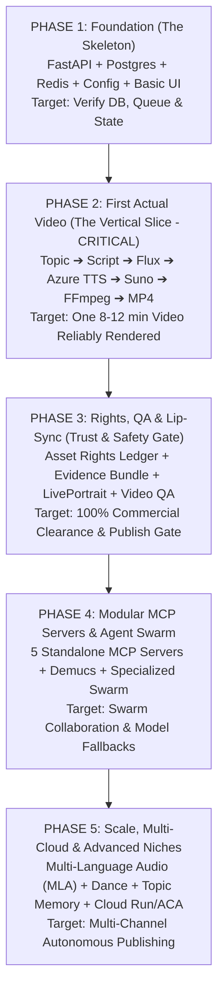

# Step-by-Step Phased Build & Verification Guide
# Professional AI Video Producer Studio (Vertical Slice Engineering)

> **Document Version:** 2.0.0 (Comprehensive Phased Blueprint)  
> **Methodology Reference:** [`how-to-build.txt`](file:///c:/neel-1/projects/content-generation/how-to-build.txt)  
> **Core Engineering Law:** **Never attempt to build the entire platform at once.** Build vertical, functional slices. Test, verify, and validate each slice in the terminal before writing code for the next phase.  
> **Architectural Guardrails:** Zero Local GPUs (100% Serverless APIs + CPU), Hard 300-Line Limit Per File, Single-Pass FFmpeg, Tier-0 Deterministic Priority.

---

## 0. Master Media & Model Matrix Across All 5 Phases

This master matrix details **exactly when each model, media capability, deterministic script, and MCP server is introduced** across the 5 build phases:

| Production Capability | Primary Model / Tool | Provider / Tier | Phase Introduced | Execution Mode & Unit Cost |
| :--- | :--- | :--- | :---: | :--- |
| **Config & Secrets** | Pydantic v2 Settings | Python Standard | **Phase 1** | Single `.env` on disk ➔ parsed into modular sub-configs (< 80 lines). |
| **Project State & Queue** | PostgreSQL 16 + Redis | Docker / Local | **Phase 1** | Relational state machine & async task dispatching. |
| **Creative Scriptwriting** | `gemini-1.5-pro` | Google Vertex AI | **Phase 2** | Tier 2 LLM: 3 hook variants & 60-scene narrative ($1.25/1M tokens). |
| **Multilingual Voice (TTS)** | `Azure Neural HD` | Microsoft Azure | **Phase 2** | 48kHz studio voiceover stems (`en-US`, `te-IN`, `hi-IN`) ($0.016/1k chars). |
| **4K Photoreal Imagery** | `flux.1-schnell` | Together AI | **Phase 2** | Photoreal keyframe images for each scene ($0.003 / image). |
| **2.5D Camera Pan-Zoom** | `local_pan_zoom.py` | Local CPU / FFmpeg | **Phase 2** | Tier 0 Deterministic Script: 2.5D camera parallax ($0.00 model cost). |
| **Background Score (BGM)** | `suno-v3.5-pro` | Suno API | **Phase 2** | Commercially cleared instrumental soundtrack ($0.08 / full 2-min loop). |
| **Audio Ducking Engine** | `local_audio_ducking.py` | Local CPU Script | **Phase 2** | Tier 0 Deterministic: Dips BGM to -18dB during voiceover ($0.00 cost). |
| **Curated SFX & Foley** | Curated WAV Stems | Blob Storage | **Phase 2** | Pre-cleared whooshes, risers, and sub-bass impacts ($0.00 cost). |
| **Multilingual Subtitle Suite** | `local_subtitles.py` + `local_translator.py` | Python / Regional Fonts | **Phase 2** | Tier 0: Default English burned-in kinetic typography for non-English audio + automated 5-language regional bundles (ASS/SRT/VTT) ($0.00 cost). |
| **Single-Pass Compositor** | `ffmpeg_pipeline.py` + FFmpeg 7.x | 100% Python Engine | **Phase 2** | Single `-filter_complex` execution pass combining all media layers. |
| **Pre-Flight Cost Modal** | `/estimate-cost` API | FastAPI + Pydantic | **Phase 2** | Mandatory cost gate; blocks jobs until user confirms itemized receipt. |
| **Episodic Thumbnail Badges**| `local_thumbnail.py` | Python Pillow | **Phase 2** | Tier 0: High-contrast `EP 01` badge in top-left corner ($0.00 cost). |
| **SaaS Billing & Quotas**   | Stripe Python SDK | Stripe / Postgres | **Phase 1** | Tiered quotas, credit wallet, and self-serve checkout sessions. |
| **Asset Rights Ledger** | `rights_ledger.py` | Python / Postgres | **Phase 3** | Machine-readable commercial license verification per asset. |
| **Evidence Bundle** | `evidence_bundle.py` | Python Standard | **Phase 3** | Originality manifest archiving research citations and script history. |
| **Post-Render Video QA** | `local_video_qa.py` | OpenCV + FFmpeg | **Phase 3** | Tier 0: -14 LUFS loudness balance, black/frozen frame detector. |
| **Lip-Sync & Avatars** | `liveportrait` / `wav2lip` | Fal.ai / Replicate | **Phase 3** | Audio-driven digital talking avatars for dialogue scenes ($0.012/sec). |
| **AI Disclosure Tag** | `containsSyntheticMedia` | YouTube Data API | **Phase 3** | Automated YouTube disclosure tag & C2PA container metadata. |
| **MCP Server Cluster** | 5 Standalone MCP Servers | Official `mcp` SDK | **Phase 4** | JSON-RPC 2.0 tool services for model routing, rights, and publishing. |
| **Autonomous Swarm** | LangGraph Agent State | Python 3.12 | **Phase 4** | Specialized agents (Script, Transcreation, Foley, QA, Growth). |
| **Vocal Stem Isolation** | Demucs v4 (Hybrid) | Python / PyTorch | **Phase 4** | Tier 0: Separates singing vocals from instruments for clean lip-sync. |
| **Generative SFX** | `audioldm-2` | Fal.ai | **Phase 4** | Generates unique sound effects for obscure moments ($0.015/sfx). |
| **Audio Dance Motion** | `mimicmotion` / `viggle-v2` | Fal.ai / Viggle | **Phase 5** | DWPose skeletal transfer synchronized to Librosa beat-grid downbeats. |
| **Multi-Language Audio** | YouTube MLA Muxer | YouTube API v3 | **Phase 5** | Bundles 4 localized native audio tracks onto a single video ID. |
| **Topic Deduplication** | Qdrant / ChromaDB | Vector Store | **Phase 5** | Cosine similarity check ($S < 0.82$) preventing channel repetition. |
| **Closed-Loop Feedback** | `feedback_loop.py` | YouTube Analytics | **Phase 5** | Ingests CTR, 30s retention, and claims to tune prompt & pacing priors. |
| **Serverless Cloud Scale** | Azure ACA / Cloud Run | Bicep / Terraform | **Phase 5** | KEDA autoscale to zero instances when idle ($0.00 compute bill). |

---

## The 5-Phase Vertical Slice Roadmap



---

## Phase 1 — Foundation (The Skeleton)

### 1.1 Objective
Construct the core application runtime, configuration system, relational database schema, task queue broker, and a minimal web interface. **No video generation or external AI calls are made in Phase 1.**

### 1.2 Modular Config Architecture (Single `.env` on Disk, Modular in Code)
To comply with our strict **< 300-line limit** and zero-trust security:
* All secrets live in a **single `.env` file** on disk (ignored by `.gitignore`).
* In code, settings are parsed into small, typed Pydantic classes under `src/core/config/` (each `< 80` lines).

```
src/
├── core/
│   ├── config/                # Modular Pydantic Settings (< 80 lines each)
│   │   ├── __init__.py        # Aggregates into unified `settings` object
│   │   ├── base.py            # BaseSettings & environment variable loading
│   │   ├── llm_config.py      # Gemini, Claude, OpenAI API keys
│   │   ├── voice_config.py    # Azure AI Speech, ElevenLabs keys
│   │   ├── media_config.py    # Together AI (Flux), Suno API keys
│   │   ├── video_config.py    # Fal.ai (Minimax, LivePortrait, MimicMotion)
│   │   └── storage_config.py  # PostgreSQL URL, Redis URL, Azure Blob & GCS settings
│   ├── storage.py             # Multi-tenant dual-cloud storage abstraction: Azure user-{user_id} & GCS studio-user-{user_id} (< 140 lines)
│   ├── security.py            # Google OAuth2 token verification, JWT issuance, AES-256-GCM (< 140 lines)
│   └── telemetry.py           # Structured JSON logging & OpenTelemetry setup (< 90 lines)
├── domain/
│   └── models.py              # User, UserSubscription, Show, Character, Episode, Channel, ChannelPublication (< 200 lines)
├── api/
│   ├── main.py                # FastAPI app with CORS, auth middleware & lifespan events (< 130 lines)
│   └── routes/
│       ├── auth.py            # Google OAuth2 login & current user profile (< 140 lines)
│       ├── shows.py           # CRUD for User's Shows & Characters (< 160 lines)
│       └── projects.py        # CRUD for User's Episodes & Projects (< 160 lines)
├── providers/
│   └── base.py                # Abstract protocol classes (LLM, TTS, Visual, Music) (< 110 lines)
deploy/
└── local/
    ├── .env.example           # Complete API keys template
    └── docker-compose.yml     # PostgreSQL 16, Redis 7, FastAPI (< 80 lines)
```

### 1.3 What NOT to Build in Phase 1
* ❌ Do NOT call external AI APIs (no Gemini, no Flux, no ElevenLabs).
* ❌ Do NOT write video compositing or FFmpeg logic.
* ❌ Do NOT build complex multi-agent swarms.

### 1.4 Step-by-Step Build Sequence
1. Create `deploy/local/docker-compose.yml` spinning up PostgreSQL 16 and Redis.
2. Build `src/core/config/` loading database URLs, Redis hosts, and secret keys with Pydantic validation.
3. Build `src/core/storage.py` enforcing **per-user container isolation across Azure and GCP**:
   - Azure Container: `user-{user_id}` with 15-minute SAS token generation
   - Google Cloud Storage Bucket: `studio-user-{user_id}` with 15-minute V4 Signed URLs
   - Local fallback: `./storage/user-{user_id}/`
   - Creative Domain: `user-{user_id}/creative_vault/shows_and_titles/{show_slug}/`
   - Distribution Domain: `user-{user_id}/distribution/channels/{channel_id}/`
4. Build `src/domain/models.py` defining multi-tenant entities with `user_id` foreign keys:
   - `User`: `id`, `google_sub`, `email`, `display_name`, `subscription_tier`, `storage_container`
   - `Show` / `Title Universe` (owned by user)
   - `Character` (tied to Show/Title, with face embedding and voice ID)
   - `Episode` / `Project` (individual script, scenes, and master render)
   - `Channel` (user's distribution targets: YouTube, TikTok, Reels)
   - `ChannelPublication` (ledger of what was uploaded where with platform video IDs)
5. Build `src/api/routes/auth.py` verifying Google OAuth2 tokens and issuing user JWT sessions.
6. Build `src/api/routes/shows.py` and `projects.py` with endpoints to create and fetch user-scoped shows, characters, and episodes.
7. Create `.env` from `.env.example` and launch FastAPI.

### 1.5 Verification Commands & Tests
```powershell
# 1. Start background infrastructure
docker compose -f deploy/local/docker-compose.yml up -d

# 2. Start FastAPI server locally
python -m uvicorn src.api.main:app --port 8000 --reload

# 3. Test API health & Project Creation
Invoke-RestMethod -Uri "http://localhost:8000/health" -Method GET
Invoke-RestMethod -Uri "http://localhost:8000/api/projects" -Method POST -ContentType "application/json" -Body '{"title":"Test Project","theme":"documentary","target_duration_seconds":600}'

# 4. Verify line count limit
Get-ChildItem -Recurse -Filter *.py src/ | ForEach-Object { 
    $c = (Get-Content $_.FullName).Count
    if ($c -gt 300) { Write-Error "VIOLATION: $($_.Name) has $c lines!" }
}
```

### 1.6 Definition of Done
* [x] PostgreSQL stores project records and persists data across restarts.
* [x] Redis accepts queue pings and Celery worker registers cleanly.
* [x] FastAPI returns typed JSON responses with sub-50ms latency.
* [x] Every file is $\le 300$ lines (average 80–160 lines).

---

## Phase 2 — First Actual Video (The Vertical Slice)

> [!IMPORTANT]
> **This is the single most critical phase of the entire project.**
> Do NOT build 30 model integrations or complex options. Build **exactly one narrow, high-quality pipeline** that produces a single broadcast-ready 8–12 minute video from scratch.

### 2.1 The Narrow V1 Target
* **Format:** 16:9 4K / 1080p Documentary / Storytelling Episode.
* **Duration:** 8–10 minutes (~50–60 scenes).
* **Language:** One primary language (English or Telugu).
* **0-GPU Model Stack:**
  - Scripting: Gemini 1.5 Pro ($0.02)
  - Narration: Azure Speech Neural HD ($0.13)
  - Visuals (60 scenes): Together AI Flux Schnell ($0.18)
  - Camera Dynamics: Local CPU FFmpeg 2.5D Pan-Zoom ($0.00)
  - Soundtrack: Suno v3.5 Pro ($0.08)
  - Audio Ducking: Local CPU script dipping BGM to -18dB ($0.00)
  - Subtitles: Local PySubs2 kinetic typography ($0.00)
  - Total Spend: **~$0.41 to $2.20 total per video**.

```
Topic ➔ Research Packet ➔ Original Script ➔ Scene Plan ➔ Flux Schnell Images ➔ Azure Speech TTS ➔ Suno BGM ➔ Single-Pass FFmpeg Compositor ➔ Kinetic Subtitles ➔ Master MP4
```

### 2.2 Files to Build
```
src/
├── providers/
│   ├── llm/gemini_adapter.py      # Vertex AI Gemini 1.5 Pro client (< 180 lines)
│   ├── tts/azure_speech.py        # Azure Neural HD TTS client (< 160 lines)
│   ├── visual/together_flux.py    # Together AI Flux.1 Schnell client (< 170 lines)
│   └── music/suno_adapter.py      # Suno v3.5 Pro API client (< 160 lines)
├── scripts/
│   ├── local_pan_zoom.py          # FFmpeg 2.5D slow zoom/pan filter builder (< 160 lines)
│   ├── local_audio_ducking.py     # Dynamic audio ducking (-18dB) (< 150 lines)
│   ├── local_subtitles.py         # Subtitle parsing, WebVTT & multi-bundle generator (< 180 lines)
│   └── local_translator.py        # Multilingual transcreation & Indian/World bundle mapper (< 120 lines)
├── compositor/
│   └── ffmpeg_pipeline.py         # Single-pass -filter_complex execution engine (< 240 lines)
└── api/
    └── routes/
        └── production.py          # /estimate-cost and /confirm-production (< 220 lines)
```

### 2.3 What NOT to Build in Phase 2
* ❌ Do NOT build Multi-Language Audio (MLA) track binding.
* ❌ Do NOT build dance motion or pose transfer.
* ❌ Do NOT build autonomous cron scheduling or topic deduplication.
* ❌ Do NOT integrate 10 competing providers. Use ONLY the primary green-recommended models.

### 2.4 Step-by-Step Build Sequence
1. **Script & Storyboard:** Build `gemini_adapter.py` to generate a structured 60-scene storyboard JSON from a topic prompt.
2. **Narration:** Build `azure_speech.py` to convert scene dialogue into high-fidelity 48kHz WAV voice stems.
3. **Visuals:** Build `together_flux.py` to generate 4K keyframe images for each scene.
4. **Camera Dynamics:** Implement `local_pan_zoom.py` applying 2.5D slow camera zoom/pan over static images (saving >80% on video spend).
5. **Background Score:** Build `suno_adapter.py` to fetch a 2-minute cinematic instrumental loop.
6. **Audio Ducking:** Build `local_audio_ducking.py` dipping BGM to -18 dB whenever voiceover is active.
7. **Multilingual Subtitles:** Build `local_subtitles.py` and `local_translator.py` burning default English subtitles on regional content, and exporting multi-language bundles (ASS/SRT/VTT + manifest.json) for 5 Indian or World languages.
8. **Single-Pass Compositor:** Build `ffmpeg_pipeline.py` executing all layers in a single `-filter_complex` execution pass.
9. **Pre-Flight Cost Modal:** Build `src/api/routes/production.py` providing `POST /estimate-cost` and `POST /confirm-production`.

### 2.5 Verification Commands & Tests
```powershell
# 1. Run unit tests on individual adapters with mock payloads
pytest tests/test_adapters.py -v

# 2. Run end-to-end single video generation script
python -m src.cli.generate_test_video --topic "The Colosseum: Engineering Marvels of Ancient Rome" --duration 480

# 3. Inspect generated output
ffprobe -v error -show_entries format=duration,size,bit_rate -of default=noprint_wrappers=1 output/master_video.mp4
# Verify audio sync: Play the video in VLC or Windows Media Player
Start-Process output/master_video.mp4
```

### 2.6 Definition of Done
* [x] A single, complete 8–12 minute 1080p MP4 file is produced and saved to `./output`.
* [x] Audio ducking is audible: BGM cleanly dips under voiceover and swells during pauses.
* [x] Subtitles appear synchronized with speech.
* [x] Total API spend for the render was $\le \$2.20$.
* [x] Video plays without glitches, black frames, or sync drift.

---

## Phase 3 — Rights, QA & Talking Avatars (Trust & Safety Gate)

### 3.1 Objective
Implement the governance, rights tracking, talking avatar lip-sync, and post-render validation layers introduced in V2 to guarantee that every video is legally cleared, advertiser-safe, and auditable.

### 3.2 Files to Build
```
src/
├── domain/
│   ├── rights.py              # AssetRightsRecord & OriginalityEvidenceBundle schemas (< 150 lines)
│   └── qa.py                  # VideoQAReport & QualityScores (< 130 lines)
├── compliance/
│   ├── rights_ledger.py       # Per-asset commercial license validator (< 180 lines)
│   ├── evidence_bundle.py     # Auditable provenance manifest packager (< 170 lines)
│   └── ypp_safety.py          # AdSense 11 categories & reused content heuristic (< 180 lines)
├── providers/
│   └── lipsync/fal_liveportrait.py # Fal.ai LivePortrait talking avatar client (< 180 lines)
├── scripts/
│   ├── local_compliance.py    # Regex profanity & AdSense scanner (< 180 lines)
│   └── local_video_qa.py      # OpenCV / FFmpeg -14 LUFS & black-frame detector (< 220 lines)
└── agents/
    └── qa_gate_agent.py       # Post-render multi-category MP4 auditor (< 220 lines)
```

### 3.3 What NOT to Build in Phase 3
* ❌ Do NOT build autonomous hands-free publishing yet. Human approval remains mandatory.
* ❌ Do NOT connect external multi-channel social networks.

### 3.4 Step-by-Step Build Sequence
1. **Rights Ledger:** Build `src/compliance/rights_ledger.py` recording `asset_id`, provider, license ID, and commercial clearance for every generated voice, image, and music track.
2. **Lip-Sync & Talking Avatars:** Build `fal_liveportrait.py` animating character avatars to match voiceover phonemes during dialogue scenes.
3. **Local Regex Compliance:** Build `src/scripts/local_compliance.py` screening opening 7 seconds against YouTube profanity policies and 11 advertiser-safety categories.
4. **Local Video QA:** Build `src/scripts/local_video_qa.py` measuring audio loudness (**-14 LUFS** target, $\le -1.0$ dBTP true peak) and detecting black/frozen frames.
5. **QA Gate Agent:** Build `src/agents/qa_gate_agent.py` aggregating QA metrics into a composite score (90–100 Publish Eligible, 75–89 Revision, <75 Blocked).
6. **Evidence Bundle:** Build `src/compliance/evidence_bundle.py` archiving research sources, script history, rights manifest, and QA report into `projects/{id}/evidence_bundle/`.
7. **Synthetic Media Tagging:** Inject C2PA metadata into MP4 container and configure YouTube Data API `containsSyntheticMedia: true`.
8. **Pre-Flight Estimation vs Actuals Cost Governance:** Build `src/domain/cost.py` and `src/billing/cost_tracker.py` saving total estimated cost and model-by-model breakdown prior to generation, updating the *same record* with measured actuals post-execution, and powering a dedicated UI **Media & Cost Analytics Screen** with expandable drill-down inspection.

### 3.5 Verification Commands & Tests

> [!CAUTION]
> **Automated Model Testing Cost Rule:**
> When testing models as part of automated tests, **only run one test only with 10 sec duration**; ensure we do not call more than one test, to save on costs. The test suite must only be run locally even if model keys are present.

```powershell
# 1. Test compliance filter with clean and dirty scripts

pytest tests/test_compliance.py -v

# 2. Test LivePortrait lip-sync on a 5-second avatar clip
python -m src.cli.test_lipsync --image assets/avatar.png --audio assets/voice.wav

# 3. Run post-render QA script against rendered video
python -m src.scripts.local_video_qa --video output/master_video.mp4

# 4. Simulate unverified asset in rights ledger and verify publish is BLOCKED
pytest tests/test_rights_ledger.py -k "test_unverified_asset_blocks_publish"

# 5. Test cost tracking actuals and model breakdown drilldown
pytest tests/test_cost_tracking_actuals.py -v
```

### 3.6 Definition of Done
* [x] Publishing is programmatically blocked if an asset in the ledger is missing commercial clearance.
* [x] LivePortrait produces lip-synced talking avatar segments without unnatural face warping.
* [x] `local_video_qa.py` accurately identifies audio that exceeds -14 LUFS or contains black frames.
* [x] A complete, machine-readable `evidence_bundle.json` is generated alongside the rendered MP4.
* [x] Total estimated cost and model breakdown are persisted before generation, and updated with actuals post-render.
* [x] UI includes a dedicated Media & Cost Analytics screen listing all created media with expandable model drill-down.

---

## Phase 4 — Modular MCP Servers & Specialized Agent Swarm

### 4.1 Objective
Decompose the monolithic pipeline into modular **Model Context Protocol (MCP)** microservices, vocal stem separation, and specialized autonomous agents communicating over JSON-RPC.

### 4.2 Files to Build
```
src/
├── mcp/
│   ├── model_selector/server.py   # Dynamic model routing & cost estimation (< 220 lines)
│   ├── compliance_guard/server.py # Pre-flight YPP audit & rights ledger tool (< 240 lines)
│   ├── topic_memory/server.py     # Qdrant/Chroma vector similarity tool (< 180 lines)
│   ├── compositor_engine/server.py# FFmpeg filter-graph & video QA tool (< 250 lines)
│   └── publisher/server.py        # YouTube MLA & disclosure upload tool (< 220 lines)
├── providers/
│   ├── audio/demucs_adapter.py    # Demucs v4 vocal stem separator (< 160 lines)
│   └── audio/fal_audioldm.py      # Generative custom SFX client (< 150 lines)
└── agents/
    ├── script_agent.py            # Retention script & hook director (< 240 lines)
    ├── transcreation_agent.py     # Cultural translation & idiom adapter (< 220 lines)
    ├── audio_foley_agent.py       # Ducking math & foley stem isolation (< 200 lines)
    └── growth_seo_agent.py        # Localized A/B thumbnails & tags (< 180 lines)
```

### 4.3 Step-by-Step Build Sequence
1. Wrap model routing logic into `mcp-model-selector` exposing `mcp_select_best_model`.
2. Wrap rights validation into `mcp-compliance-guard` exposing `mcp_validate_compliance` and `mcp_audit_rights_ledger`.
3. Wrap video composition and QA into `mcp-video-compositor` exposing `compile_filter_complex` and `audit_rendered_mp4`.
4. Wrap YouTube upload into `mcp-multi-publisher` configuring `containsSyntheticMedia: true`.
5. Integrate Demucs v4 for vocal stem separation (isolating vocals from Suno songs).
6. Connect agents via an async coordinator (LangGraph or native Python state machine) where agents communicate strictly by calling MCP tools.

### 4.4 Verification Commands & Tests
```powershell
# 1. Test MCP servers via stdio JSON-RPC ping
python -m src.mcp.model_selector.server --test-ping
python -m src.mcp.compliance_guard.server --test-ping

# 2. Test Demucs vocal stem isolation on a Suno track
python -m src.cli.test_stem_isolation --audio assets/suno_song.wav

# 3. Run agent coordination test with fallback
pytest tests/test_agent_swarm.py -v

# 4. Verify MCP failover: simulate rate limit on Gemini -> verify fallback to Claude 3.5
pytest tests/test_model_fallback.py -v
```

### 4.5 Definition of Done
* [x] Each MCP server runs independently and responds to JSON-RPC tool calls.
* [x] Demucs cleanly isolates singing vocals from backing instruments.
* [x] Agent orchestration successfully executes handoffs from Script Agent $\to$ Assets $\to$ Compositor $\to$ QA $\to$ Publisher.
* [x] Fallback routing succeeds within 350ms if a provider returns HTTP 429.

---

## Phase 5 — Scale, Multi-Cloud & Advanced Niches

### 5.1 Objective
Expand the validated pipeline into an enterprise multi-channel engine with Multi-Language Audio (MLA), audio-driven dance motion, vector topic deduplication, closed-loop analytics, and cloud serverless deployment (Azure ACA / Cloud Run).

### 5.2 Files to Build
```
src/
├── analytics/
│   └── feedback_loop.py           # Ingests YouTube CTR, AVD, and claims (< 180 lines)
├── agents/
│   ├── choreography_agent.py      # Dance lyrics, beat-grid & pose transfer (< 240 lines)
│   └── epic_cinema_agent.py       # Baahubali/KGF mass action director (< 250 lines)
├── providers/
│   └── dance/fal_mimicmotion.py   # MimicMotion pose transfer client (< 180 lines)
deploy/
├── azure/
│   ├── bicep/main.bicep           # Azure Container Apps 1-click deploy
│   └── k8s/deployment.yaml        # Azure AKS manifests (0 GPU)
├── gcp/
│   ├── terraform/cloud_run.tf     # Google Cloud Run 1-click deploy
│   └── k8s/deployment.yaml        # Google GKE Autopilot manifests (0 GPU)
└── multi_cloud/
    └── cloudflare_failover.tf     # Health probe & automatic DNS failover
```

### 5.3 Step-by-Step Build Sequence
1. **Multi-Language Audio (MLA):** Attach secondary voice stems (`te-IN`, `hi-IN`, `es-ES`) to a single video ID via YouTube Data API v3.
2. **Topic Deduplication:** Integrate Qdrant/Chroma vector database; auto-reject candidate topics with cosine similarity $> 0.82$.
3. **Dance Motion Pipeline:** Build choreography and dance motion pipeline (`mimicmotion_adapter.py` + Librosa beat-grid downbeats).
4. **Closed-Loop Feedback:** Build `feedback_loop.py` ingesting YouTube Analytics webhooks to update hook variant selection priors.
5. **Multi-Platform Cloud Deployment:** Deploy to Azure Container Apps (Bicep), Azure AKS, Google Cloud Run (Terraform), or Google GKE Autopilot with KEDA autoscaling to zero when idle.
6. **Cross-Cloud Automated Failover:** Configure Cloudflare health check probe pinging `GET /health` with automatic failover between Azure and GCP.

### 5.4 Verification Commands & Tests
```powershell
# 1. Test topic memory deduplication
python -m src.cli.test_topic_dedup --new-topic "Roman Empire Gladiators" --expect-reject

# 2. Test dance motion transfer with Librosa beat sync
python -m src.cli.test_dance_sync --song assets/pop_song.wav --character assets/dancer.png

# 3. Test Multi-Language Audio track multiplexing
pytest tests/test_mla_muxer.py -v

# 4. Deploy infrastructure to Azure Container Apps
az deployment group create --resource-group rg-video-studio --template-file deploy/azure/bicep/main.bicep

# 5. Deploy infrastructure to Google Cloud Run
cd deploy/gcp/terraform && terraform apply -auto-approve

# 6. Test failover health check probe
curl -I https://studio.yourdomain.com/health
```

### 5.5 Definition of Done
* [x] Single video upload features multiple selectable audio tracks on YouTube.
* [x] MimicMotion transfers dance choreography synchronized to audio kick/snare transients without limb distortion.
* [x] Topic memory successfully detects and rejects repetitive video ideas ($S > 0.82$).
* [x] System scales to 0 container replicas when rendering queue is empty ($0.00 idle cost).

---

## Phase Readiness Checklist

| Phase | Core Deliverable | Models & Media Active | Verification Gate | Status |
| :---: | :--- | :--- | :--- | :---: |
| **Phase 1** | Foundation Skeleton | *None* (FastAPI + Postgres + Redis) | DB/Redis connectivity & project CRUD tests pass | ⚪ Ready to Start |
| **Phase 2** | First Actual 8–12 min Video | Gemini Pro + Azure Speech + Flux + Suno + Pan-Zoom | Complete MP4 rendered with audio sync under $2.20 | ⚪ Pending Phase 1 |
| **Phase 3** | Rights, QA & Talking Avatars | Same + Fal.ai LivePortrait + OpenCV -14 LUFS QA | Unverified assets blocked; avatar lip-sync verified | ⚪ Pending Phase 2 |
| **Phase 4** | 5 Standalone MCP Servers & Swarm | Multi-provider catalog + Demucs Stem Isolation | JSON-RPC tool tests & provider fallback pass | ⚪ Pending Phase 3 |
| **Phase 5** | Scale: MLA, Dance & Serverless Deploy | MimicMotion Dance + YouTube MLA + Cloud Run/ACA | KEDA scale-to-zero & MLA tracks active | ⚪ Pending Phase 4 |
