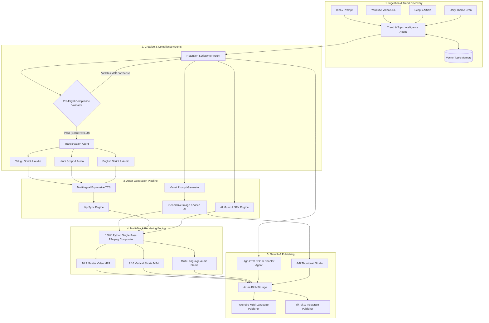
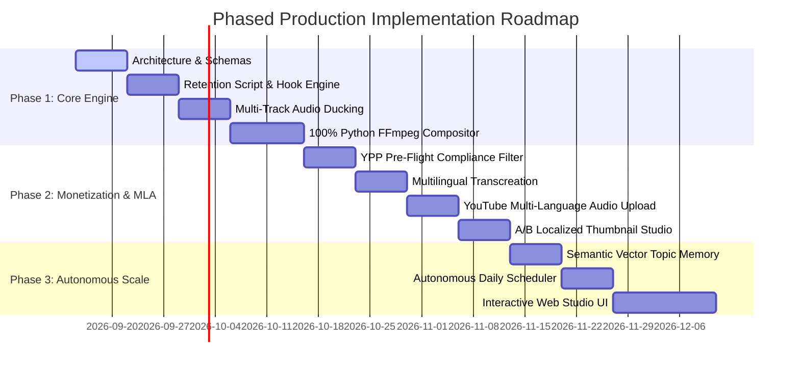

# Master System Specification & Architecture Blueprint
# Professional AI Video Producer Studio (YPP Monetization-Readiness & Risk Management)

> **Document Version:** 2.0.0 (Monetization-Ready Production Blueprint)  
> **Status:** Production-Oriented Architectural Planning  
> **Target Platforms:** YouTube (Long-Form & Shorts), TikTok, Instagram Reels, Facebook Reels  
> **Core Objective:** Build a commercial-grade, multi-agent AI video production platform engineered for original, high-retention video production, rights traceability, brand safety, editorial quality, and strong YPP monetization readiness. The platform reduces monetization risk but does not guarantee YPP approval, ad suitability, reach, or revenue.

---

## Table of Contents
1. [Executive Summary & Core Value Proposition](#1-executive-summary--core-value-proposition)
2. [YouTube Monetization & YPP Compliance Framework](#2-youtube-monetization--ypp-compliance-framework)
   - 2.1 The Reused & Repetitious Content Challenge
   - 2.2 Advertiser-Friendly Pre-Flight Validator (AdSense Safety)
   - 2.3 Synthetic Media Disclosure (YouTube 2024–2026 AI Policy)
   - 2.4 Commercial Rights & Copyright Clearance
3. [Viral Retention & Algorithmic Growth Engineering](#3-viral-retention--algorithmic-growth-engineering)
   - 3.1 The 3-Second Hook Engine
   - 3.2 Dynamic Visual Pacing & Multi-Track Compositing
   - 3.3 Audio Ducking & Sound Design Architecture
   - 3.4 Kinetic Subtitles (Hormozi-Style Typography)
4. [Multilingual Transcreation & YouTube Multi-Language Audio (MLA)](#4-multilingual-transcreation--youtube-multi-language-audio-mla)
   - 4.1 Native Multi-Language Audio Integration (Single Video Upload)
   - 4.2 Cultural Transcreation vs. Literal Translation
   - 4.3 Cadence Matching & Lip-Sync Engine
   - 4.4 Localized A/B Thumbnail Studio & Typography
5. [Cinematic Grandeur & Epic World-Building Engine (Baahubali, KGF, Salaar, Game of Thrones)](#5-cinematic-grandeur--epic-world-building-engine-baahubali-kgf-salaar-game-of-thrones)
   - 5.1 Colossal Scale & Mythological/Dystopian Environments
   - 5.2 The Hero Elevation & Mass Action Framework (120fps Slow-Mo & Bass Impacts)
   - 5.3 Character Consistency & Armor/Costume Preservation (LoRA & Face ID)
   - 5.4 Cinematic Color Grading Presets (KGF Amber/Charcoal, Baahubali Gold, GoT Winter)
   - 5.5 High-Stakes Dramatic Dialogue & Voice Acting
6. [10/10 Choreography & Cinematic Music Video Engine (Bollywood, Tollywood, Pop)](#6-1010-choreography--cinematic-music-video-engine-bollywood-tollywood-pop)
   - 6.1 AI Song Scripting & Structured Lyrical Cadence (Gemini Pro / Claude 3.5)
   - 6.2 Commercially Owned Original Hit Music Generation (Suno v3.5 / Udio v1.5)
   - 6.3 Deterministic Audio Beat-Grid & Drop Detection (Librosa Tier-0)
   - 6.4 Audio-Driven Dance Motion Generation & Skeletal Transfer (EDGE / MimicMotion)
   - 6.5 Multi-Camera Cinematic Direction & Particle Atmosphere
   - 6.6 Singing Lip-Sync & Vocal Stem Separation (Demucs + MuseTalk)
7. [Comprehensive Genre-by-Genre Feasibility & Monetization Analysis](#7-comprehensive-genre-by-genre-feasibility--monetization-analysis)
   - 7.1 [Master Genre Production Specifications (Duration, Format, Visual Style & 0-GPU Total Cost)](#71-master-genre-production-specifications-duration-format-visual-style--0-gpu-total-cost)
8. [10/10 Kids & Family Animation Studio (Panchatantra, Moral Fables, Pixar-Grade Cultural Stories)](#8-1010-kids--family-animation-studio-panchatantra-moral-fables-pixar-grade-cultural-stories)
   - 8.1 The "Co-Viewing / Family Friendly" Strategy (Bypassing Low-CPM COPPA Penalties)
   - 8.2 YouTube Kids Quality Principles Compliance Engine
   - 8.3 3D Pixar / Disney-Grade Character Consistency Pipeline
   - 8.4 Hyper-Expressive Character Voices & Cartoony Foley Sound Design
   - 8.5 Interactive Sing-Along Kinetic Typography
9. [Autonomous Scheduling & Semantic Vector Topic Memory](#9-autonomous-scheduling--semantic-vector-topic-memory)
   - 9.1 The Topic Repetition Problem
   - 9.2 Vector Similarity Deduplication (Cosine Thresholds)
   - 9.3 Automated Trend Discovery Pipeline
10. [Dual-Operating Modes: Autonomous vs. Co-Pilot Studio](#10-dual-operating-modes-autonomous-vs-co-pilot-studio)
11. [System Architecture & Agentic Workflow](#11-system-architecture--agentic-workflow)
    - 11.1 Multi-Agent Orchestration Diagram (Mermaid)
    - 11.2 Backend Data Pipeline & Azure Storage Structure
    - 11.3 Domain Data Models (Pydantic / DB Entities)
12. [Interactive Web Studio UI / UX Specification](#12-interactive-web-studio-ui--ux-specification)
    - 12.1 Mandatory Pre-Flight Cost Estimation & Confirmation Modal (CRITICAL)
    - 12.2 Media & Cost Analytics Screen (Predicted vs. Actuals Drill-Down)
    - 12.3 Commercial SaaS Subscription Management & Billing Architecture
13. [REST API & MCP Tool Specifications](#13-rest-api--mcp-tool-specifications)
    - 13.1 Core REST Endpoints
    - 13.2 Dedicated Model Selector MCP Server (`mcp-model-selector`)
14. [Technology Stack & Third-Party Integrations](#14-technology-stack--third-party-integrations)
15. [Phased Implementation Roadmap & Risk Matrix](#15-phased-implementation-roadmap--risk-matrix)

---

## 1. Executive Summary & Core Value Proposition

Most AI video generators produce generic, low-effort slideshows: static images, unvarying camera angles, robotic text-to-speech voices, and scraped Wikipedia scripts. Platforms like YouTube, TikTok, and Instagram have implemented aggressive automated detection systems that categorize this content as **"Reused Content"**, **"Repetitious Content"**, or **"Low-Effort Automated Content"**, leading to instant demonetization or algorithmic suppression.

The **Professional AI Video Producer Studio** solves this at the architectural level. It is designed to act as an automated production studio that produces **multi-layered, human-grade, high-retention video content** that is designed to maximize monetization readiness on YouTube and other platforms while preserving meaningful editorial and creative value.


### 1.1 Non-Negotiable Product Principles

1. **No monetization guarantees.** The system provides readiness/risk scoring and evidence, not approval promises.
2. **Original value over automation volume.** More AI assets or faster cuts do not automatically make content original or monetizable.
3. **Human editorial ownership.** The creator/director remains the final authority on narrative, factual framing, taste, and publication.
4. **Rights by asset, not by provider name.** Every asset carries its own provenance and commercial-use evidence.
5. **QA after rendering.** The final MP4—not only the script—is tested before publication.
6. **Measure real outcomes.** Post-upload performance and claims feed back into production decisions.
7. **Build V1 narrowly.** Reliability and repeatable quality come before autonomous scale.

### Key Innovations:
1. **YPP Monetization Readiness & Risk Assessment:** Pre-flight and post-render validators identify reused/repetitious-content risk, advertiser-safety risk, rights gaps, disclosure requirements, and quality defects. Results are risk indicators—not a guarantee of YPP approval.
2. **YouTube Multi-Language Audio (MLA):** Uploads a single master video containing multiple native audio tracks (Telugu, Hindi, English, Spanish, etc.), consolidating global views and algorithm ranking onto a single video.
3. **Multi-Track Compositing:** Combines A-roll digital actors/avatars, dynamic B-roll cuts every 2.5–4 seconds, intelligent audio ducking (-18dB during voiceover), and kinetic pop-up typography.
4. **Zero-Repetition Semantic Topic Memory:** Uses vector embeddings to prevent repetitive content across daily automated runs.
5. **A/B Localized Thumbnail Studio:** Produces high-contrast, emotion-driven thumbnail variations rendered in regional typography (e.g., Telugu, Devanagari) for YouTube's Test & Compare feature.

---

## 2. YouTube Monetization & YPP Compliance Framework

```
                  ┌──────────────────────────────────────────────┐
                  │       INPUT TOPIC / SCRIPT / REFERENCE       │
                  └──────────────────────┬───────────────────────┘
                                         │
                                         ▼
                  ┌──────────────────────────────────────────────┐
                  │    PRE-FLIGHT COMPLIANCE VALIDATOR (AI)      │
                  │  • Reused Content Heuristic Score ( > 0.85 ) │
                  │  • Advertiser-Friendly AdSense Audit (Pass)  │
                  │  • Copyright / Trademark Keyword Filter      │
                  │  • Commercial Asset License Verification     │
                  └──────────────────────┬───────────────────────┘
                                         │ Passed
                                         ▼
                  ┌──────────────────────────────────────────────┐
                  │       MULTI-LAYER PRODUCTION PIPELINE        │
                  │  • Original Narrative & Scene Breakdown      │
                  │  • Commercially Cleared TTS & BGM Scoring    │
                  │  • B-Roll Cut Pacing (Every 2.5 - 4 seconds) │
                  │  • Audio Ducking (-18dB) + SFX Layering      │
                  └──────────────────────┬───────────────────────┘
                                         │
                                         ▼
                  ┌──────────────────────────────────────────────┐
                  │          DISTRIBUTION & YOUTUBE API          │
                  │  • `syntheticMedia: true` flag declared      │
                  │  • Multi-Language Audio Tracks attached      │
                  │  • A/B Localized Thumbnails & Chapters       │
                  │  • Pinned Comment with Affiliate Disclosures │
                  └──────────────────────────────────────────────┘
```

### 2.1 The Reused & Repetitious Content Challenge
YouTube Partner Program (YPP) guidelines state:
> *"Reused content refers to channels that repurpose someone else's content without adding significant original commentary or educational value. Repetitious content refers to content that appears mass-produced or generated without individual care."*

#### System Safeguards:
* **2-Stage Transformative Ingestion & Anti-Mimicking Engine:** When ingesting a YouTube reference URL, script, or competitor video:
  - **Stage 1 (Idea & Tension Distillation - Gemini Flash):** The system purges all narrative text, character names, and dialogue. It extracts *only* abstract metadata: core theme, genre, format pacing, psychological tension, and factual anchors.
  - **Stage 2 (100% Brand-New Original IP Synthesis - Gemini Pro / Claude 3.5):** Synthesizes a completely original narrative using the user's persistent characters from their Creative Vault (`creative_vault/`). It enforces strict negative constraints forbidding borrowed dialogue, joke formulas, or scene beats—guaranteeing 100% original, copyright-cleared, and YPP-monetizable IP.
* **Non-Repetitive Visual Architecture:** No two consecutive scenes may share the same camera angle, transition, or background style.
* **Human-in-the-Loop Override:** The Studio UI allows the creator to edit lines, swap B-roll, or re-record voice segments in seconds before the final composite.
* **Creative Director / Editorial Layer:** Every project receives a deliberate editorial plan covering the thesis, audience promise, narrative arc, evidence selection, scene intent, visual motifs, pacing changes, and ending. The system must not equate “many cuts” with originality; meaningful commentary, storytelling, analysis, education, or entertainment value is the primary quality signal.
* **Reference Separation:** Reference videos, articles, transcripts, and images are treated as research inputs, not source material to be reproduced. The system stores source provenance and generates an independent narrative/visual plan.
* **Originality Evidence Bundle:** Before publication, the project records the research sources consulted, original script version, scene plan, generated/edited asset manifest, editorial decisions, and final QA result. This creates an auditable record of how the finished video was produced.

### 2.2 Advertiser-Friendly Pre-Flight Validator (AdSense Safety)
Before rendering, the script is evaluated against YouTube's 11 advertiser-friendly categories:
1. **Profanity & Vulgarity:** Monitored against YouTube's opening-30-seconds rule (strict ban on profanity in the first 7 seconds).
2. **Violence & Shock Value:** Visual prompts filtered to exclude graphic depictions.
3. **Sensitive Events:** Scans for prohibited political, disaster, or tragic events.
4. **Hate Speech & Harassment:** Zero-tolerance semantic scan.
5. **Medical Misinformation:** Verified against platform claims rules.
6. **Advertiser Safety Score ($0.0 - 1.0$):** Scores below $0.90$ generate an alert requiring script revision.

### 2.3 Synthetic Media Disclosure (YouTube 2024–2026 AI Policy)
YouTube requires creators to disclose realistic AI/synthetic media. Failing to disclose can lead to demonetization, video takedown, or channel strikes.
* **Automated Upload Payload:** The publishing service automatically configures YouTube Data API v3 upload parameters:
  ```json
  {
    "status": {
      "privacyStatus": "public",
      "selfDeclaredMadeForKids": false,
      "containsSyntheticMedia": true
    }
  }
  ```
* **C2PA Metadata:** Output MP4 containers are injected with C2PA metadata describing AI generation provenance.

### 2.4 Commercial Rights & Copyright Clearance
* **Voice Synthesis:** Strict API keys for commercial licenses (ElevenLabs Commercial tier, Azure Speech Enterprise).
* **Music & Audio Scoring:** Minimize Content ID and copyright-claim risk by using assets whose current license explicitly permits the intended commercial use. No provider, fingerprinting check, or AI-generation workflow can guarantee zero claims. Store license evidence and provider terms with every asset.
* **Visuals:** Stock footage and generated visuals are accepted only after provider-specific commercial-use terms are recorded. License status must be evaluated per asset, model, plan, date, and intended use rather than assumed globally.

---

## 3. Viral Retention & Algorithmic Growth Engineering

Monetization requires views. The YouTube recommendation engine rewards two core metrics above all else: **Click-Through Rate (CTR)** and **Average View Duration (AVD)**.

```
+─────────────────────────────────────────────────────────────────────────────+
|                         RETENTION TIMELINE BLUEPRINT                        |
+─────────────────────┬─────────────────────────┬─────────────────────────────+
|  0:00 - 0:03        |  0:03 - 0:20            |  0:20 - End                 |
|  THE HOOK           |  THE STAKES & VALUE     |  RE-ENGAGEMENT CYCLES       |
|  • Curiosity Gap    |  • What viewer discovers|  • Visual cut every 2.5-4s  |
|  • Visual punch cut |  • Why staying matters  |  • Sound FX every 15-20s    |
|  • Bold question    |  • Pacing established   |  • Audio ducking dynamics   |
|  • High emotional face| • No fluff or intro   |  • Mid-video curiosity open |
+─────────────────────┴─────────────────────────┴─────────────────────────────+
```


### 2.5 Asset Rights Ledger (Mandatory)
Every externally sourced, generated, or transformed asset must have a machine-readable rights record containing:
- `asset_id`, `project_id`, provider/source, model or library, generation/download date, account/plan tier, license reference, commercial-use status, attribution requirements, restrictions, source URL/reference, and Content ID/copyright-risk notes.
- The final project stores a rights manifest alongside the rendered deliverables.
- Publishing is blocked when a required asset has unknown, expired, incompatible, or unverified commercial rights.
- Provider terms are versioned because commercial-use rights and API terms can change over time.

### 2.6 Final Video QA & Publish Gate (Mandatory)
Compliance screening is not sufficient. A **Final Video QA Agent** runs after rendering and before publication.

Automated checks include:
- face/hand/character deformation and temporal consistency
- lip-sync and multilingual timing
- subtitle spelling, punctuation, font fallback, and safe-area placement
- audio clipping, loudness balance, voice intelligibility, music ducking, and SFX peaks
- black frames, frozen frames, corrupted clips, duplicate scenes, broken transitions, and missing assets
- factual consistency against the approved research packet
- title/thumbnail/video promise alignment
- rights manifest completeness and synthetic-media disclosure requirements
- visual continuity, pacing outliers, and excessive template repetition

The QA engine returns category scores and a publish recommendation:
- **90–100:** publish eligible, subject to creator approval
- **75–89:** revision recommended
- **<75:** publication blocked pending rework

The score is an internal quality/risk signal and is not a prediction or guarantee of YouTube monetization.

### 3.1 The 3-Second Hook Engine
The opening seconds are a critical retention window. The system should test multiple hooks rather than assume a fixed retention percentage.
* The script agent generates **3 hook variants** for every video:
  1. *Curiosity Gap Hook:* "Everyone thinks X, but what actually happened behind closed doors is terrifying..."
  2. *In-Media-Res Hook:* Starts right at the climax/punchline before jumping back.
  3. *Contrarian Question Hook:* "What if everything you were told about X was an intentional lie?"

### 3.2 Dynamic Visual Pacing & Multi-Track Compositing
* **The 3-Second Rule:** The video compositor targets a 2.5–4.0 second visual-change range where appropriate, while allowing longer shots when story comprehension, emotion, or cinematic intent benefits from them.
* **Compositor Layers (100% Python Single-Pass FFmpeg Compositor):**
  - **Track 1 (Background):** Generative visuals / stock B-roll with dynamic camera motion (subtle slow zoom-in or pan-left).
  - **Track 2 (A-Roll Digital Actor):** Talking head / avatar with transparent background (LivePortrait / Wav2Lip) positioned for narrative segments.
  - **Track 3 (Overlays & Inserts):** Picture-in-picture graphics, memes, data charts, or reaction shots.
  - **Track 4 (Kinetic Subtitles):** Dynamic word-by-word animated captions.
  - **Track 5 (Audio Master):** Ducked BGM + voiceover stem + SFX cues.

### 3.3 Audio Ducking & Sound Design Architecture
* **Intelligent Audio Ducking:**
  - When voiceover speaks: BGM automatically dips to **-18 dB**.
  - During speech pauses (> 0.6s): BGM smoothly fades up to **-6 dB**.
  - During dramatic climaxes or comedic beats: BGM cut-to-silence for maximum punch.
* **Contextual SFX Ingestion:**
  - Automated placement of sound effects:
    - *Whoosh / Swoosh:* On every scene cut and text pop-up.
    - *Riser / Tension Build:* Leading up to a revelation or punchline.
    - *Sub-Bass Impact / Thud:* On key dramatic statements.
    - *Record Scratch / Ding:* On comedic punchlines (Telugu comedy, skits).

### 3.4 Kinetic Subtitles (Hormozi-Style Typography)
* Captions are burned via FFmpeg libass / ASS subtitles generated deterministically in Python:
  - 1 to 3 words displayed at a time in sync with speech.
  - Active spoken word highlighted in vibrant yellow/green with a scale bounce (1.1x).
  - Full Unicode font fallback for non-Latin languages (e.g., Telugu, Devanagari).

---

## 4. Multilingual Transcreation & YouTube Multi-Language Audio (MLA)

### 4.1 Native Multi-Language Audio Integration (Single Video Upload)
YouTube allows creators to attach **multiple audio tracks to a single video upload**.
* **Traditional Approach (Flawed):** Creator creates 4 channels (English, Hindi, Telugu, Spanish). Audience is fragmented, watch time is divided, and monetization takes 4x longer.
* **Our Multi-Language Audio Pipeline:**
  1. Render master video track (visuals + ducked BGM + SFX).
  2. Generate separate voice stems for:
     - Primary Language (e.g., Telugu)
     - Secondary Language (e.g., Hindi)
     - Global Language (e.g., English)
     - Additional Languages (e.g., Spanish, Tamil)
  3. Mix each voice stem with the BGM/SFX master into dedicated `.m4a` / `.aac` audio streams.
  4. YouTube Data API v3 uploads the video and binds the localized audio streams to the single video ID.
  5. Viewers automatically hear the audio track matching their device language.

### 4.2 Cultural Transcreation vs. Literal Translation
* Literal translation destroys humor, sarcasm, and regional timing (especially in Telugu comedy or Bollywood dance culture).
* The **Transcreation Agent**:
  - Replaces regional metaphors and idioms with culturally relevant equivalents.
  - Adapts comedic timing, punchlines, and cultural callbacks (e.g., Tollywood references in Telugu, Bollywood in Hindi).

### 4.3 Cadence Matching & Lip-Sync Engine
* Different languages require different speaking durations for the same idea (e.g., German or Telugu often takes 15–25% longer than English).
* **Dynamic Time-Stretching & Scene Padding:**
  - The compositor adjusts visual scene durations or smoothly interpolates video frames so the localized voiceover never feels rushed or truncated.
* **Audio-Driven Lip-Sync:**
  - Uses models like **Wav2Lip** or **LivePortrait** to animate digital character avatars so mouth movements match the target phonemes of the selected language.

### 4.4 Localized A/B Thumbnail Studio & Episodic Numbering Engine
* **High-CTR Compositional Rules:**
  - Subject: High-emotion expressive face (surprise, laughing, intense focus).
  - Background: High-contrast, saturated scene with depth-of-field blur.
  - Headline: 3 words maximum in high-contrast block typography.
* **Episodic Numbering Engine (Web Series & Episodic Shows):**
  - **Prominent Episode Identification Badge:** Every episodic thumbnail automatically generates a high-contrast badge (e.g., `EP 01`, `EPISODE 01`, `భాగం 01`, `भाग 01`).
  - **Standardized Non-Obscured Placement:** The episode badge is strictly positioned in the **top-left corner** (or top-right), explicitly avoiding the **bottom-right corner** where YouTube overlays the video duration timestamp pill.
  - **High-Contrast Readability at Scale:** The badge uses heavy font weights, high-contrast borders, and drop-shadows (e.g., vibrant yellow text on charcoal block with 2px white border) ensuring it remains instantly recognizable on mobile screens at only 120px display width.
  - **Localized Episodic Labels:** Automatically translated per language:
    - English: `EP 01` / `EPISODE 1`
    - Telugu: `ఎపిసోడ్ 01` / `భాగం 01`
    - Hindi: `एपیسوڈ 01` / `भाग 01`
    - Spanish: `EPISODIO 01`
* **Regional Font Support:**
  - Telugu: Custom font rendering (*Suranna*, *Ramabhadra*, *Gidugu*).
  - Hindi: Devanagari Unicode bold typography with stroke and shadow.
  - Generates 3 variants per language for YouTube's **Test & Compare** A/B thumbnail tool.

---

## 5. Cinematic Grandeur & Epic World-Building Engine (Baahubali, KGF, Salaar, Game of Thrones)

Producing epic cinematic movies requires an entirely different visual and narrative pipeline than standard YouTube videos. The studio implements a specialized **Epic Cinema Pipeline** that replicates the grandeur, tension, and high-octane "mass elevation" of global cinematic hits like *Baahubali*, *K.G.F: Chapter 1 & 2*, *Salaar: Ceasefire*, and *Game of Thrones*.

### 5.1 Colossal Scale & Mythological/Dystopian Environments
* **Mythological / Historical Grandeur (*Baahubali* / *RRR* Style):**
  - Massive architectural scales: 500-foot waterfalls (*Jalaparvatham*), colossal stone fortresses (*Mahishmati*), golden royal darbars, ancient temple courtyards, war chariot charges.
  - Lighting dynamics: Warm sunrise rims, volumetric dust shafts, royal crimson and gold velvet color accents, shimmering oil on warriors.
* **Dark Dystopian & Industrial Mass Cinema (*KGF* / *Salaar* Style):**
  - High-contrast visual language: Crushed charcoal blacks, desaturated monochromatic tones accented by blazing amber fires, sparks, and blood-red highlights.
  - Gritty environments: Coal dust storms, roaring diesel-punk industrial machinery, silhouette hero reveals against blinding tungsten backlights.
* **High-Fantasy & Medieval Intrigue (*Game of Thrones* Style):**
  - Realistic medieval grit: Weathered iron plate armor, banners flapping in sub-zero Nordic blizzards, torch-lit war council chambers, towering stone battlements, photorealistic dragon flight aerials.

### 5.2 The Hero Elevation & Mass Action Framework
The defining signature of Indian mass cinema and Hollywood epic blockbusters is the **"Hero Elevation Sequence"**:
* **The 120fps Slow-Motion Hero Stride:** Character striding forward with weapon in hand through flying embers, dust, and smoke, while background action moves at normal frame rates.
* **Speed Ramping & Impact Shockwaves:** Fast-motion camera zoom suddenly decelerating into an ultra-slow-motion weapon clash, accompanied by a micro screen shake (4px amplitude) and radial blur.
* **Bass-Boosted Audio Impact Synchronization:** 
  - Every hammer drop, sword clash, and colossal footstep triggers a sub-bass acoustic impact (35Hz–55Hz).
  - Voiceover/dialogue drops into silence for 0.8 seconds before an iconic punch dialogue ("ఇది నా రాజ్యం... / This is my kingdom...").

### 5.3 Character Consistency & Armor/Costume Preservation
Serialized movies and multi-episode epics fail if the protagonist's face or armor morphs between scenes:
* **Dual-Anchor Conditioning:** Combines **InstantID / IP-Adapter Face ID** with **Custom Character LoRAs** trained on 15–20 reference portrait angles of the protagonist.
* **Costume & Prop Persistence Tokens:** Specific visual tokens locked into prompts across all scenes (e.g., `wearing scarred black leather brigandine armor with silver wolf pauldrons, holding double-edged valyrian steel broadsword`).
* **Multi-Scale Consistency:** Ensures the same actor's likeness is preserved identically in wide battle charges, mid-torso action cuts, and intense emotional close-ups.

### 5.4 Cinematic Color Grading Presets (LUT Pipeline)
* **KGF / Salaar Preset:** Contrast +35%, Saturation -40%, Highlights Tinted Amber (`#FFAA00`), Shadows Crushed Charcoal (`#0A0A0A`).
* **Baahubali Royal Preset:** Warm Saturation +25%, Golden Highlights (`#FFD700`), Deep Regal Red Boost, Diffused Glow.
* **Game of Thrones Winter Preset:** Cool Desaturation, Teal-Blue Shadows (`#1B2A38`), Pale Skin Tones, High Sharpness, Atmospheric Mist.

### 5.5 High-Stakes Dramatic Dialogue & Voice Acting
* Scripting agent generates high-tension dialogue with philosophical undertones, imperial politics, loyalty, and betrayal.
* Voice synthesis routes to deep baritone, authoritative voices with reverberant acoustics matching castle throne rooms or cavernous mines.

---

## 6. 10/10 Choreography & Cinematic Music Video Engine (Bollywood, Tollywood, Pop)

### 6.1 AI Song Scripting & Structured Lyrical Cadence (Gemini Pro / Claude 3.5)
* **Songwriting Engine:** Generates structured lyrical scripts with metric cadence, rhyming patterns (AABB/ABAB), catchy hook phrases, and sectioned choreographic prompts.
* **Song Script Contract:** Outputs precise `SongChoreographyScript` JSON with BPM targets, instrumentation tags (e.g., dholak, whistle hook, 808 sub-bass), and dance movement instructions per musical section (Intro, Verse, Pre-Chorus, Hook Drop, Outro).

### 6.2 Commercially Owned Original Hit Music Generation (Suno v3.5 / Udio v1.5)
* **Hit Music Synthesis:** Translates the lyrical script into radio-ready songs across genres (Tollywood mass folk, Bollywood romantic duets, Punjabi bhangra, Western pop/EDM).
* **Commercial-Use Readiness:** Music is generated or licensed under a plan whose terms permit the intended commercial use. Claims and platform decisions remain possible, so rights evidence and post-upload monitoring are required.
* **Demucs Stem Isolation:** Automatically separates isolated vocal stems from the instrumental backing track for downstream phoneme lip-syncing.

### 6.3 Deterministic Audio Beat-Grid & Drop Detection (Librosa Tier-0)
* **Zero-Token Rhythm Analysis:** Python Librosa script extracts exact BPM, downbeats (kicks), upbeats (snares), and bass drop timestamps.
* **Frame-Accurate Synchronization:** Camera cuts, lighting flare pulses, and dynamic zoom punch-ins snap frame-accurately to the millisecond beat grid.

### 6.4 Audio-Driven Dance Motion Generation & Skeletal Transfer (EDGE / MimicMotion)
* **Audio-to-3D-Pose Synthesis (EDGE / MotionGPT):** Generates continuous 3D skeletal dance sequences directly conditioned on the song's audio waveform, BPM downbeats, and energy curves. Foot-contact physics ensure zero floor sliding.
* **Pose-to-Video Rendering (MimicMotion / Champ on AKS GPU):** Ingests 4K Flux character keyframes and transfers the 3D dance skeleton with consistency-focused motion transfer designed to reduce warped joints, extra fingers, and clothing distortion; final QA remains mandatory (sarees, lehengas, kurtas).
* **Pre-Indexed OpenPose Choreo Library:** Fallback library of iconic Tollywood mass steps (Allu Arjun/Jr NTR high-energy footwork) and Bollywood mudras.

### 6.5 Multi-Camera Cinematic Direction & Glamour Atmosphere
* **Cinematic Song Staging:** Intro sweeping crane shot $\to$ medium tracking steadicam $\to$ Dutch-angle pre-chorus push-in $\to$ 120fps slow-motion hero celebration on the drop.
* **Atmospheric Particles:** Festival Holi color powder, glistening monsoon rain physics, or club neon laser streaks composited over the dance scenes.

### 6.6 Singing Lip-Sync & Vocal Stem Separation (Demucs + MuseTalk)
* **Singing While Dancing:** MuseTalk / Wav2Lip applies singing mouth shapes and joyful smiles to the dancing protagonist's face using the isolated vocal stem, creating the illusion of the actor singing the song live during the dance performance.

---


## 7.0 Recommended V1 Scope (Production First, Platform Second)

The architecture is intentionally broad, but implementation should begin with a narrow production wedge. A smaller, excellent pipeline is more valuable than a large set of partially reliable agents.

### V1 Recommended Format
**8–12 minute cinematic documentary / storytelling episode, 16:9, one primary language, with optional English localization after the master is approved.**

V1 should include:
1. Topic/research packet with source provenance.
2. Original narrative + 3 hook variants.
3. Scene-by-scene visual plan.
4. Commercial-rights validation and Asset Rights Ledger.
5. TTS voice + BGM/SFX mixing.
6. Image-based B-roll with selective AI motion for hero shots.
7. Remotion/FFmpeg compositor.
8. Captions and thumbnail generation.
9. Final Video QA Agent.
10. Human Director approval.
11. YouTube packaging and publishing.
12. Post-publication monitoring for claims, processing failures, and performance.

### Defer Until V1 Is Stable
- multi-language audio at scale
- autonomous daily publishing
- music-video dance generation
- kids-specific pipelines
- multi-cloud Kubernetes
- large provider catalogs
- complex multi-agent swarms
- automatic publishing without human approval

These can be added after the core pipeline consistently produces videos that pass editorial QA and demonstrate viewer satisfaction.

### Definition of Done for V1
A V1 production is considered successful only when:
- the final render passes technical QA;
- every monetizable asset has rights evidence;
- synthetic-media disclosure requirements are evaluated and applied when applicable;
- the script and visuals demonstrate meaningful original value;
- the creator approves the final cut;
- title/thumbnail/description accurately represent the video;
- production cost and runtime are recorded;
- post-upload claims and performance are observable.

## 7. Comprehensive Genre-by-Genre Feasibility & Monetization Analysis

| Genre / Niche | Feasibility in Studio | How It Produces It Professionally | Monetization Potential |
| :--- | :---: | :--- | :--- |
| **Epic Cinema & Grandeur Movies (*Baahubali, KGF, Salaar, Game of Thrones*)** | ⭐⭐⭐⭐⭐ **(9.8/10)** | Colossal world-building, 120fps slow-mo hero elevation walks, bass-boosted impact SFX, color grading LUTs (KGF Amber/Charcoal, Baahubali Gold), and LoRA character/armor consistency. | **Astronomical:** Strong potential for episodic storytelling, sponsorships, and audience growth when execution and audience fit are strong. |
| **Bollywood, Tollywood & Pop Music Videos** | ⭐⭐⭐⭐⭐ **(10/10)** | Pose-guided motion transfer (OpenPose/MimicMotion), zero limb distortion, millisecond beat-grid sync, cinematic multi-camera cuts, glamour lighting, and owned original songs. | **Massive:** Original music can support discovery and cross-platform packaging, but reach, claims, and revenue are not guaranteed. |
| **Nature, Wildlife & Tourism** | ⭐⭐⭐⭐⭐ **(10/10)** | Photorealistic 4K visual generation (Flux.1 / Midjourney), cinematic drone aerials (Runway Gen-3/Kling), immersive ambient soundscapes (rain, ocean, birds), soothing narration. | **Extremely High:** Potentially attractive evergreen demand; actual RPM/CPM varies by audience, geography, season, advertiser demand, and content classification. Rights still require verification. |
| **Short-Form Viral (Shorts / Reels / TikTok)** | ⭐⭐⭐⭐⭐ **(10/10)** | 3-second viral hook engine, visual cuts every 2 seconds, punchy Hormozi-style kinetic captions with yellow highlight bounces, and trending beat-synced audio. | **Massive Reach:** High reach potential, but Shorts monetization and revenue depend on current platform eligibility, audience response, and program rules. |
| **Horror, True Crime & Mystery** | ⭐⭐⭐⭐⭐ **(10/10)** | Dark cinematic color grading, suspenseful pacing, atmospheric audio drone risers, mystery cliffhangers, and deep baritone narrator voices. | **Very High:** Can support strong retention when storytelling is compelling; actual AVD varies widely and sensitive topics may increase advertiser-safety risk. |
| **Telugu & Regional Comedy Skits** | ⭐⭐⭐⭐⭐ **(9.5/10)** | Cultural transcreation engine with regional slang and Tollywood comic timing, punchline pause detection, comedic SFX (record scratch, comedic thuds), expressive faces. | **Viral Engagement:** Massive regional shareability on WhatsApp and YouTube India. |
| **Travel & Cultural Documentaries** | ⭐⭐⭐⭐⭐ **(9.5/10)** | Multi-language audio tracks (MLA) allowing 1 video to speak English, Telugu, Hindi, Spanish; authentic architectural visuals, localized A/B thumbnails. | **Global CPM:** Can broaden the addressable audience through localization; revenue varies by viewer geography, demand, and watch behavior. |
| **Podcasts & Conversational Skits** | ⭐⭐⭐⭐⭐ **(9.5/10)** | Dual-avatar split-screen, conversational scriptwriting agent with natural interruptions, synchronized talking heads (LivePortrait / SadTalker). | **High:** Long watch time (10–20+ mins), high mid-roll ad placement revenue. |
| **Animation & Anime Web Series** | ⭐⭐⭐⭐⭐ **(9.0/10)** | Anime/stylized visual model routing, seed-locked character consistency across episodes, episodic cliffhanger scriptwriting, energetic voice acting. | **Cult Followings:** High merchandise, Patreon, and channel membership monetization. |
| **Kids Content & Moral Fables** | ⭐⭐⭐⭐⭐ **(10/10)** | Co-viewing all-ages family animation strategy (bypassing COPPA low CPM to unlock full $5–$10 AdSense), YouTube Kids Quality Principles pre-check, 3D Pixar-grade turnaround consistency, expressive character foley & bouncing-ball sing-along subtitles. | **Colossal:** Large audience potential, but kids/family classification, ad suitability, platform quality policies, and merchandising rules must be evaluated per channel and video. |

### 7.1 Master Genre Production Specifications (Duration, Format, Visual Style & 0-GPU Total Cost)

For creators operating without local GPUs, all operations are routed through low-cost serverless cloud APIs and lightweight local CPU scripts:

| Genre / Niche | Recommended Duration | Technical Delivery Format | Cinematic Visual Style | Recommended 0-GPU Model Stack | Est. Production Time | Total Cost (USD) |
| :--- | :--- | :--- | :--- | :--- | :---: | :---: |
| **1. Epic Cinema & Grandeur Movies** (*Baahubali, KGF, GoT, Salaar*) | **4 – 8 mins**<br>*(Avg 6 min episode)* | • 21:9 Cinemascope (`2560x1080`) or 16:9 4K<br>• 24fps cinematic<br>• Stereo / Dolby 5.1 48kHz | Crushed charcoal shadows, amber/gold highlights, volumetric battle haze, 120fps hero slow-mo walk, LoRA armor reflection tokens. | • Script: Gemini 1.5 Pro ($0.02)<br>• Voice: Azure Speech Neural ($0.07)<br>• Visuals (40 scenes): Together AI Flux Schnell + Local CPU Pan-Zoom ($0.12)<br>• Hero Action (10 scenes): Fal.ai Minimax ($1.50)<br>• Lip-Sync (30s): Fal.ai LivePortrait ($0.36)<br>• Music: Suno v3.5 Pro ($0.16)<br>• SFX: Curated Stems ($0.00) | **3.5 – 5.0 mins**<br>*(Parallel async batch)* | **$2.23** |
| **2. Bollywood, Tollywood & Pop Music Videos** | **2.5 – 3.5 mins**<br>*(Avg 3 min song)* | • 16:9 4K UHD (`3840x2160`) + 9:16 vertical crop<br>• 30fps<br>• Stereo 320kbps 48kHz | Glamour lighting, saturated vibrant color palette, dynamic particle flares (Holi color smoke, rain, sparks), 360-orbit camera tracking. | • Lyrical Script: Gemini 1.5 Pro ($0.015)<br>• Song & Vocals: Suno v3.5 Pro ($0.08)<br>• Beat-Grid: Local CPU Librosa ($0.00)<br>• Costumes (5 keyframes): Together AI Flux Dev ($0.09)<br>• Dance Motion (30s): Fal.ai MimicMotion ($1.20)<br>• B-Roll (20 scenes): Together AI Flux Schnell + CPU Pan-Zoom ($0.06)<br>• Singing Lip-Sync (45s): Fal.ai LivePortrait ($0.54) | **3.0 – 4.5 mins**<br>*(Song + Dance transfer)* | **$1.98** |
| **3. Nature, Wildlife & Tourism** | **8 – 12 mins**<br>*(Avg 10 min documentary)* | • 16:9 4K UHD (`3840x2160`)<br>• 30fps / 60fps<br>• Spatial Stereo 48kHz | Hyper-detailed macro flora/fauna textures, golden hour sunbeams, sweeping aerial drone parallax, vibrant National Geographic color science. | • Script: Gemini 1.5 Pro ($0.03)<br>• Narration: Azure Speech Neural ($0.13)<br>• Landscapes (60 scenes): Together AI Flux Schnell + Local CPU Pan-Zoom ($0.18)<br>• Wildlife Action (10 scenes): Fal.ai Minimax ($1.50)<br>• Ambient Music: Suno v3.5 Pro ($0.16)<br>• SFX: Curated Nature Stems ($0.00) | **4.5 – 6.5 mins**<br>*(High-res 4K composite)* | **$2.00** |
| **4. Short-Form Viral** (*Shorts / Reels / TikTok*) | **30 – 50 secs**<br>*(Avg 45s)* | • 9:16 Vertical (`1080x1920`)<br>• 30fps / 60fps<br>• Stereo Audio | Hyper-kinetic, visual cut every 1.5–2.5s, Hormozi kinetic typography with yellow bounce highlight boxes, punchy zooms. | • Viral Hook: Gemini 1.5 Flash ($0.0002)<br>• Voice: Azure Speech Neural ($0.011)<br>• Visuals (12 scenes): Together AI Flux Schnell + Local CPU Pan-Zoom ($0.036)<br>• Hero Climax (2 scenes): Fal.ai Minimax ($0.30)<br>• Beat & Captions: Royalty-free loop + CPU FFmpeg ($0.00) | **50 – 75 secs**<br>*(Near real-time)* | **$0.35** |
| **5. Horror, True Crime & Mystery** | **10 – 15 mins**<br>*(Avg 12 min episode)* | • 16:9 4K UHD (`3840x2160`)<br>• 24fps<br>• Stereo 48kHz | Moody film noir, deep desaturated shadows, cool teal & sepia grading, archival document mockups, slow ominous camera push-ins. | • Script: Gemini 1.5 Pro ($0.045)<br>• Suspense Voice: Azure Speech Neural ($0.18)<br>• B-Roll (80 scenes): Together AI Flux Schnell + Local CPU Pan-Zoom ($0.24)<br>• Tension Clips (5 scenes): Fal.ai Minimax ($0.75)<br>• Dark Drone Music: Suno v3.5 Pro ($0.08)<br>• SFX: Curated Heartbeat/Riser Stems ($0.00) | **4.0 – 5.5 mins**<br>*(80-scene async queue)* | **$1.29** |
| **6. Telugu & Regional Comedy Skits** | **3 – 6 mins**<br>*(Avg 4.5 min sketch)* | • 16:9 (`1920x1080`) + 9:16 crop for Shorts<br>• 30fps<br>• Stereo Audio | Bright sitcom lighting, exaggerated facial reactions, freeze-frames, comedic snap-zooms. | • Script: Gemini 1.5 Pro Telugu ($0.018)<br>• Voices: Azure Speech Neural `te-IN` ($0.064)<br>• Sets (25 scenes): Together AI Flux Schnell + CPU Pan-Zoom ($0.075)<br>• Expressions (5 scenes): Together AI Flux Dev ($0.09)<br>• Talking Avatars (40s): Fal.ai LivePortrait ($0.48)<br>• Comedic SFX: Curated Stems ($0.00) | **2.0 – 3.0 mins**<br>*(Fast talking avatars)* | **$0.73** |
| **7. Travel & Cultural Documentaries (YouTube MLA)** | **8 – 12 mins**<br>*(Avg 10 min master)* | • 16:9 4K UHD (`3840x2160`)<br>• 30fps<br>• **Multi-Language Audio (EN, TE, HI, ES)** | Saturated architectural colors, warm sunlight, aerial drone perspectives, stylized animated map paths. | • Script & 3 Transcreations: Gemini 1.5 Pro ($0.08)<br>• 4 Voice Tracks: Azure Speech Neural ($0.48)<br>• Visuals (60 scenes shared): Together AI Flux Schnell + Local CPU Pan-Zoom ($0.18)<br>• Hero Travel (10 scenes): Fal.ai Minimax ($1.50)<br>• Cultural Music: Suno v3.5 Pro ($0.08)<br>• SFX: Curated Stems ($0.00) | **5.0 – 7.0 mins**<br>*(4 audio tracks muxed)* | **$2.32**<br>*(Only **$0.58 / lang**)* |
| **8. Podcasts & Conversational Shows** | **12 – 20 mins**<br>*(Avg 15 min show)* | • 16:9 1080p/4K<br>• 30fps<br>• Multi-camera switching | Modern acoustic slat studio, soft warm neon signs, directional studio mics. | • Conversational Script: Gemini 1.5 Pro ($0.06)<br>• Dual Host Voices: Azure Speech Neural ($0.26)<br>• Talking Avatars (90s dialogue): Fal.ai LivePortrait ($1.08)<br>• B-Roll (30 scenes): Together AI Flux Schnell + Local CPU Pan-Zoom ($0.09)<br>• Music & Room Tone: Suno v3.5 Pro + Stems ($0.08) | **4.5 – 6.0 mins**<br>*(Long-form audio split)* | **$1.57** |
| **9. Animation & Anime Web Series** | **5 – 10 mins**<br>*(Avg 7 min episode)* | • 16:9 1080p/4K<br>• 24fps anime standard<br>• Stereo Audio | Japanese anime line art / 2D cel-shaded aesthetic, high contrast shadows, speed lines, dramatic eye close-ups. | • Episodic Script: Gemini 1.5 Pro ($0.025)<br>• Dramatic Voice: Azure Speech Neural ($0.096)<br>• Anime Frames (35 scenes): Together AI Flux Dev Anime LoRA + Local CPU Pan-Zoom ($0.175)<br>• Hero Action (10 scenes): Fal.ai Minimax ($1.50)<br>• Theme Music: Suno v3.5 Pro ($0.08)<br>• SFX: Curated Anime Stems ($0.00) | **3.5 – 5.0 mins**<br>*(Anime styling & VFX)* | **$1.88** |
| **10. Kids Content & Moral Fables** (*Panchatantra, Jataka*) | **6 – 10 mins**<br>*(Avg 8 min story)* | • 16:9 4K UHD (`3840x2160`)<br>• 24fps / 30fps<br>• Stereo 48kHz | 3D Pixar/Disney stylized aesthetic, soft subsurface scattering (clay/fur textures), vibrant warm colors, child-friendly rounded proportions. | • Moral Fable Script: Gemini 1.5 Pro ($0.022)<br>• Storyteller & Animals Voice: Azure Speech Neural ($0.088)<br>• 3D Story Scenes (40 scenes): Together AI Flux Schnell 3D LoRA + Local CPU Pan-Zoom ($0.12)<br>• Animal Motion (5 scenes): Fal.ai Minimax ($0.75)<br>• Whimsical Music: Suno v3.5 Pro ($0.08)<br>• Bouncing-Ball Subtitles & Foley: Python CPU + Stems ($0.00) | **3.0 – 4.5 mins**<br>*(3D render + sing-along)* | **$1.06** |

---

## 8. 10/10 Kids & Family Animation Studio (Panchatantra, Moral Fables, Pixar-Grade Cultural Stories)

Transforming Kids Content & Moral Fables from an 8.5/10 to a true **10/10 powerhouse** requires conquering the two biggest roadblocks in kids' digital media: **COPPA monetization suppression** and **YouTube's automated "low-quality kids content" penalty**.

### 8.1 The "Co-Viewing / Family Friendly" Strategy (Bypassing Low-CPM COPPA Penalties)
* **The COPPA Trap:** Marking a video as `madeForKids: true` disables personalized ads, comments, community tabs, notifications, and drops CPM to $0.50–$1.50.
* **The 10/10 Solution — The "Co-Viewing All-Ages" Framework:**
  - Instead of low-effort nursery rhymes intended only for unattended toddlers, the studio produces **High-Value Cultural Moral Fables & Folktales** (*Panchatantra, Jataka Tales, Amar Chitra Katha style, Aesop's Fables, Arabian Nights, Tenali Ramakrishna, Birbal*).
  - Designed for **parents and children to watch together** (Co-Viewing).
  - Qualifies legally as **General Audience / Family Content** under FTC COPPA guidelines.
  - **Unlocks:** Full personalized AdSense ($5.00–$10.00 CPM), active comments, community posts, notifications, and YouTube Merchandise Shelf.
  - For toddler-specific content (YouTube Kids app), the system leverages **YouTube Multi-Language Audio (MLA)** to release each video in 10+ languages simultaneously, turning sheer global volume into massive revenue.

### 8.2 YouTube Kids Quality Principles Compliance Engine
YouTube actively removes low-quality, repetitive, or mass-produced kids' content. The studio incorporates an automated pre-flight audit against **YouTube's 5 Quality Principles for Kids & Family**:
1. **Enriching & Inspiring:** Demonstrates real moral courage, honesty, empathy, and intellectual curiosity.
2. **Real-World Connections:** Integrates relatable childhood lessons (sharing, patience, teamwork, respecting nature).
3. **High Aesthetic Standards:** Pixar/Disney-grade 3D lighting, vibrant saturated color palettes, and cinematic depth-of-field.
4. **Active Engagement:** Features an interactive host/narrator posing questions directly to the young viewer (*"Can you spot where the little rabbit went?"*).
5. **Anti-Commercialism & Safety:** Zero exploitative commercial placement or harmful stunt promotions.

### 8.3 3D Pixar / Disney-Grade Character Consistency Pipeline
* **Character Turnaround Model Sheets:** Before scene generation, the agent creates a standardized 4-angle turnaround sheet (Front, 3/4, Profile, Back) with locked RGB values for fur, eyes, and clothing.
* **Stylized Subsurface Scattering (SSS) & 3D Shaders:** Visual prompts are routed to 3D stylized models (Flux.1 with 3D animation LoRA or Midjourney v6 with character reference `--cref`) to produce soft, tactile, high-budget 3D clay/fur textures.
* **Zero Feature Morphing:** Seeds and reference tokens guarantee that recurring characters (*"Chintu the Wise Monkey"*, *"Leo the Brave Cub"*) remain 100% visually identical across every episode.

### 8.4 Hyper-Expressive Character Voices & Cartoony Foley Sound Design
* **Multi-Character Emotional Voice Synthesis:** Routes voices to specialized expressive child and cartoon voice models:
  - Giggles, gasps, crying, cheerful shouts, and exaggerated dramatic villain laughs.
  - Warm, comforting, grandfather/grandmother narrator voices for classical storytelling.
* **Interactive Cartoon Foley Library:** Automated insertion of whimsical sound effects:
  - Comical *boings*, *slide whistles*, *pop bubbles*, *spring jumps*, and *magical sparkles*.
  - Synchronized animal sounds (lion roar, elephant trumpet, chirping birds) layered cleanly into the audio mix.

### 8.5 Interactive Sing-Along Kinetic Typography
* **Bouncing-Ball Karaoke Subtitles:** Words appear in large, rounded, friendly typography (e.g., *Fredoka One*, *Baloo* for regional languages), with a glowing bouncing star/ball jumping from word to word.
* **Animated Emoji & Sticker Pop-ups:** Animals, fruits, and moral icons pop up on screen alongside spoken keywords to reinforce vocabulary and keep children captivated.

---

## 9. Autonomous Scheduling & Semantic Vector Topic Memory

```
┌────────────────────────────────────────────────────────────────────────┐
│                     TOPIC DEDUPLICATION & MEMORY                       │
├────────────────────────────────────────────────────────────────────────┤
│ 1. Scheduled Cron triggers: Niche = "Telugu Comedy"                    │
│ 2. Candidate Topic: "IT Employee Work From Home Struggles"             │
│ 3. Generate Embedding: Vector = [0.124, -0.892, 0.441, ...]           │
│ 4. Query ChromaDB Vector Memory: Compare against past 180 uploads      │
│                                                                        │
│    Cosine Similarity Check:                                            │
│    - Score = 0.88 (> 0.82 Threshold) ──► REJECT (Topic too similar)    │
│    - Agent re-prompts: "IT Employee return-to-office culture clash"    │
│    - Score = 0.61 (< 0.82 Threshold) ──► APPROVED                      │
│ 5. Save new topic embedding into Vector Memory                         │
│ 6. Proceed to scriptwriting & production                               │
└────────────────────────────────────────────────────────────────────────┘
```

### 9.1 The Topic Repetition Problem
Autonomous channels often run out of fresh ideas and generate repetitive content (e.g., "5 Facts about Lions" followed three days later by "5 Things You Didn't Know About Lions"). This can reduce perceived originality and viewer satisfaction, and may create monetization or channel-quality risk.

### 9.2 Vector Similarity Deduplication
* **Vector Store:** ChromaDB or Qdrant.
* Every video published stores:
  - Vector embedding of `title + hook + core_entities + script_summary`.
  - Channel ID, timestamp, and performance metrics.
* When scheduling a daily video:
  - The topic idea is embedded and compared against the channel's vector history.
  - **Cosine Similarity Threshold ($S$):**
    $$S = \frac{\mathbf{A} \cdot \mathbf{B}}{\|\mathbf{A}\| \|\mathbf{B}\|}$$
    - If $S > 0.82$: Candidate rejected; agent mutates angle or switches sub-theme.
    - If $S \le 0.82$: Candidate accepted and committed to memory.

### 9.3 Automated Trend Discovery Pipeline
* Integrates with:
  - YouTube Search Autocomplete API (high search volume queries).
  - Google Trends RSS feed for regional niches.
  - Reddit community discussions for organic comedic tropes and viral questions.

---

## 10. Dual-Operating Modes: Autonomous vs. Co-Pilot Studio

The platform supports two distinct operational modes:

| Feature | Autonomous Mode (Hands-Free) | Director Co-Pilot Mode (Studio UI) |
| :--- | :--- | :--- |
| **Trigger** | Scheduled Cron / Webhook | Manual creation via Web Dashboard |
| **Script Generation** | Fully automated from theme & trends | User prompts, edits, or pastes script |
| **Scene Editing** | Auto-composited from templates | Scene-by-scene inspector & regenerator |
| **Voice / Visual Review**| Auto-selected based on genre | Audio waveform preview & image re-roll |
| **Monetization Check** | Auto-aborts if score < 0.90 | Visual red/green checklist with suggestions |
| **Publishing** | Auto-uploads to YouTube at scheduled hour | 1-click publish after user preview |
| **Ideal For** | Daily niche publishing & scaling channels | High-production web series, comedy sketches |

---

## 11. System Architecture & Agentic Workflow

### 11.1 Multi-Agent Orchestration Diagram



### 11.2 Multi-Tenant Storage Architecture: Per-User Container Isolation & Decoupled Vault
To enable public SaaS subscriptions, user isolation, and enterprise security, the system enforces **Hardware-Grade Container Isolation**:
* **Dedicated Storage Container Per User (`user-{user_id}`):** When a user signs in via Google OAuth, the system verifies or automatically provisions their private storage container (e.g. `user-c4b8e28f-7f61-4c12-b2df-128a50b89312`).
* **Absolute Data Privacy:** A user can strictly only see, query, and access artifacts within their own container. SAS tokens generated by the backend are strictly scoped to the authenticated user's container.
* **Decoupled Internal Vault:** Inside each user's container, the creative domain (**Show / Title Universe**) remains decoupled from distribution channels (**Publishing Targets**):

```
Azure Blob Storage Account / Google Cloud Storage Root
│
├── 📦 container: user-{user_id_1}/             # HARD AIR-GAPPED TENANT CONTAINER
│   │
│   ├── 🎬 creative_vault/                      # USER'S CREATIVE DOMAIN
│   │   └── shows_and_titles/
│   │       └── {series_or_title_slug}/         # e.g., "delhi_wfh_confusions"
│   │           ├── series_metadata.json        # Show synopsis, genre, default aspect ratio
│   │           │
│           ├── characters/                     # 🟢 CHARACTERS TIED TO SCRIPT / SHOW UNIVERSE
│           │   ├── char_aaradhya/
│           │   │   ├── character_profile.json  # Name, age, backstory, locked prompt tokens
│           │   │   ├── master_face_4k.png      # 4K master front portrait
│           │   │   ├── face_embedding.npy      # Pre-extracted 512-dim IP-Adapter vector
│           │   │   ├── voice_profile.json      # Azure Speech voice ID, pitch, speed
│           │   │   └── costumes/               # Costumes (formal, home casual, festive)
│           │   └── char_kabir/
│           │       ├── character_profile.json
│           │       ├── master_face_4k.png
│           │       ├── face_embedding.npy
│           │       └── voice_profile.json
│           │
│           ├── recurring_sets/                 # Recurring environments (cafe, home, office)
│           │   ├── cafe_interior.png
│           │   └── apartment_living_room.png
│           │
│           ├── show_branding/                  # Series soundtrack, LUT color grade, logo
│           │   ├── series_theme_intro.wav
│           │   └── cinematic_grade.cube
│           │
│           └── episodes/                       # Individual produced episodes
│               ├── ep001_first_day/
│               │   ├── script.json
│               │   ├── scenes/
│               │   ├── audio_stems/
│               │   ├── subtitles/              # Multilingual bundle (ASS, SRT, VTT + manifest.json)
│               │   ├── master_renders/
│               │   │   ├── 16x9_master_4k.mp4
│               │   │   └── 9x16_shorts_cut.mp4
│               │   └── evidence_bundle/        # Rights ledger & provenance archive
│               └── ep002_the_meeting/
│
└── 📡 distribution/                           # DISTRIBUTION DOMAIN (Publishing Targets)
    └── channels/
        ├── {channel_id_1}/                     # e.g., "yt_main_entertainment"
        │   ├── channel_config.json             # YouTube OAuth tokens, tags, defaults
        │   ├── upload_ledger.json              # 📋 Chronological record of videos published
        │   └── published_media/                # Manifest of what was uploaded & video IDs
        │       ├── ep001_manifest.json         # YT Video ID, upload date, MLA tracks
        │       └── ep002_manifest.json
        │
        ├── {channel_id_2}/                     # e.g., "yt_hindi_dubbed_hub"
        │   ├── channel_config.json             # Syndicated same episode with Hindi default
        │   └── upload_ledger.json
        │
        └── {channel_id_3}/                     # e.g., "tiktok_viral_clips"
            ├── channel_config.json             # Pushed 9:16 vertical cuts
            └── upload_ledger.json
│
└── 📦 container: user-{user_id_2}/             # FULLY ISOLATED CONTAINER FOR USER 2
    ├── 🎬 creative_vault/                      # Completely invisible to User 1
    └── 📡 distribution/
```

### 11.3 Domain Data Models

#### User & Subscription Schema (Account Domain - SaaS Multi-Tenant)
```json
{
  "user_id": "usr_c4b8e28f-7f61-4c12-b2df-128a50b89312",
  "google_sub": "109823471092837401928",
  "email": "creator@studio.com",
  "display_name": "Krishna P.",
  "avatar_url": "https://lh3.googleusercontent.com/a/...",
  "subscription_tier": "pro_studio",
  "stripe_customer_id": "cus_N7x8b9Q2eR4tY",
  "stripe_subscription_id": "sub_1Om8Xz2eZvKYlo2C",
  "storage_container": "user-c4b8e28f-7f61-4c12-b2df-128a50b89312",
  "credit_balance_usd": 42.50,
  "quota_limits": {
    "video_minutes_monthly": 480,
    "video_minutes_used": 64,
    "storage_limit_gb": 250,
    "storage_used_gb": 14.2,
    "max_resolution": "4K_UHD",
    "concurrent_renders": 5
  },
  "created_at": "2026-09-12T20:00:00Z"
}
```

#### Episode / Project Schema (Creative Domain - Web Series)
```json
{
  "episode_id": "ep_wfh_confusions_001",
  "user_id": "usr_c4b8e28f-7f61-4c12-b2df-128a50b89312",
  "show_id": "show_wfh_confusions",
  "title": "IT Employee WFH Confusions - Episode 1",
  "episode_number": 1,
  "thumbnail_badge": {
    "label": "EP 01",
    "position": "top_left",
    "style": "yellow_block_high_contrast",
    "localized": {
      "te": "ఎపిసోడ్ 01",
      "hi": "एपिसोड 01",
      "en": "EP 01"
    }
  },
  "theme": "telugu comedy",
  "format": "web_series",
  "aspect_ratio": "16:9",
  "target_duration_seconds": 480,
  "primary_language": "te",
  "target_languages": ["te", "hi", "en"],
  "featured_character_ids": ["char_aaradhya", "char_kabir"],
  "visual_style": "cinematic_stylized",
  "status": "in_progress",
  "compliance_score": 0.96,
  "created_at": "2026-09-12T22:00:00Z"
}
```

#### Channel Publication Schema (Distribution Domain)
```json
{
  "publication_id": "pub_0912",
  "episode_id": "ep_wfh_confusions_001",
  "target_channel_id": "chan_telugu_fun_hub",
  "platform": "youtube",
  "platform_video_id": "dQw4w9WgXcQ",
  "published_url": "https://youtube.com/watch?v=dQw4w9WgXcQ",
  "privacy_status": "public",
  "attached_audio_tracks": ["te", "hi", "en"],
  "published_at": "2026-09-13T10:00:00Z"
}
```

#### Scene Schema
```json
{
  "scene_id": 1,
  "timestamp_start": 0.0,
  "timestamp_end": 3.8,
  "hook_type": "curiosity_gap",
  "visual_prompt": "Hyper-realistic tired Indian IT engineer wearing headset with chaotic living room behind him, funny frustrated expression, warm cinematic lighting, 8k",
  "camera_motion": "slow_push_in",
  "voiceover": {
    "te": "వర్క్ ఫ్రమ్ హోమ్ అని చెప్పి రోజుకి 18 గంటలు లాగిన్ లోనే ఉంటే...",
    "hi": "वर्क फ्रॉम होम बोलके दिन के 18 घंटे लॉगिन करवा रहे हैं...",
    "en": "They promised work from home, but what they meant was 18 hours of endless calls..."
  },
  "sfx_cue": "whoosh_intro",
  "bgm_volume_db": -18,
  "kinetic_caption": {
    "text": "18 HOURS A DAY?!",
    "style": "hormozi_pop_yellow"
  }
}
```

---

## 12. Interactive Web Studio UI / UX Specification

The UI is designed as a responsive, multi-tenant creator studio dashboard with **Google OAuth 2.0 Single Sign-On** and full **SaaS Subscription Billing**:

```
+─────────────────────────────────────────────────────────────────────────────────────────────+
|  CINEAI PRODUCER STUDIO  [Universe: IT Life v] [Ep: WFH Ep 1 v]  [Plan: Pro Studio]  [Krishna 👤]|
|  [Storage: 14.2 / 250 GB (user-c4b8)]   [💳 Credits: $42.50 USD | + Add]    [Active: Azure ACA]   |
+───────────────────────────┬─────────────────────────────────────┬───────────────────────────+
|  PROJECT CONFIGURATION    |  INTERACTIVE STORYBOARD & TIMELINE  |  PACKAGING & PUBLISHING   |
|                           |                                     |                           |
|  Source Mode:             |  [Scene 1] [0:00 - 0:03.8] (Hook)   |  YouTube Preview Card:    |
|  (o) Single Idea          |  Visual: [Regenerate] [Edit Prompt] |  +─────────────────────+  |
|  ( ) YouTube URL          |  VO (TE): "వర్క్ ఫ్రమ్ హోమ్ అని..." |  | [EP 01] (Top-Left)  |  |
|  ( ) Script Text          |  Audio: [Waveform ▶] [Voice: Ravi]  |  | "వర్క్ ఫ్రమ్ హోమ్"  |  |
|  ( ) Daily Theme Schedule |                                     |  +─────────────────────+  |
|                           |  [Scene 2] [0:03.8 - 0:07.5]        |  Episodic Badge:          |
|  Theme / Niche:           |  Visual: [Regenerate] [Edit Prompt] |  [x] Auto EP Number (01)  |
|  [ Telugu Comedy        v]|  VO (TE): "మేనేజర్ కాల్ వచ్చినప్పుడు"|  [x] Localized: ఎపిసోడ్ 01|
|                           |                                     |                           |
|  Target Languages (MLA):  |  [Scene 3] [0:07.5 - 0:12.0]        |  YPP Pre-Flight Score:    |
|  [x] Telugu [x] Hindi     |  Visual: [Regenerate] [Edit Prompt] |  ● 96% Green / Approved   |
|  [x] English              |                                     |  [✓] Anti-Reused Content  |
|                           |  [+ Add Scene]                      |  [✓] AdSense Compliant    |
|  Options:                 |                                     |  [✓] Synthetic Tagged     |
|  [x] Lip-Sync Avatars     |  BGM: [Upbeat Acoustic - Cleared v] |                           |
|  [x] Auto Ducking (-18dB) |  Captions: [Hormozi Kinetic Pop  v] |  Target Distribution:     |
|  [x] Episodic Badge (EP1) |                                     |  [Telugu Comedy Hub   v]  |
|  [x] Localized A/B Thumbs |                                     |  [Produce Master Video]   |
|                           |                                     |  [Publish to Channel]     |
+───────────────────────────┴─────────────────────────────────────┴───────────────────────────+
```

### 12.1 Mandatory Pre-Flight Cost Estimation & Confirmation Modal (CRITICAL)

When the user clicks **"Produce Video (Submit)"**, the system **must NEVER immediately trigger billable generation**. 

Instead, an interactive **Pre-Flight Cost Breakdown Modal** renders immediately. Generation only begins once the user reviews the itemized costs and explicitly clicks **"Confirm & Produce Video"**.

```
+─────────────────────────────────────────────────────────────────────────────+
|                     CONFIRM VIDEO PRODUCTION & ESTIMATED COST               |
+─────────────────────────────────────────────────────────────────────────────+
| Project: "IT Employee WFH Confusions" | Format: 16:9 Long-Form (8 mins)     |
| Target Languages: Telugu (Primary), Hindi, English (3 Audio Stems)          |
+─────────────────────────────────────────────────────────────────────────────+
| ITEM / CATEGORY              | SELECTED MODEL / PROVIDER      | EST. COST   |
+──────────────────────────────+────────────────────────────────+─────────────+
| 1. Script & Transcreation    | Claude 3.5 Sonnet (~14k tokens)| $0.18       |
| 2. Multilingual Voice (TTS)  | ElevenLabs v2 (18,400 chars)   | $0.46       |
| 3. Visuals (24 Scenes B-Roll)| Flux.1 Schnell (24 Images)     | $0.12       |
| 4. AI Video Motion (4 Clips) | Kling AI (20 secs total)       | $0.50       |
| 5. Lip-Sync Digital Avatar   | LivePortrait (90 secs A-Roll)  | $0.25       |
| 6. Royalty-Cleared BGM & SFX | Suno v3.5 + SFX Stems          | $0.10       |
| 7. Cloud Render & FFmpeg     | Azure GPU Worker (~4 mins)     | $0.08       |
+──────────────────────────────+────────────────────────────────+─────────────+
| TOTAL ESTIMATED COST:        |                                | $1.69 USD   |
| ESTIMATED PRODUCTION TIME:   | ~3.5 to 5.0 minutes            |             |
+─────────────────────────────────────────────────────────────────────────────+
| [✓] YPP Monetization Safeguards Verified (Green / Safe)                    |
| [✓] Synthetic Media Flag Declared for YouTube                              |
+─────────────────────────────────────────────────────────────────────────────+
|  [ Cancel & Edit Options ]                 [ ✓ CONFIRM & PRODUCE VIDEO ]   |
+─────────────────────────────────────────────────────────────────────────────+
```

#### Modal Workflow & Safety Guarantees:
1. **Deterministic Calculation:** The cost breakdown is computed deterministically by querying model rates from the Model Selector MCP server and counting characters, scenes, and tokens before making any upstream generation calls.
2. **User Control & Downgrade Options:** If the user wants to reduce costs, they can cancel and adjust settings (e.g., deselect video motion to use image B-roll, saving \$0.50).
3. **Double-Click Protection & Idempotency:** The confirm button disables itself upon click, displays a spinner, and submits an idempotent idempotency key to prevent accidental duplicate charges.

### 12.2 Media & Cost Analytics Screen (Predicted vs. Actuals Drill-Down)

To provide complete post-production financial transparency, the studio features a dedicated **Media & Cost Analytics Screen** displaying all created media assets alongside their estimated and actual production costs:

```
+──────────────────────────────────────────────────────────────────────────────────────────────────────────────+
|                                    PRODUCED MEDIA & COST ANALYTICS                                           |
+──────────────────────────────────────────────────────────────────────────────────────────────────────────────+
| Filter: [ All Shows ▼ ] [ All Statuses ▼ ]                       Search: [ 🔍 Search videos...             ] |
+──────────────────────────────────────────────────────────────────────────────────────────────────────────────+
| THUMB / TITLE          | FORMAT / DURATION | EST. COST | ACTUAL COST | VARIANCE       | ACCURACY | DRILL DOWN |
+────────────────────────┼───────────────────┼───────────┼─────────────┼────────────────┼──────────┼────────────+
| [▶] Delhi WFH Ep 01    | 16:9 • 8 mins     | $0.2034   | $0.1514     | -$0.0520 (-25%)| 74.4% 🟢 | [▼ Expand] |
| [▶] Travel India Ep 02 | 9:16 • 60 secs    | $0.0850   | $0.0810     | -$0.0040 (- 5%)| 95.3% 🟢 | [▼ Expand] |
| [▶] Daily Tech Ep 05   | 16:9 • 12 mins    | $0.3200   | $0.3310     | +$0.0110 (+ 3%)| 96.6% 🟢 | [▼ Expand] |
+──────────────────────────────────────────────────────────────────────────────────────────────────────────────+

▼ EXPANDED MODEL-BY-MODEL DRILL-DOWN (Delhi WFH Ep 01):
┌────────────────────────────────┬─────────────────┬──────────────────┬─────────────────┬──────────┬───────────┐
│ Component / Pipeline Stage     │ AI Model / Ptr  │ Predicted Units  │ Actual Measured │ Est Cost │ Act Cost  │
├────────────────────────────────┼─────────────────┼──────────────────┼─────────────────┼──────────┼───────────┤
│ Creative Scriptwriting         │ Gemini 1.5 Pro  │ ~14,000 tokens   │ 13,420 tokens   │ $0.0200  │ $0.0168   │
│ Multilingual Voiceover         │ Azure Neural HD │ ~1,800 chars     │ 1,450 chars     │ $0.0700  │ $0.0232   │
│ 4K Keyframe Diffusion          │ FLUX.1-schnell  │ 3 keyframes      │ 3 keyframes     │ $0.0090  │ $0.0090   │
│ Original Master Soundtrack     │ Suno v3.5 Pro   │ 1 master track   │ 1 master track  │ $0.0800  │ $0.0800   │
│ Single-Pass CPU Compositor     │ FFmpeg 7.1      │ ~12.0s render    │ 11.2s render    │ $0.0034  │ $0.0031   │
├────────────────────────────────┴─────────────────┴──────────────────┴─────────────────┼──────────┼───────────┤
│ TOTAL SPEND BREAKDOWN:                                                                │ $0.1824  │ $0.1321   │
│ NET VARIANCE: -$0.0503 (Savings; 72.4% forecast accuracy)                             │          │           │
└───────────────────────────────────────────────────────────────────────────────────────┴──────────┴───────────┘
```

#### Key Capabilities:
1. **In-Place Record Updating:** The exact `EpisodeCostRecord` created during pre-flight estimation is updated upon completion with actual tokens, characters, keyframes, and render durations.
2. **Interactive Expandable Rows:** Clicking `[▼ Expand]` unfolds the model-by-model comparison table directly underneath the media row.
3. **Drill-Down Modal & Audit Export:** Users can drill down into granular compute logs and download the complete `cost_report.json` alongside the C2PA originality evidence bundle.

### 12.3 Commercial SaaS Subscription Management & Billing Architecture

To open the studio up for public subscriptions, the platform implements an enterprise multi-tier SaaS billing engine integrated with **Stripe Billing**:

```
+───────────────────────────────────────────────────────────────────────────────────────────────────────────+
|                                    COMMERCIAL SAAS SUBSCRIPTION TIERS                                     |
+──────────────────────────┬──────────────────────┬─────────────────────────────┬───────────────────────────+
| Tier Name & Price        | Video Quota & Format | Cloud Storage & Credits     | Capabilities & Channels   |
+──────────────────────────┼──────────────────────┼─────────────────────────────┼───────────────────────────+
| **Starter Creator**      | 2 videos / month     | • 5 GB private storage      | • Single-Pass 1080p FFmpeg|
| ($0 / month - Free Trial)| Max 5 mins (1080p)   | • $2.00 free signup credits | • Community Discord       |
|                          | Watermark optional   | • Standard queue priority   | • 1 YouTube Channel       |
+──────────────────────────┼──────────────────────┼─────────────────────────────┼───────────────────────────+
| **Creator**              | 20 videos / month    | • 50 GB private storage     | • Zero watermark, 1080p   |
| ($29 / month)            | Max 10 mins (1080p)  | • $30 included credits / mo | • 3 YouTube Channels      |
|                          |                      | • Standard API queue        | • 2 Multi-Language Audio  |
+──────────────────────────┼──────────────────────┼─────────────────────────────┼───────────────────────────+
| **Pro Studio**           | 60 videos / month    | • 250 GB private storage    | • Full 4K UHD Master cuts |
| ($79 / month - POPULAR)  | Max 20 mins (4K UHD) | • $90 included credits / mo | • Unlimited Channels      |
|                          | Episodic Series Mode | • Priority render queue     | • 4 MLA Audio Stems       |
|                          |                      | • Rights Ledger Export      | • LivePortrait Talking AV |
+──────────────────────────┼──────────────────────┼─────────────────────────────┼───────────────────────────+
| **Media Enterprise**     | 250+ videos / month  | • 1 TB dedicated storage    | • Custom LoRA Character   |
| ($249 / month or Custom) | Unlimited duration   | • Dedicated serverless pool | • Dual-Cloud Failover SLA |
|                          | High-volume batches  | • Custom model finetunes    | • 24/7 Dedicated Manager  |
+──────────────────────────┴──────────────────────┴─────────────────────────────┴───────────────────────────+
```

* **Stripe Webhook Lifecycle:** Handles `checkout.session.completed`, `customer.subscription.updated`, and `customer.subscription.deleted` to dynamically adjust user quotas in PostgreSQL.
* **Credit Wallet Engine:** Deducts generation spend in real time from `users.credit_balance_usd`. If credits run low, users can auto-reload via Stripe PaymentIntents.
* **Hard Quota Gates:** Generation is programmatically blocked if the user's monthly video minutes or storage GBs exceed their tier limit.

### 12.3 High-Concurrency Architecture for Millions of Users

To reliably support millions of registered creators and high concurrent traffic, the platform eliminates all single points of failure:

1. **Edge Caching & DDoS Protection (Cloudflare / Azure Front Door):**
   - Cloudflare Global Anycast routes traffic to the nearest regional edge.
   - Static Next.js assets, UI icons, and public documentation cached at edge with sub-20ms TTFB.
2. **Stateless Web & API Tier (Azure Container Apps / Google Cloud Run):**
   - UI and FastAPI containers maintain zero local state. Session state is verified cryptographically via Google OAuth JWTs.
   - Containers autoscale from 0 to hundreds of instances within seconds based on HTTP request volume.
3. **Database Connection Pooling (PgBouncer) & PostgreSQL Read Replicas:**
   - PgBouncer manages up to 10,000 pooled client connections to prevent database socket exhaustion.
   - Read-heavy operations (browsing vault, listing characters, viewing ledgers) route to PostgreSQL Read Replicas, preserving primary database IOPS for write transactions.
4. **Asynchronous Distributed Job Bus (Redis Cluster / Azure Service Bus / Cloud PubSub):**
   - All render tasks, LLM script generations, and media synthesis jobs are offloaded to distributed message queues with KEDA auto-scaling workers.
   - Heavy rendering never blocks web request threads.
5. **Direct-to-Cloud Media Streaming (Zero API Bandwidth Bloat):**
   - Rendered MP4 videos and 4K images are streamed directly to creators' browsers from **Azure Blob Storage** or **Google Cloud Storage** via 15-minute SAS / V4 signed URLs.
   - The backend API servers transfer **0 MB/s of video streaming traffic**, preventing bandwidth saturation even under millions of active video views.

---

## 13. REST API & MCP Tool Specifications

### 13.1 Core REST Endpoints
* `POST /api/auth/google`: Authenticate via Google OAuth 2.0, provision user storage container, and issue JWT session.
* `GET /api/auth/me`: Fetch authenticated user profile, subscription tier, credit balance, and container status.
* `GET /api/user/usage`: Track monthly usage metrics (render minutes, storage consumption, token spend).
* `POST /api/billing/create-checkout-session`: Create Stripe checkout session for subscription plan upgrade or credit top-up.
* `POST /api/billing/webhook`: Handle Stripe subscription lifecycle webhooks (`customer.subscription.updated`, etc.).
* `GET /api/billing/subscription`: Retrieve active subscription tier, quota limits, and remaining credits.
* `POST /api/shows`: Create a new Show/Title Universe owned by the authenticated user.
* `GET /api/shows`: List only shows and characters owned by the current user.
* `POST /api/projects`: Initialize new video project/episode under a show (with `episode_number`).
* `POST /api/projects/ingest-youtube`: Ingest and transcribe reference YouTube video URL, extracting core narrative thesis for original transformative adaptation.
* `POST /api/projects/{id}/script`: Generate viral retention script based on input source (idea, script, or YouTube reference).
* `POST /api/projects/{id}/compliance-check`: Execute pre-flight YPP and AdSense safety audit.
* `POST /api/projects/{id}/estimate-cost`: **(Mandatory Step 1)** Calculates itemized cost breakdown (tokens, TTS characters, image/video clips, compute) and estimated runtime without triggering generation.
* `POST /api/projects/{id}/confirm-production`: **(Mandatory Step 2)** Receives user's explicit confirmation from the modal, validates budget limit, and dispatches background production jobs.
* `POST /api/projects/{id}/transcreate`: Generate cultural translations and localized audio stems.
* `POST /api/projects/{id}/generate-assets`: Dispatch jobs for visual images/video and TTS voiceovers.
* `POST /api/projects/{id}/thumbnails/multilingual`: Create high-contrast A/B thumbnail variants per language with prominent **Episode Numbering Badges** (`EP 01`, `భాగం 01`) using Python Pillow.
* `POST /api/projects/{id}/render`: Trigger single-pass 100% Python FFmpeg compositing (`ffmpeg_pipeline.py`).
* `POST /api/projects/{id}/publish`: Publish video to YouTube with multi-language audio tracks and synthetic media flags.
* `GET /api/scheduler`: Inspect and configure autonomous daily scheduled publishing.
* `GET /api/vault/videos`: Browse all past generated videos, streaming SAS / V4 signed URLs, and artifacts from the user's private storage container (`creative_vault/`).

### 13.2 Dedicated Model Selector MCP Server (`mcp-model-selector`)

The studio employs a dedicated **Model Selector MCP Server (`mcp-model-selector`)** to dynamically route tasks to the best-in-class AI models across all production categories, taking into account real-time benchmarks, token pricing, latency, language capabilities (e.g., Telugu/Hindi fluency), and commercial licensing.

#### Supported Model Categories:
1. `script_creative`: High-retention writing, hooks, storytelling (Claude 3.5 Sonnet, GPT-4o, Gemini 1.5 Pro).
2. `script_fast`: Keyword extraction, tag generation, formatting (Gemini 1.5 Flash, GPT-4o-mini).
3. `voice_tts`: Multilingual neural voices (ElevenLabs v2, Azure Neural Speech, Cartesia) indexed by language code (`te`, `hi`, `en`, `es`).
4. `visual_image`: Photorealistic, stylized, and anime visuals (Flux.1 Schnell/Dev, Midjourney v6, SDXL).
5. `video_motion`: Generative video clips (Runway Gen-3 Alpha, Kling AI, Luma Dream Machine, Minimax Video-01).
6. `lipsync`: Audio-driven facial animation (LivePortrait, SadTalker, Wav2Lip, MuseTalk).
7. `music_bgm`: Commercially cleared background music scoring (Suno v3.5, Udio v1.5, MusicGen).
8. `sfx_audio`: Contextual sound effects and transitions (ElevenLabs SFX, AudioLDM 2).

#### Model Selector MCP Tools:
* `mcp_select_best_model(category: str, task_context: dict, priority: "quality"|"speed"|"cost", language: str = None)`: Returns the highest-scoring model, recommended configuration (temperature, max_tokens), commercial license status, and secondary fallback chain.
* `mcp_get_model_catalog(category: str = None)`: Lists all registered models per category with pricing, token limits, and benchmark scores.
* `mcp_check_model_health(provider: str, model_id: str)`: Reports API availability and rate-limit headroom.

#### Production Pipeline MCP Tools:
* `mcp_select_best_model(category: str, budget_tier: str, language: str)`: Dynamic value-for-money arbitrator routing between local scripts, commercial APIs, and self-hosted GPU models.
* `mcp_validate_compliance(script: str)`: Audits text against AdSense & YPP policies.
* `mcp_check_topic_memory(scope_id: str, scope_type: "show" | "channel", topic: str)`: Computes cosine similarity against past show episodes or channel uploads ($S < 0.82$).
* `mcp_transcreate(text: str, source_lang: str, target_lang: str, genre: str)`: Culturally adapts script with regional slang.
* `mcp_generate_thumbnail_prompt(scene_summary: str, emotion: str, language: str)`: Generates image prompt and localized bold headline.
* `mcp_publish_youtube(video_path: str, metadata: dict, audio_tracks: list)`: Executes multi-track upload with disclosure flags.

---

## 14. Technology Stack & Third-Party Integrations

| Subsystem | Technology / Provider | Justification |
| :--- | :--- | :--- |
| **Backend API** | Python 3.12 (FastAPI, Pydantic v2) | Asynchronous, typed, high-performance web framework. 100% Python backend (Zero C/C++/Java/Node.js). |
| **Orchestration** | LangGraph / AutoGen / Anthropic & Gemini API | Multi-agent coordination with tool calling and state cycles. |
| **Compositing** | 100% Python FFmpeg Compositor (`ffmpeg_pipeline.py`) | Single-pass `-filter_complex` layer compositing, kinetic text, and audio ducking in pure Python. |
| **Cloud Storage** | Azure Blob Storage + Google Cloud Storage (GCS) | Pluggable dual-cloud object storage (`STORAGE_BACKEND="azure"` or `"gcs"`) with per-user air-gapped isolation (`user-{user_id}`). 15-min SAS / V4 Signed URLs. |
| **Vector Memory** | ChromaDB / Qdrant | Fast vector search for zero-repetition topic deduplication ($S < 0.82$). |
| **LLMs** | Gemini 1.5 Pro / Claude 3.5 Sonnet / Gemini Flash | Superior storytelling, 2-stage anti-mimicking distillation, and structured output. |
| **Speech (TTS)** | Azure Neural HD / ElevenLabs v2 | Commercially licensed, emotional, high-fidelity multilingual voices (11x cheaper on Azure). |
| **Lip-Sync** | LivePortrait / Wav2Lip (Fal.ai serverless) | Accurate audio-to-video phoneme mouth synchronization without local GPUs. |
| **Visual AI** | Flux.1 (Together AI), Minimax Video-01 (Fal.ai), Kling | Photorealistic imagery and cinematic camera motion. |
| **Multi-Cloud Deployment**| Azure ACA / AKS + GCP Cloud Run / GKE Autopilot | Zero-GPU serverless compute, scale-to-zero when idle, and Cloudflare automated failover. |
| **Publishing** | YouTube Data API v3, TikTok API, Meta Graph | Multi-platform publishing with native multi-language audio and synthetic disclosure. |

---


## 14.5 Post-Publication Learning & Feedback Loop

The studio must treat publication as the start of measurement, not the end of production.

Track, per video:
- impressions and CTR
- audience retention curve and average view duration
- first-30-second retention
- returning vs. new viewers
- traffic sources
- language/audio-track performance
- comments/sentiment signals where available
- copyright claims, blocks, and disputes
- monetization status and advertiser-suitability outcomes
- production cost, render time, and provider failures

Use these outcomes to update:
- hook templates
- pacing policies
- scene-duration priors
- thumbnail concepts
- topic-selection weights
- model-routing decisions
- QA thresholds

The system must not optimize solely for CTR. A clickbait title/thumbnail that produces poor satisfaction can damage long-term channel performance.

## 15. Phased Implementation Roadmap & Risk Matrix



### 15.1 Recommended Implementation Order

**Phase 0 — Production Wedge**
- one niche
- one format
- one primary language
- one compositor
- 2–3 model providers per category
- rights ledger
- final QA
- human approval

**Phase 1 — Core Engine**
- research packet + source provenance
- retention script and hook engine
- scene planner
- TTS/audio mix
- image B-roll + selective video motion
- 100% Python single-pass FFmpeg compositor
- technical QA

**Phase 2 — Monetization Readiness**
- compliance/risk scoring
- rights verification
- synthetic-media disclosure workflow
- thumbnail/title packaging
- YouTube publishing
- post-upload claim monitoring

**Phase 3 — Localization**
- transcreation engine
- multilingual audio (MLA)
- default English subtitles burned on regional audio + 5-language regional bundles (ASS, SRT, WebVTT + manifest)
- localized episodic A/B thumbnails
- language-specific QA

**Phase 4 — Scale**
- topic memory
- autonomous scheduling
- provider arbitrage
- GPU workers
- multi-platform publishing
- additional genres

### 15.2 Risk Matrix & Mitigation Strategies

| Risk | Impact | Likelihood | Architectural Mitigation |
| :--- | :--- | :--- | :--- |
| **YouTube Reused / Repetitious Content Risk** | High | Medium | Require original editorial value, source provenance, meaningful commentary/storytelling, visual authorship, and human QA. Cutting every few seconds alone is not treated as proof of originality. |
| **Demonetization (AdSense Flags)** | High | Low | Pre-flight script validator screens against 11 demonetization categories before spending rendering credits. |
| **Copyright / Content ID Claim** | High | Medium | Maintain per-asset rights evidence, verify current commercial-use terms, fingerprint where useful, and monitor claims after upload. Never promise zero-claim risk. |
| **Cadence/Timing Mismatch in Dubbing** | Medium | High | Dynamic time-stretching engine expands scene visuals or adjusts voiceover speed so translated words fit video frames seamlessly. |
| **Channel Topic Cannibalization** | Medium | Medium | Vector database tracks all past topics and hooks; auto-rejects candidates with cosine similarity $> 0.82$. |
| **Synthetic Media Disclosure Risk** | High | Medium | Determine whether disclosure is required for each upload, apply the appropriate platform disclosure workflow, preserve provenance metadata where supported, and require final publishing review. |
