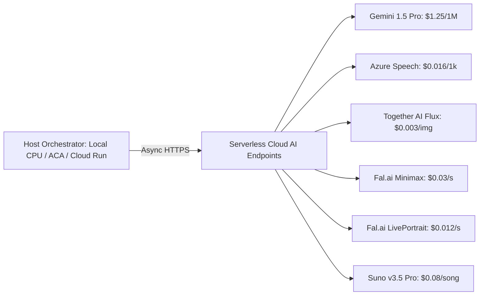

# Technology Stack & Tools Catalog
# Professional AI Video Producer Studio (YPP Monetization-Ready)

> **Document Version:** 1.0.0  
> **Target Scope:** Exhaustive component-by-component inventory of programming languages, libraries, frameworks, deterministic CPU scripts, AI models, cloud providers, and protocols.  
> **Key Architectural Mandates:** Zero Local GPUs (100% Serverless APIs + CPU), Hard 300-Line Limit Per File, Single-Pass FFmpeg, Tier-0 Deterministic Priority.

---

## Table of Contents
1. [Core Engineering Principles & Language Matrix](#1-core-engineering-principles--language-matrix)
2. [Web Studio Tier (Frontend & UI)](#2-web-studio-tier-frontend--ui)
3. [Control Plane & Backend Tier](#3-control-plane--backend-tier)
4. [Model Context Protocol (MCP) Cluster](#4-model-context-protocol-mcp-cluster)
5. [Autonomous Multi-Agent Swarm](#5-autonomous-multi-agent-swarm)
6. [Tier-0 Deterministic Local CPU Scripts (0 Token Spend)](#6-tier-0-deterministic-local-cpu-scripts-0-token-spend)
7. [Zero-GPU Serverless Cloud Model Adapters (External AI)](#7-zero-gpu-serverless-cloud-model-adapters-external-ai)
8. [Rendering, Audio Engineering & Compositing](#8-rendering-audio-engineering--compositing)
9. [Data Layer, Queues & Distributed Caching](#9-data-layer-queues--distributed-caching)
10. [DevOps, Tri-Modal Deployment & Observability](#10-devops-tri-modal-deployment--observability)

---

## 1. Core Engineering Principles & Language Matrix

```
┌────────────────────────────────────────────────────────────────────────────────────────────┐
│                                 LANGUAGE SELECTION MATRIX                                  │
├────────────────────┬──────────────────┬────────────────────────────────────────────────────┤
│ Language           │ Version / Target │ Components Implemented                             │
├────────────────────┼──────────────────┼────────────────────────────────────────────────────┤
│ **Python**         │ 3.12+            │ 100% Backend & Processing: FastAPI, MCP Servers,   │
│                    │                  │ Agent Swarm, Single-Pass Video Compositor,         │
│                    │                  │ Audio Sync, Thumbnail Engine, Cloud Adapters       │
├────────────────────┼──────────────────┼────────────────────────────────────────────────────┤
│ **TypeScript**     │ 5.4+ (Node 20+)  │ Frontend UI Only: Next.js 15 Web Studio Dashboard, │
│                    │                  │ In-Browser Canvas Preview, Wavesurfer Scrubbers    │
├────────────────────┼──────────────────┼────────────────────────────────────────────────────┤
│ **CLI Utility**    │ FFmpeg 7.x       │ Pre-compiled utility invoked purely via Python     │
│                    │ (Static Binary)  │ subprocess (Zero C, C++, or Java code developed)   │
├────────────────────┼──────────────────┼────────────────────────────────────────────────────┤
│ **SQL**            │ PostgreSQL 16    │ Relational DB schemas, Asset Rights Ledger,        │
│                    │ + pgvector       │ Channel settings, Project state management         │
├────────────────────┼──────────────────┼────────────────────────────────────────────────────┤
│ **IaC / Config**   │ HCL / Bicep/YAML │ Docker Compose, Azure Bicep, Terraform, Helm       │
└────────────────────┴──────────────────┴────────────────────────────────────────────────────┘
```

---

## 2. Web Studio Tier (Frontend & UI)

The frontend provides creator-in-the-loop control, timeline inspection, and mandatory cost approval before rendering.

| Component | Technology | Version | Purpose & Architectural Justification |
| :--- | :--- | :--- | :--- |
| **Web Dashboard Framework** | **Next.js (App Router)** | 15.1+ | Server-side rendering (SSR), fast routing, React Server Components for minimal client JS bundle. |
| **UI Component Library** | **React + Tailwind CSS** | React 19, Tailwind v3.4 | Atomic utility styling with zero runtime CSS overhead. |
| **Component Primitives** | **shadcn/ui (Radix UI)** | Latest | Fully accessible, customizable primitives (Modals, Dropdowns, Sliders, Accordions). |
| **Interactive Waveform** | **Wavesurfer.js** | 7.8+ | Frame-accurate audio waveform scrubbing, beat drop indicators, and dialogue inspection in-browser. |
| **Real-Time Video Preview** | **Remotion Player** | 4.0+ | In-browser canvas preview of transitions, kinetic text pop-ups, and scene layout before server render. |
| **Authentication (SSO)** | **NextAuth.js (Auth.js)** | 5.0+ | Google OAuth 2.0 Single Sign-On, JWT session handling, and user profile synchronization. |
| **Subscription Billing UI**| **Stripe Checkout & Elements** | Latest | Embedded Stripe payment element for self-serve subscription upgrades and credit purchases. |
| **Icons & Visual Feedback** | **Lucide React** | Latest | Lightweight, clean iconography for studio actions. |
| **Client Validation** | **Zod** | 3.23+ | Type-safe form validation for project prompts, aspect ratios, and custom model settings. |

---

## 3. Control Plane & Backend Tier

The backend handles asynchronous job lifecycle, pre-flight cost calculations, security, and agent coordination.

| Component | Technology | Version | Purpose & Architectural Justification |
| :--- | :--- | :--- | :--- |
| **Web Framework** | **FastAPI** | 0.115+ | High-throughput asynchronous Python framework with native OpenAPI doc generation and ASGI support. |
| **ASGI Server** | **Uvicorn** | 0.32+ | Ultra-fast ASGI web server implementation using `uvloop` and `httptools`. |
| **Connection Pooling** | **PgBouncer** | 1.23+ | Connection pooling managing up to 10,000 pooled client connections for millions-of-users scalability. |
| **SaaS Billing Engine** | **Stripe Python SDK** | 10.0+ | Validates webhook signatures, manages recurring subscription lifecycles, and provisions credit top-ups. |
| **Data Contracts & Typing** | **Pydantic** | 2.9+ | Strict type-safety, runtime validation, and JSON schema generation across all pipeline boundaries. |
| **Async HTTP Client** | **HTTPX** | 0.28+ | Persistent connection-pooled asynchronous HTTP client (`httpx.AsyncClient`) for non-blocking API calls. |
| **Token & Secret Security** | **Cryptography** | 43.0+ | AES-256-GCM encryption for YouTube OAuth tokens and cloud credentials stored at rest. |
| **Auth & Multi-Tenancy** | **PyJWT + Google Auth** | 2.9+ / 2.33+ | Validates Google OAuth tokens, extracts `user_id`, and enforces tenant isolation on all storage and DB queries. |
| **Distributed Tracing** | **OpenTelemetry SDK** | 1.28+ | Vendor-neutral distributed tracing exporting spans across agent steps to Azure App Insights or Prometheus. |
| **Metrics Scraping** | **Prometheus Client** | 0.21+ | Exposes `/metrics` endpoint tracking active renders, queue depth, token usage, and API response latencies. |

---

## 4. Model Context Protocol (MCP) Cluster

Independent, stateless microservices communicating via standard JSON-RPC 2.0 over `stdio` or `HTTP/SSE`.

| MCP Server | Core Dependencies | Primary Tools Exposed | Architectural Rationale |
| :--- | :--- | :--- | :--- |
| **`mcp-model-selector`** | `mcp`, `pydantic`, `httpx` | • `mcp_select_best_model`<br>• `mcp_get_model_catalog`<br>• `mcp_check_model_health` | Arbitrates lowest-cost/highest-quality model dynamically without hardcoding vendor names. |
| **`mcp-compliance-guard`** | `mcp`, `re`, `hashlib` | • `audit_ypp_reused_content`<br>• `screen_adsense_safety`<br>• `verify_commercial_rights`<br>• `generate_evidence_bundle` | Prevents demonetization by enforcing AdSense rules, checking rights manifests, and archiving evidence. |
| **`mcp-topic-memory`** | `mcp`, `qdrant-client`, `numpy` | • `compute_topic_similarity`<br>• `commit_topic_memory`<br>• `fetch_trending_niche_entities` | Prevents self-repetition by calculating cosine distance against past 180 uploads/episodes (scoped by show or channel) ($S < 0.82$). |
| **`mcp-video-compositor`** | `mcp`, `ffmpeg-python`, `opencv-python` | • `compile_filter_complex`<br>• `calculate_beat_grid`<br>• `audit_rendered_mp4` | Assembles single-pass FFmpeg commands and runs post-render visual/audio QA audits. |
| **`mcp-multi-publisher`** | `mcp`, `google-api-python-client` | • `publish_youtube_mla`<br>• `set_synthetic_disclosure`<br>• `publish_shorts` | Direct YouTube Data API v3 integration attaching multi-language audio stems and AI disclosure tags. |

---

## 5. Autonomous Multi-Agent Swarm

Specialized agent roles orchestrated via state graph cycles with explicit human-in-the-loop gates.

| Agent Name | Upstream Model / Tool | Primary Responsibility | Output Artifact |
| :--- | :--- | :--- | :--- |
| **Scriptwriter Agent** | Google Vertex: `gemini-1.5-pro` | Drafts 3 hook variants (Curiosity Gap, In-Media-Res) and scene-by-scene retention narrative. | `script.json` |
| **Transcreation Agent** | Google Vertex: `gemini-1.5-pro` | Replaces regional idioms, comedic punchlines, and timing for Telugu (`te-IN`) and Hindi (`hi-IN`). | `transcreated_scripts.json` |
| **Choreography Agent** | `gemini-1.5-pro` + Librosa | Writes rhyming lyrics, musical tags, and frame-accurate DWPose dance movement cues. | `SongChoreographyScript` |
| **Epic Cinema Agent** | `gemini-1.5-pro` | Injects Baahubali/KGF mass elevation staging, LUT color grading, and 120fps hero walks. | `cinematic_storyboard.json` |
| **Kids Animation Agent** | `gemini-1.5-flash` | Audits Co-Viewing rules, YouTube Kids principles, and Pixar-grade 3D subsurface scattering. | `kids_compliance_report.json` |
| **Audio Foley Agent** | Demucs v4 + NumPy + PyDub | Calculates -18dB ducking curves, extracts vocal stems, and layers contextual whooshes/risers. | `audio_mix_manifest.json` |
| **Growth & SEO Agent** | `gemini-1.5-flash` | Generates 3 localized A/B thumbnail prompts and high-CTR titles for YouTube Test & Compare. | `thumbnails_metadata.json` |
| **Final Video QA Agent** | OpenCV + FFmpeg + Gemini Flash | Audits rendered MP4 for face morphs, lip-sync, -14 LUFS loudness, and black frames (90–100 gate). | `VideoQAReport` |
| **Analytics Feedback Agent** | YouTube Analytics API + NumPy | Ingests real-world CTR, AVD, and 30s retention to dynamically update prompt and pacing priors. | `priors_adjustment.json` |

---

## 6. Tier-0 Deterministic Local CPU Scripts (0 Token Spend)

These scripts execute locally on host CPUs at **$0.00 model cost**, replacing expensive LLM/GPU calls.

```
src/scripts/
├── local_compliance.py        # Regex safety filter (AdSense 11 categories & profanity)
├── local_video_qa.py          # OpenCV / FFmpeg post-render check (-14 LUFS, black frames)
├── local_beat_detector.py     # Librosa BPM, kick/snare downbeat & drop detector
├── local_pan_zoom.py          # FFmpeg 2.5D camera parallax builder (saves >80% on video spend)
├── local_audio_ducking.py     # Volume ducking math (-18dB speech dip, -6dB pause fade)
├── local_audio_sync.py        # Multilingual cadence sync & SSML prosody time-stretching
├── local_subtitles.py         # Hormozi kinetic typography parser (ASS / SRT)
├── local_vector_math.py       # NumPy vectorized cosine similarity matrix math
├── local_thumbnail.py         # Pillow (PIL) localized typography overlay renderer
└── youtube_ingest.py          # Reference YouTube/script idea & thesis distillation engine
```

| Script File | Core Dependencies | Primary Functionality |
| :--- | :--- | :--- |
| **`local_compliance.py`** | `re` (Standard Library) | Evaluates opening 7s against YouTube profanity ban; screens 11 AdSense categories via compiled regex. |
| **`local_video_qa.py`** | `opencv-python-headless`, `ffmpeg-python` | Verifies loudness targeting **-14 LUFS** ($\pm 1$ LUFS), true peak $\le -1.0$ dBTP, and detects frozen/black frames. |
| **`local_beat_detector.py`** | `librosa`, `scipy`, `numpy`, `soundfile` | Extracts exact millisecond downbeat/upbeat arrays for frame-accurate musical cuts. |
| **`local_pan_zoom.py`** | `ffmpeg-python`, `math` | Builds 2.5D slow zoom-in/pan-left expressions over 4K static renders, eliminating video motion fees for B-roll. |
| **`local_audio_ducking.py`** | `pydub`, `ffmpeg-python` | Generates FFmpeg `sidechaincompress` or volume filter curves with 200ms attack and 350ms release. |
| **`local_audio_sync.py`** | `soundfile`, `pydub` | Aligns multilingual speech durations across scenes using SSML prosody rate scaling ($\pm 15\%$). |
| **`local_subtitles.py`** | `pysubs2`, `cairosvg` | Formats word-by-word active highlight boxes with yellow/green styling and Unicode font fallback. |
| **`local_vector_math.py`** | `numpy` | Computes $S = \frac{\mathbf{A} \cdot \mathbf{B}}{\|\mathbf{A}\| \|\mathbf{B}\|}$ across historical topic vectors in $< 5$ms. |
| **`local_thumbnail.py`** | `Pillow (PIL)` | Composites regional fonts (*Suranna*, *Baloo*, *Gidugu*) and renders high-contrast, non-obscured **Episode Numbering Badges** (`EP 01`, `భాగం 01`) in top-left corners. |
| **`youtube_ingest.py`** | `youtube-transcript-api`, `yt-dlp` | Distills core theme, genre, format, and psychological thesis from references for 100% original script generation. |

---

## 7. Zero-GPU Serverless Cloud Model Adapters (External AI)

All diffusion, video generation, and neural voice tasks are offloaded to **pay-per-second serverless cloud endpoints**:



| Subsystem Adapter | Cloud Provider | Target Model | Unit Cost | Why Selected |
| :--- | :--- | :--- | :--- | :--- |
| `gemini_adapter.py` | **Google Vertex AI** | `gemini-1.5-pro` | $1.25/1M in, $5.00/1M out | Best cultural fluency in Telugu/Hindi; 60% cheaper than Claude 3.5 Sonnet. |
| `azure_speech.py` | **Microsoft Azure** | `Azure Neural HD` | $0.016 / 1k chars | **11x cheaper than ElevenLabs**; unmatched regional catalog (`te-IN`, `hi-IN`). |
| `together_flux.py` | **Together AI** | `flux.1-schnell` / `dev` | $0.003 / $0.018 per image | **94% cheaper than Midjourney**; photoreal skin, typography, hands. |
| `fal_minimax.py` | **Fal.ai** | `minimax-video-01` | $0.03 / sec ($0.15 / 5s) | **50% cheaper than Runway/Kling**; cinematic camera motion, zero GPU setup. |
| `liveportrait.py` | **Fal.ai** | `liveportrait` | $0.012 / sec | Phoneme mouth accuracy and natural eye blinks with 0 local GPU load. |
| `mimicmotion.py` | **Fal.ai / Viggle** | `mimicmotion` | $0.025 – $0.040 / sec | Pose-guided dance synthesis preserving character clothing without distortion. |
| `suno_adapter.py` | **Suno API** | `suno-v3.5-pro` | $0.08 / full 2-min song | Full commercial master rights included; radio-ready regional song arrangements. |

---

## 8. Rendering, Audio Engineering & Compositing

| Engine / Library | Language | Purpose & Performance Optimization |
| :--- | :--- | :--- |
| **`src/compositor/ffmpeg_pipeline.py`** | **100% Pure Python** | **Single-Pass Compositor:** Python engine that constructs dynamic `-filter_complex` graphs, burning 2.5D pan-zoom, subtitle overlays, and audio ducking in a single execution pass. |
| **FFmpeg 7.x** | Pre-compiled Binary | CLI processing engine invoked asynchronously via Python `asyncio.subprocess` (Zero C/C++/Java custom code). |
| **Client-Side Remotion Preview** | TypeScript (Frontend) | Optional in-browser canvas player inside Next.js for timeline scrubbing before server rendering (client only). |
| **Demucs v4** | Python / PyTorch | Hybrid Transformer vocal stem separation to isolate singing vocals for lip-syncing. |
| **PyDub / SoundFile** | Python | High-speed audio format conversion, trimming, and loudness measurement. |
| **Pillow (PIL)** | Python | Deterministic multi-language 4K/1080p thumbnail text rendering with Unicode fonts. |

---

## 9. Data Layer, Queues & Distributed Caching

| Subsystem | Technology | Deployment Profile | Purpose |
| :--- | :--- | :--- | :--- |
| **Relational Database** | **PostgreSQL 16** | Cloud SQL / Azure Postgres Flexible | Multi-tenant schema with Row-Level Security: Users, Subscriptions, Usage Ledgers, Shows, Characters, Episodes, Channels, and Rights Ledger. |
| **Semantic Vector Store**| **Qdrant / ChromaDB** | Cloud Serverless / Local Container | Cosine similarity topic deduplication ($S < 0.82$) over 1,536-dimensional vectors. |
| **Distributed Message Bus**| **Redis / Cloud PubSub** | In-Memory / Azure Service Bus | Celery task queue broker, dead-letter queue (DLQ), and KEDA autoscaler metric source. |
| **Cloud Object Storage** | **Azure Blob / GCS** | Dedicated Per-User Containers | Dedicated `container: user-{user_id}` air-gapping each user's `creative_vault/` and `distribution/channels/`. Enables public SaaS subscription quotas and secure SAS tokens. |

---

## 10. DevOps, Multi-Platform Deployment & Failover Architecture

The studio is designed for **Tri-Modal Deployment** and **Multi-Cloud Failover** across Microsoft Azure and Google Cloud Platform:

```
deploy/
├── local/                             # Local workstation development (0 GPU)
│   ├── .env.example                   # API keys template
│   └── docker-compose.yml             # Next.js UI, FastAPI, Redis, PostgreSQL
│
├── azure/                             # Microsoft Azure Infrastructure
│   ├── bicep/                         # Azure Container Apps (ACA) 1-Click Deploy
│   │   ├── main.bicep                 # Resource Group, ACA Environment, Key Vault
│   │   ├── container_apps.bicep       # studio-ui, studio-api, render-worker
│   │   ├── postgres.bicep             # Azure Flexible Server PostgreSQL
│   │   └── storage.bicep              # Blob Storage with per-user container rules
│   └── k8s/                           # Azure Kubernetes Service (AKS) manifests
│       ├── ingress.yaml               # AGIC Ingress Controller
│       ├── keda_scaledobject.yaml     # Scale workers 0 to 20 based on queue depth
│       └── deployment.yaml
│
├── gcp/                               # Google Cloud Platform Infrastructure
│   ├── terraform/                     # Google Cloud Run 1-Click Deploy
│   │   ├── main.tf                    # GCP Project, VPC, Secret Manager
│   │   ├── cloud_run.tf               # Cloud Run services (API, UI, Workers)
│   │   ├── cloud_sql.tf               # PostgreSQL 16 on Cloud SQL
│   │   └── gcs.tf                     # GCS buckets with per-user isolation
│   └── k8s/                           # Google Kubernetes Engine (GKE Autopilot)
│       ├── gke_ingress.yaml           # Managed Cloud Armor Ingress
│       ├── horizontal_pod_autoscaler.yaml
│       └── deployment.yaml
│
└── multi_cloud/                       # Global Traffic & Automated Failover
    ├── cloudflare_failover.tf         # Health check probe & automatic DNS failover
    └── traffic_manager.json           # Azure Traffic Manager / Google Anycast policy
```

| Deployment Profile | Target Platform | Monthly Idle Cost | Failover Role | Worker Scaling |
| :--- | :--- | :---: | :--- | :--- |
| **Local Machine** | Developer Laptop / Workstation | **$0.00** | Primary Dev & Offline Iteration | Direct Python CLI / Docker Compose |
| **Azure Container Apps (ACA)** | Azure Serverless Environment | **~$5.00 – $15.00** | Active Primary (or Active-Active) | KEDA scales CPU workers 0 to 20 replicas |
| **Google Cloud Run** | GCP Serverless Containers | **$0.00 – $2.50** | Active Secondary / Failover Target | Native scale-to-zero (2M free requests) |
| **Azure AKS / GKE Autopilot** | Managed Kubernetes Cluster | **~$120 – $280** | Enterprise High-Throughput Cluster | HPA + KEDA scaling (50+ videos/day) |
